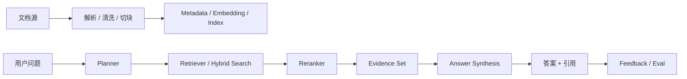

---
kb_id: ai-agent/cases/agentic-rag-full-stack-case
title: Agentic RAG 全链路案例：为什么知识问答系统不能只靠一次向量检索
domain: ai-agent
component: agent-cases
topic: agentic-rag-full-stack-case
difficulty: advanced
status: reviewed
sidebar_position: 1
version_scope: 实践资料 RAG repositories and existing RAG pattern documents as verified on 2026-05-12
last_verified_at: '2026-05-12'
source_ids:
  - practice-all-in-rag
  - practice-what-is-vs
  - practice-easy-vecdb
claim_ids:
  - case-claim-0001
  - case-claim-0002
  - case-claim-0003
  - case-claim-0004
tags:
  - ai-agent
  - rag
  - vector-database
  - retrieval
  - case-study
---
## Agentic RAG 最容易被讲成 Demo，因为很多回答只停在“向量检索 + 大模型生成”
很多人一提 RAG，就会按最小演示链路回答：文档切 chunk、embedding 入库、查询向量检索、结果交给大模型生成。这条链路能跑起来，但离生产级知识系统还差得很远。真正的系统设计难点在于：

- 文档怎样进入知识库，更新和删除如何同步。
- 问题是否需要改写、路由、拆解和多路检索。
- 向量库、重排器和生成器各自负责什么，不负责什么。
- 返回的引用是否真的支撑答案。
- 权限、新鲜度、冲突来源和评估闭环如何落地。

所以 Agentic RAG 的重点不是“再多打一发检索”，而是把检索系统升级成可规划、可验证、可治理的知识运行链。

## 这类系统到底解决什么问题
企业知识问答系统通常追求的不是“能聊天”，而是：

- 能回答制度、产品、技术和运营知识。
- 答案必须带证据和来源。
- 复杂问题能拆解而不是胡乱综合。
- 知识更新后，系统能感知和同步。
- 权限和租户范围必须正确生效。
- 线上质量能被评估，而不是靠感觉判断。

这就决定了它不能只靠一次向量检索，而必须有更完整的检索与生成控制面。

## 核心对象怎么拆
### Document
原始文档、网页、表格、PDF、数据库记录。它们是知识源，但还不是可检索资产。

### Chunk
经过清洗与切分后的最小检索片段。切分策略直接影响后续召回粒度和证据完整性。

### Metadata
包括来源、时间、权限、业务域、文档版本、语言等过滤信息。没有 metadata，权限检索和新鲜度控制几乎无法落地。

### Vector Index
负责语义召回候选，但它不是整个 RAG 系统。它只承担候选发现，不承担最终事实裁决。

### Query Planner
决定当前问题是否需要 query rewrite、query decomposition、routing、hybrid search 或额外工具调用。它是 Agentic 的核心之一。

### Retriever / Reranker
前者负责召回，后者负责重新排序和过滤。两者职责不同，不应混成一个“搜索步骤”。

### Evidence Set
最终送入生成阶段的证据集合。这里的选择质量直接决定答案能不能被证据支撑。

### Answer Synthesizer
负责基于证据生成回答，并明确引用与不确定性边界。

### Evaluator
负责离线集、线上反馈、trace 和错误样本回流。没有评估，RAG 很难稳定改进。

## 两条主链路必须分开讲
### 入库链路
1. 文档采集
2. 格式解析
3. 清洗去噪
4. chunking
5. metadata 标注
6. embedding / 索引写入
7. 版本、新鲜度、删除同步

### 查询链路
1. 用户问题进入系统
2. 权限和知识域过滤
3. query rewrite / decomposition / routing 判断
4. 向量、关键词或 hybrid search
5. reranking 与冲突过滤
6. evidence selection
7. answer synthesis
8. 引用与不确定性说明
9. feedback 与 evaluation 回流



## 为什么一次向量检索不够
一次向量检索容易在这些场景失败：

- 用户问题表达方式和文档表达方式不一致。
- 问题本身包含多个子问题。
- 需要跨多个来源比对，而不是找最像的一段。
- 需要按权限、时间、业务域过滤。
- 需要补关键词匹配、表格字段或结构化约束。

Agentic RAG 的价值就在于，不把所有问题都当成“打一发向量召回”来处理，而是根据问题复杂度动态决定检索策略。

## 向量数据库到底负责什么
向量数据库主要负责：

- 存储向量和 metadata
- 相似度召回候选
- 支持过滤
- 提供可扩展检索性能

它通常不负责：

- 判断用户真实意图
- 决定复杂问题怎么拆
- 判断证据是否权威
- 合成最终答案
- 保证知识实时更新

这也是为什么不能把所有 RAG 问题都归因给向量库。

## 一致性与证据边界怎么讲
成熟答案必须主动说清：

- 有引用不等于答案一定正确理解了引用。
- 召回到相似内容，不等于召回到最权威内容。
- Agent 会增加灵活性，也会增加成本、延迟和失败面。
- ingestion 和 reindex 的问题，不能靠 query 侧硬补。

这条边界很重要，因为它把“有证据”与“证据足够支撑”明确分开了。

## 性能模型与成本模型怎么看
RAG 的成本不是一次向量查询，而是整条链的累计：

- query rewrite 和 decomposition 增加模型调用成本
- hybrid search 增加召回开销
- reranking 增加延迟
- evidence selection 和 synthesis 增加 token 消耗
- freshness / eval 增加后台治理成本

### 检索预算样例
```yaml
rag_runtime_budget:
  max_query_rewrites: 2
  max_subqueries: 4
  retrieval_strategy: hybrid
  rerank_top_k: 20
  final_evidence_k: 6
  answer_must_include_citations: true
```

这个样例强调：Agentic RAG 的预算，是整个检索决策链和答案合成链的预算，而不是单个向量调用预算。

## 生产排障应该怎么做
- 先分清问题出在入库链路还是查询链路。
- 再看 planner 是否错误选择了检索策略。
- 再看向量召回、重排和 evidence selection 哪一步失真。
- 最后看答案是否错误理解了正确证据。

这个顺序比只看“最终答案对不对”更有效。

## 样例：RAG 检索决策快照
```yaml
rag_debug_snapshot:
  query: "2025 年报销政策和 2024 年相比有哪些变化"
  rewritten_queries:
    - "2025 报销政策 变化"
    - "2024 2025 报销制度 对比"
  routed_indices:
    - hr-policy
    - finance-policy
  retrieval_mode: hybrid
  top_evidence_count: 6
  citation_required: true
  suspected_failure_point: reranker_confused_by_old_versions
```

这个样例表达的是：很多答案错误并不是“模型乱说”，而是 planner、版本过滤或 reranker 在更早阶段就已经出了问题。

## 本页结论
Agentic RAG 不是“向量检索多打一轮”，而是一套把入库、规划、召回、重排、证据选择、生成和评估串起来的知识运行链。只有把这整条链讲清楚，知识问答系统的答案才真正具备系统设计深度。
