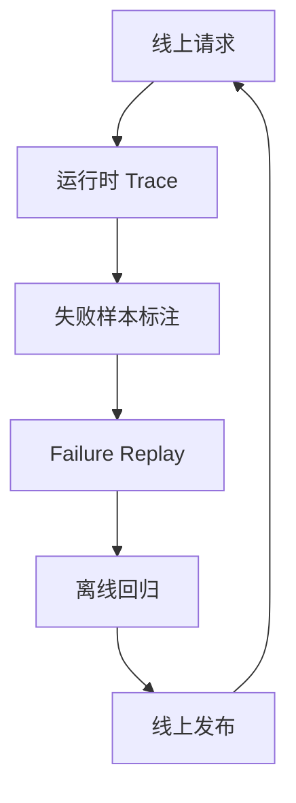

## Agentic RAG 一旦上线，最关键的能力不是“今天答得不错”，而是“明天变差时能不能立刻知道为什么”
很多团队在离线 Demo 阶段只关注答案对不对，但真正上线之后，系统质量会受到知识库变更、检索策略调整、模型升级、工具接口波动和权限策略变化的共同影响。此时如果没有线上评估、trace、失败回放和治理闭环，系统就会变成一个很难解释的黑箱。

所以，Agentic RAG 的长期价值不只来自检索设计，还来自是否建立了可观测、可回放、可回归的运营机制。

## 解决什么问题
这一页主要解决：

1. 为什么 Agentic RAG 的线上评估必须覆盖链路中间对象，而不只是最终答案。
2. 可观测性需要记录哪些关键证据，才能支持快速定位故障。
3. 为什么失败样本回放比零散日志更有价值。
4. 如何把线上失败重新变成离线回归测试资产。

## 核心对象
| 对象 | 作用 | 缺失后会怎样 |
| --- | --- | --- |
| Runtime Trace | 记录 planner、router、retriever、tool、answer 的关键步骤 | 只能看到最终错答案 |
| Eval Sample | 代表真实业务问题的线上样本 | 回归集无法覆盖真实故障 |
| Failure Replay | 对失败请求做可重复执行的回放 | 故障只能靠主观描述 |
| Governance Loop | 将线上故障转入规则修复、评估集更新和版本回归 | 修一次漏一次 |

### 为什么 Agentic RAG 比普通 FAQ 系统更依赖 trace
因为它的失败点更多，既可能出在检索，也可能出在规划、路由、证据收敛或生成。如果没有中间 trace，只看最终答案，团队很难知道应该改的是索引、规则、prompt 还是模型。

## 执行链路
Agentic RAG 的评估闭环通常应这样工作：

1. 在线请求运行时保留核心 trace。
2. 对高价值或失败样本打标签，沉淀为 `Eval Sample`。
3. 当问题被定位后，将该样本加入 `Failure Replay` 集合。
4. 系统改动后，先跑 replay 和离线评估，再上线验证。
5. 将新的线上结果继续回流，形成治理闭环。



### 运行时快照样例
```json
{
  "trace_id": "rag-run-4421",
  "planner": "compare_policy_change",
  "router": ["vector_search", "sql_lookup"],
  "retrieved_docs": 14,
  "final_evidence": 5,
  "answer_has_citations": true,
  "user_feedback": "missing_one_key_difference"
}
```

这个样例说明，可观测性必须覆盖中间对象，否则团队很难把用户反馈映射回技术根因。

## 一致性与容错
线上治理中常见的一致性问题包括：

1. 线下评估集和线上真实失败模式不一致。
2. 同样的故障被多次修复，但没有沉淀成回归样本。
3. 只有日志，没有可复现的输入、检索结果和输出快照。
4. 模型、索引、规则版本没有和 trace 一起记录，导致复盘时证据不完整。

### 为什么失败回放比“看日志复盘”更有效
因为日志通常只记录了局部证据，而失败回放保留的是一次完整请求在当时版本组合下的运行轨迹。它能让团队真正判断：修复是否解决了整类问题，而不是只在脑中复原一个大概过程。

## 性能模型
线上评估与治理会增加存储和分析成本，但它换来的是更低的长期故障成本：

1. 保留 trace 会增加日志体量。
2. 失败回放需要保存更多上下文和证据快照。
3. 每次发布前跑 replay 会增加回归时间。
4. 但这些成本通常远低于线上答错关键问题后的人工排查成本。

### 为什么只监控延迟和错误率远远不够
因为 Agentic RAG 最常见的问题是“系统回答了，但回答错了、漏了、引用不稳”。这些不是基础可用性指标能直接反映的，必须靠任务级评估和链路 trace 才能捕捉。

## 生产排障
如果线上用户反馈“这次答错了”，推荐排障顺序：

1. 先查是否存在完整的运行 trace。
2. 再看 Planner、Router、Retriever、Final Evidence 哪一步最可能偏离。
3. 将该请求转成 replay 样本，验证问题是否稳定复现。
4. 修复后把 replay 加入长期回归集。

### 回放登记样例
```yaml
failure_replay_case:
  case_id: rag_online_2026_0514_17
  symptom: missing_policy_delta
  root_cause: router_skipped_sql_lookup
  fixed_by: add_compare_query_route
  added_to_regression: true
```

这个样例表达的是，治理闭环的关键不是“一次修好”，而是把同类故障永久纳入回归体系。

## 相邻技术边界
这一页讲的是 Agentic RAG 的线上治理，不是单纯的 APM 监控，也不是数据仓库运营。APM 可以告诉你请求慢不慢，但不能告诉你证据为什么错；日志系统能保存事件，但不天然形成回归样本；评估系统能给分，但若没有 trace，也很难支撑根因定位。

## 本页结论
Agentic RAG 想长期稳定提升，必须把线上评估、可观测性、失败回放和治理闭环做成正式基础设施。只有能解释“为什么这次错了”，系统才真正具备持续变好的能力。
