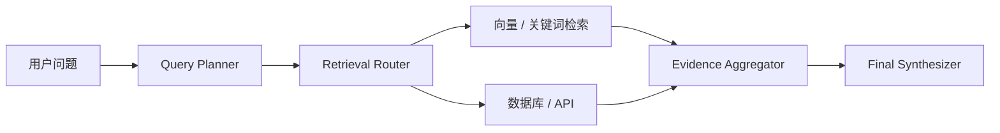

## Agentic RAG 的分水岭，不在于有没有向量库，而在于是否具备查询规划和多阶段证据收敛能力
很多知识问答系统一开始都长得很像：用户提问，系统向量检索几段内容，再让模型生成答案。但一旦问题变复杂，例如需要跨部门制度对比、先查结构化指标再补文本说明、或先判断应该走 FAQ 还是数据库查询，这种单阶段搜索就会明显不够。

Agentic RAG 的价值在于它把“找答案”拆成一条有决策的链：先理解问题，再选择检索策略，再决定是否调用工具，再对候选证据收敛，而不是所有问题都用同一种召回方式处理。

## 解决什么问题
这一页关注四个关键问题：

1. 为什么复杂问答需要 query planning，而不是直接拿原始问题检索。
2. 工具路由和文本检索应该怎样分工。
3. 多阶段检索为什么必须有证据收敛，而不是无限追加上下文。
4. 当系统答错时，怎样判断是 planner、router、retriever 还是 synthesizer 出了问题。

## 核心对象
| 对象 | 作用 | 如果失控会怎样 |
| --- | --- | --- |
| Query Planner | 判断是否需要改写、拆解、路由或调用工具 | 所有问题被同质化处理 |
| Retrieval Router | 在向量、关键词、数据库、API 等入口之间分流 | 走错入口，后面再好也白费 |
| Subquery Set | 复杂问题拆成的子查询集合 | 问题无法覆盖完整 |
| Evidence Aggregator | 把多路结果汇总、去重、排序和冲突处理 | 上下文越堆越乱 |
| Final Synthesizer | 基于收敛后的证据生成答案 | 正确证据被错误综合 |

### 为什么证据收敛比“召回更多”更重要
因为召回更多不等于更准。多阶段检索的真正难点不在找到更多片段，而在于从更多候选里收敛出最相关、最可信、最适合当前问题的证据集合。没有这一步，系统只是在把噪声送给模型。

## 执行链路
更成熟的 Agentic RAG 查询链一般包含：

1. 读取问题并识别意图、权限域和时间范围。
2. Planner 判断问题是否需要改写、拆解或工具调用。
3. Router 决定走向量库、关键词搜索、数据库或外部 API。
4. 对复杂问题发起多路子查询。
5. Aggregator 对候选证据做去重、重排、冲突识别和收敛。
6. Synthesizer 基于最终证据集生成答案与引用。



### 检索决策快照样例
```yaml
query_plan:
  intent: compare_policy_change
  need_decomposition: true
  routes:
    - vector_search
    - sql_lookup
  subqueries:
    - "2026 差旅制度报销标准"
    - "2025 差旅制度报销标准"
  evidence_budget: 6
```

这个样例体现的是，复杂问答的关键在于先做决策，再做召回。

## 一致性与容错
Agentic RAG 的失败面通常比普通 RAG 更宽，但也更可定位：

1. Planner 没识别出需要拆解，导致系统只回答了部分问题。
2. Router 选错入口，本该查结构化数据却只做了文本检索。
3. Aggregator 没做冲突识别，把相互矛盾的证据一起送进生成。
4. Synthesizer 拿到了正确证据，却在最后综合时理解错误。

### 为什么复杂问题不能只靠更大的上下文窗口硬扛
因为窗口变大只会让系统更容易把大量候选内容堆给模型，却不自动提升检索决策和证据筛选能力。真正需要的是更好的链路拆分和收敛控制，而不是无上限堆料。

## 性能模型
多阶段检索的成本主要来自：

1. Planner 和 router 增加额外模型调用或规则判断。
2. 多路检索会增加外部系统延迟。
3. Aggregator 需要做重排和冲突处理。
4. 若证据预算不控住，最终上下文成本会迅速膨胀。

### 为什么 Agentic RAG 的优化方向不是“每轮都多查一点”
因为很多时候系统不是查得不够，而是选得不准。优化重点应当先放在路由命中率、子查询质量和证据收敛，而不是机械扩大 top-k。

## 生产排障
如果 Agentic RAG 回答不完整或答偏，建议按下面顺序拆：

1. 先看 Planner 有没有正确识别问题类型。
2. 再看 Router 是否把问题送到了正确的数据入口。
3. 再看多路结果是否在 Aggregator 阶段被错误去重或错误排序。
4. 最后再判断是否是生成阶段综合失真。

### 排障快照样例
```json
{
  "query": "2026 报销制度相较 2025 有哪些变化",
  "planner_error": false,
  "router_error": true,
  "expected_route": "vector_plus_sql",
  "actual_route": "vector_only"
}
```

这个样例说明，很多表面上的“RAG 答错”，本质上是查询规划层出了问题。

## 相邻技术边界
这一页讨论的是查询规划与多阶段检索，不是向量数据库内部实现，也不是单纯的 prompt 设计。向量库负责相似度检索，Router 负责决定要不要用它；数据库能提供精确字段值，但不会自己决定何时应该被调用；大模型能综合证据，但不能替代检索控制面。

## 本页结论
Agentic RAG 从普通 RAG 进化的关键，不是多打一轮检索，而是建立查询规划、工具路由和证据收敛能力。只有把这些前置决策做好，复杂知识问答才不会退化成一次相似度搜索。
