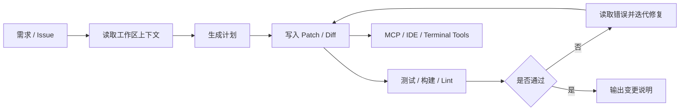

---
kb_id: ai-agent/cases/ai-coding-workflow-roo-code-deepseek-case
title: AI 编程 Agent 案例：代码上下文、文件权限、测试闭环与 MCP 工具边界应该怎样一起设计
domain: ai-agent
component: ai-coding-workflow
topic: roo-code-deepseek-ai-coding-workflow
difficulty: advanced
status: reviewed
sidebar_position: 5
version_scope: 实践资料 smart-dev repository and Roo Code docs as verified on 2026-05-12
last_verified_at: '2026-05-12'
source_ids:
  - practice-smart-dev
  - roo-code-docs
  - mcp-introduction
  - mcp-server-concepts
claim_ids:
  - practice-p1-claim-0012
tags:
  - ai-agent
  - ai-coding
  - roo-code
  - deepseek
  - mcp
---
## AI 编程 Agent 最核心的，不是“能写代码”，而是“能否在受控环境里稳定改代码”
AI 编程工作流很容易被讲成一个酷炫演示：读需求、写代码、自动修 bug、自动调用工具。但真正进入工程场景后，问题会立刻变成：

- 代码上下文从哪里来，是否完整。
- Agent 可以读哪些目录，改哪些文件。
- 改完之后如何验证，不通过时如何回滚或继续修。
- 终端命令、环境变量和 MCP 工具的权限边界如何限制。
- 产出的 diff 是否可审查、可解释、可复核。

所以 AI 编程 Agent 的本质不是生成器，而是一个受控代码变更运行系统。

## 生命周期边界为什么要主动讲
截至 2026-05-12，相关 Roo Code 文档已提示产品生命周期变化风险，因此本页更适合被理解为“AI 编程工作流设计案例”，而不是某个单一产品的长期推荐。这个边界很重要，因为它说明我们吸收的是工作流方法，而不是把某一工具的短期状态写成长期事实。

## 这类系统到底解决什么问题
成熟的 AI 编程 Agent 应该解决：

- 需求如何转成计划。
- 代码上下文如何被安全读取。
- 变更如何被局部、精确地写入文件。
- 构建、测试、lint 和运行结果如何反馈到下一轮修复。
- 工具调用如何标准化、权限化、可审计。

这已经不是“模型会写代码”的问题，而是“代码变更流水线是否可控”的问题。

## 核心对象怎么拆
### Request
用户需求或 issue。必须先被约束范围，否则 Agent 很容易修改无关模块。

### Workspace Context
包括代码目录、配置文件、依赖、测试、构建脚本和历史变更。没有这个上下文，模型只是在猜。

### Plan
执行计划决定先读什么、改什么、跑什么验证。计划不是装饰，而是约束变更范围和顺序的控制面。

### Patch / Diff
真正应该被交付的是 diff，而不是“模型回复”。可读的 patch 才能支持代码审查和责任追踪。

### Validation Loop
包括测试、构建、lint、运行验证和错误回读。没有这一层，所谓 AI 编程工作流只是一轮文本生成。

### Tool Surface / MCP
包括 IDE 能力、终端命令、文档检索、构建系统、内部 API 等。MCP 的价值是把外部能力标准化暴露给 Agent，但这不等于自动安全。

## 一条典型执行链怎么走
1. 需求进入系统。
2. Agent 扫描工作区上下文和相关文件。
3. 生成局部计划，明确修改目标。
4. 按计划写入 patch。
5. 运行测试、构建或 lint。
6. 读取失败信息并判断是否继续修复。
7. 生成变更说明和最终 diff。
8. 提交给人工审查或进入下一步自动流程。



## 权限边界为什么比“效果好不好”更重要
AI 编程 Agent 常见的高风险权限包括：

- 读写工作区文件
- 运行终端命令
- 访问环境变量
- 读取 API Key
- 调用内部 MCP 工具
- 与浏览器、数据库或外部服务交互

因此系统必须先定义：

- 哪些目录只读，哪些可写。
- 哪些命令允许自动执行，哪些必须审批。
- 哪些环境变量不能暴露给模型。
- 哪些 MCP 工具只能读取，不能修改。

这层权限如果不前置设计，AI 编程 Agent 的风险远高于普通聊天机器人。

## MCP 在 AI 编程场景里的位置
MCP 很适合接入：

- 项目文档和规范
- 构建状态
- 内部 API
- 数据库只读查询
- CI / 工具系统

但这里最容易犯的错误，是把 MCP 当成“天然安全工具总线”。实际上 MCP server 只是协议暴露面，真正的权限、参数校验、审批和审计仍然要在平台层或工具层设计。

## 一致性与容错要怎么讲
代码变更系统的容错难点在于外部世界会变化：

- 测试依赖可能不稳定。
- 生成 patch 可能和最新工作区冲突。
- 一次错误修复可能引入新的回归。
- 自动重试某些命令会产生额外副作用。

因此成熟系统不会只靠“重试”，而是依赖更细的状态判断：当前 patch 是否已应用、测试失败是环境问题还是逻辑问题、是否需要人工接管。

## 性能模型怎么看
AI 编程 Agent 的主要成本来自：

- 大量读取代码上下文带来的 token 成本
- 多轮测试 / 构建导致的时间成本
- 工具调用和 MCP 查询的外部时延
- 失败后反复修复的迭代开销

### 验证预算样例
```yaml
coding_agent_budget:
  max_files_to_edit: 6
  max_test_rounds: 3
  build_timeout_minutes: 10
  terminal_auto_approval_scope:
    - npm test -- --runInBand
    - pytest tests/unit
  restricted_paths:
    - .env
    - secrets/
    - infra/prod/
```

这个样例强调：AI 编程系统的真正预算，不只是 token，而是“可改多少文件、可跑多少次验证、哪些路径永远不能自动碰”。

## 生产排障应该怎么做
- 先看问题出在上下文读取、patch 写入、验证失败还是工具权限。
- 再看 diff 是否偏离任务目标或修改了无关文件。
- 再看测试失败是业务 bug、环境问题还是命令边界问题。
- 最后检查是否有敏感路径、凭证或高风险工具暴露给了模型。

## 本页结论
AI 编程 Agent 的重点不是“让模型写代码”，而是建立一条受控的代码变更闭环：读取上下文、生成计划、输出 patch、执行验证、回读错误、限制权限、审计工具边界。把这些一起讲，AI 编程工作流的系统设计答案才算真正完整。
