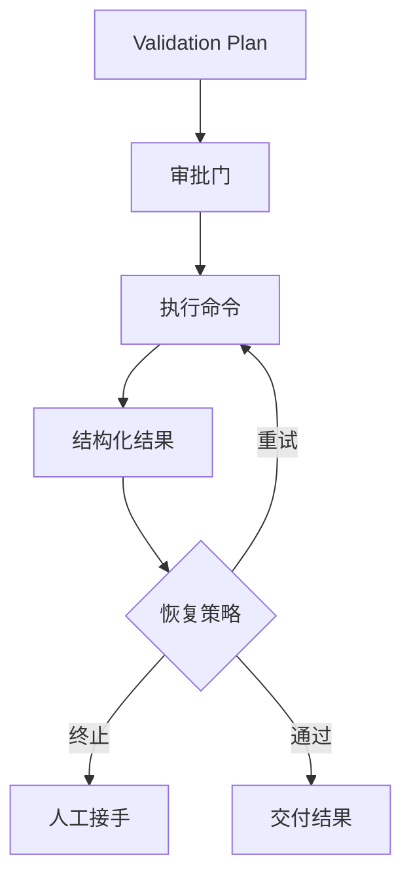

## 编程 Agent 最危险的部分，常常不是写 patch，而是它为了验证 patch 去执行了什么命令、产生了什么副作用
很多系统会把验证环节简单理解成“跑个 test”。但在实际工程中，验证动作可能涉及构建、迁移、网络访问、数据库连接、浏览器操作甚至部署前检查。只要这条链没有审批、限制和失败恢复，AI 编程 Agent 的风险就不只是“写错代码”，而是“在错误前提下安全边界失控”。

所以，测试闭环不是一个附属动作，而是 AI 编程工作流里和 patch 同等重要的执行链。

## 解决什么问题
这一页重点解决：

1. 为什么验证环节必须被设计成受控闭环，而不是让模型自由决定跑什么。
2. 权限审批在命令执行链中应放在哪里。
3. 失败后怎样区分环境问题、测试问题和 patch 逻辑问题。
4. 为什么恢复与回滚设计要在自动化之前明确下来。

## 核心对象
| 对象 | 作用 | 风险 |
| --- | --- | --- |
| Validation Plan | 规定允许执行的测试、构建和检查动作 | 模型自由扩权执行高风险命令 |
| Approval Gate | 对敏感命令或资源访问做人工或策略审批 | 高副作用动作缺少拦截 |
| Command Result | 收集退出码、日志、时间和环境信息 | 失败原因无法复盘 |
| Recovery Policy | 规定失败后是重试、回退还是交给人工 | 自动化越跑越乱 |
| Audit Trace | 记录执行过的命令、参数和审批历史 | 出问题后无法追责 |

### 为什么测试闭环不能只看“通过/失败”
因为一个失败的测试可能是业务逻辑错误，也可能是环境变量缺失、依赖下载失败、端口冲突、数据库脏状态，甚至是命令本身不该被自动执行。只看布尔结果，根本不足以支持下一步决策。

## 执行链路
成熟的编程 Agent 验证链通常应这样推进：

1. 在计划阶段生成 `Validation Plan`，列出允许执行的动作和顺序。
2. 对高副作用命令经过 `Approval Gate`。
3. 执行命令并保留结构化结果，而不是只读终端最后一行。
4. 按 `Recovery Policy` 判断是否可重试、需回退，还是必须人工接手。
5. 输出完整 trace，供后续复盘和回归评估。



### 审批策略样例
```yaml
approval_policy:
  auto_allow:
    - npm test -- middleware
    - pytest tests/unit
  require_manual:
    - prisma migrate deploy
    - docker compose up
    - kubectl apply -f
  deny:
    - rm -rf /
    - curl | sh
```

这个样例强调的是：验证链的核心不是“是否自动化”，而是自动化的边界是否清晰。

## 一致性与容错
编程 Agent 的常见故障，往往出现在“patch 已经对了，但验证链不可靠”：

1. 命令在不同环境下行为不一致，系统却把所有失败都当成代码 bug。
2. Agent 自动重试了不应该重试的高副作用动作。
3. 测试通过，但构建产物、配置文件或数据库状态已经被污染。
4. 审批结果没有记录，后续无法判断是系统自动做的还是人工放行的。

### 为什么恢复策略不能等到故障发生后再补
因为一旦命令涉及副作用，再去讨论“现在要不要回滚”通常已经太晚。成熟系统会提前约定：哪些动作允许自动重试、哪些动作失败必须停止、哪些环境需要快照或沙箱。

## 性能模型
验证闭环的主要成本不在模型，而在外部执行链：

1. 测试和构建耗时往往大于 patch 生成本身。
2. 审批会增加等待时间，但能显著降低风险。
3. 结构化日志和 trace 会增加记录成本，但能提升排障效率。
4. 恢复策略设计越清晰，失败后的重复执行成本越低。

### 为什么“验证越多越好”是错误直觉
因为验证也有边界。把整个 CI、全量集成环境、重型部署动作都塞进单次 Agent 回路，通常只会让成本、延迟和副作用急剧放大。更合理的做法是分层验证：先小后大，先只读后有副作用。

## 生产排障
如果 AI 编程 Agent 在验证环节反复失败，推荐按这个顺序判断：

1. 先确认失败是 patch 逻辑问题还是环境问题。
2. 再看该命令是否本来就不应该自动执行。
3. 再检查审批历史和命令参数是否与计划一致。
4. 最后再决定是否需要重新生成 patch。

### 执行 trace 样例
```json
{
  "run_id": "agent-run-918",
  "command": "npm test -- middleware",
  "exit_code": 1,
  "approval": "auto_allow",
  "suspected_failure_type": "environment",
  "next_action": "stop_and_request_human_check"
}
```

这个样例传达的是：恢复决策应该基于结构化证据，而不是让模型凭感觉继续跑。

## 相邻技术边界
这一页讲的是验证闭环、审批和恢复，不是单纯的测试工程，也不是权限系统本身。CI 能提供执行环境，但不能替代 Agent 侧的命令分层；沙箱能降低风险，但不能决定何时该停止；MCP 能提供工具入口，但不能天然保证命令副作用被正确分类。

## 本页结论
AI 编程 Agent 的测试闭环、权限审批、命令副作用和失败恢复必须被一起设计。只有把“改完之后怎样安全验证”讲清楚，自动改代码这件事才真正可落地。
