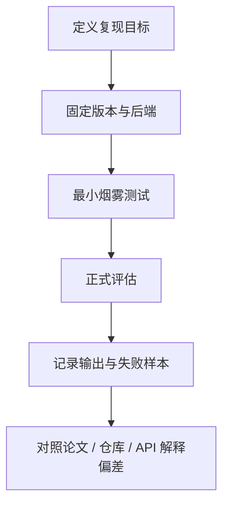

## 复现 DeepSeek 类资料时，真正难的不是跑通脚本，而是知道自己到底复现了什么
很多人做模型复现时有一个常见误区：只要脚本跑起来、输出看起来像样，就觉得“复现成功”。但对推理模型、推理方法或复杂模型资料来说，这个判断太粗了。你至少要分清两件事：

1. 你复现的是运行链路，还是复现了论文声称的结论。
2. 你拿来对比的是同类对象，还是把仓库实现、托管 API 和社区包装项目放在同一条基线上。

如果这两个问题不先回答，后面的评估、结论和知识沉淀都会失真。

## 解决什么问题
这一页聚焦三个任务：

1. 把 DeepSeek 相关资料的复现过程拆成可执行、可复核的步骤。
2. 说明评估记录为什么必须和运行记录一起保存，而不能只留最终分数。
3. 给出当复现结果与预期不一致时，优先从哪几层排障。

### 复现不是只有“成功”或“失败”
更准确的说法是：

1. 运行可复现：相同配置下，流程能稳定跑完。
2. 结果可复现：相同配置下，输出和指标波动在可接受范围内。
3. 结论可复核：知道为什么接近或偏离原始资料。

## 核心对象
| 对象 | 作用 | 为什么必须单独记录 |
| --- | --- | --- |
| 复现目标 | 说明这次实验要复现的是方法、接口行为还是学习路线 | 不同目标决定不同证据要求 |
| 环境清单 | 记录依赖、运行方式、模型入口和关键参数 | 没有环境清单就无法重跑 |
| 输入与提示词 | 记录样例输入、prompt、采样策略 | 推理任务对提示细节往往敏感 |
| 执行后端 | 说明是仓库脚本、本地推理、托管接口还是教学包装 | 不同后端不是同一个对象 |
| 评估器 | 记录数据集、打分方式、人工复核标准 | 没有评估器就无法解释分数 |
| 结果证据 | 保存样例输出、失败样本和对比记录 | 只有总分很难定位问题 |

### 为什么“执行后端”必须单独成为对象
因为很多所谓“复现差异”其实不是模型差异，而是后端差异：

1. 仓库脚本和托管 API 暴露的控制面可能不同。
2. 教学项目可能省略了原始评测中的某些过程。
3. 本地实验和在线服务的限流、重试和默认参数不一定一致。

## 执行链路
一个更可靠的复现链路通常长这样：

1. 先明确目标，是理解方法、验证链路，还是核对当前接口。
2. 再固定版本和运行入口，避免边跑边换对象。
3. 先做最小烟雾测试，确认流程能跑。
4. 再做正式评估，保存输入、输出、分数和失败样例。
5. 最后对照论文、仓库和 API 文档解释偏差。



### 一份适合长期维护的实验清单
```yaml
deepseek_reproduction_run:
  target: "method_understanding | repo_path | api_behavior"
  source_scope:
    paper_or_report: true
    repo: true
    api_doc: false
  backend: "official_repo | hosted_api | community_wrapper"
  prompt_template_pinned: true
  eval_dataset_pinned: true
  output_samples_saved: true
  failure_cases_saved: true
```

只要这类最小清单缺一半，后续就很难做真正的回归比较。

## 一致性与容错
复现里最常见的错误，并不是模型坏了，而是比较对象不一致。典型情况包括：

1. 用托管 API 的当前默认行为去对比历史论文实验。
2. 用社区封装项目的运行结果去宣称官方仓库一定具备相同行为。
3. 只对比一个总分，却不核对失败样本和输出模式。

### 容错时最应该先确认的三件事
1. 目标是否变了：你一开始要复现方法，后来却拿它去验证当前产品。
2. 对象是否变了：你开始用仓库脚本，后来切到了 API。
3. 评估是否变了：你开始用固定样例，后来改成了随手提问。

只要这三件事里有一件漂移，就不该再继续把结果写成确定结论。

## 性能模型
复现实验中的性能通常要分成四个维度看：

1. 能否跑通：流程稳定性。
2. 跑得多快：吞吐和延迟。
3. 跑得多贵：成本和资源消耗。
4. 跑得多准：任务输出质量与错误模式。

### 为什么“更快”和“更准”经常不能同时下结论
因为很多优化会改变以下因素：

1. 输出 token 数量。
2. 采样策略。
3. 外部工具或检索使用方式。
4. 评估器对过程性推理的容忍度。

所以复现文档里必须单独记录“当前优化改动主要影响的是哪一维”，而不能只写“效果更好了”。

## 生产排障
当 DeepSeek 相关复现实验与预期不一致时，最稳的排障顺序不是改 prompt，而是先按层检查：

1. 目标层：你到底在复现什么对象。
2. 版本层：仓库、接口、样例和评估器是否被固定。
3. 输入层：prompt、样例和采样策略有没有变化。
4. 输出层：失败模式是拒答、跑偏、格式错，还是证据链断裂。
5. 评估层：分数变化来自模型能力，还是来自评测设置变化。

### 四类高频故障
1. 能跑通但分数明显偏低：优先看评估设置和提示词。
2. 样例表现不错但批量评估不稳定：优先看数据集覆盖和失败样本。
3. API 结果与仓库脚本明显不同：优先看对象是否已切换。
4. 社区路线可以演示，但难以复核：优先补环境清单和原始输出存档。

### 一份排障记录样例
```json
{
  "symptom": "api_result_differs_from_repo",
  "pinned_versions": false,
  "same_prompt_template": false,
  "same_eval_set": true,
  "same_backend": false,
  "first_action": "split the comparison by backend"
}
```

这个样例强调的不是具体工具，而是排障必须先做对象切分。

## 相邻技术边界
这页讲的是复现、评估和排障方法，不是模型训练细节全景图。和相邻主题的边界如下：

1. 和资料分层页的边界：资料分层页回答“该信谁”，这一页回答“实验怎么做、偏差怎么查”。
2. 和评估工程页的边界：评估工程页关注通用评测闭环，这一页关注 DeepSeek 类案例如何保存复核证据。
3. 和 API 使用页的边界：API 使用页关注如何调用，这一页关注调用结果能否和其他证据层正确比较。

## 本页结论
DeepSeek 复现真正难的地方，不是脚本本身，而是目标、对象、版本、评估和结果证据能不能同时被固定。只要复现记录里没有明确这五层信息，任何“成功复现”都只能算一次演示，而不能算可复核的知识沉淀。
