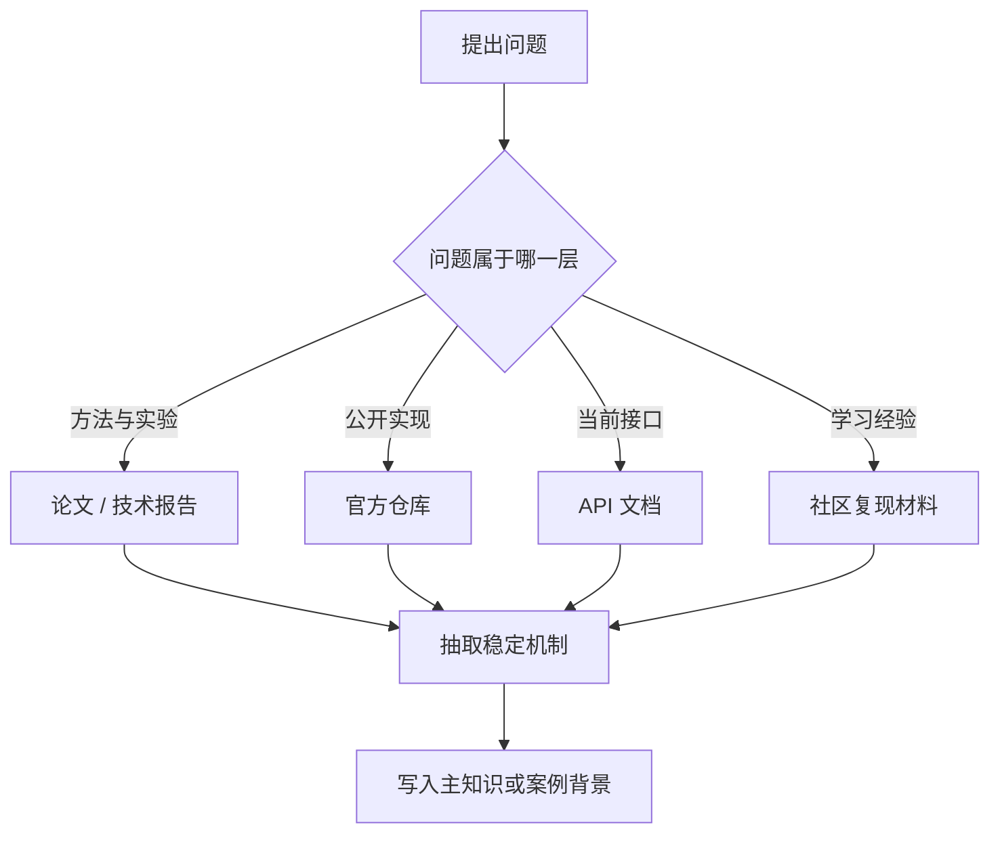

## 如果不先做资料分层，DeepSeek 相关内容最容易沦为“排行榜叙事”而不是知识
围绕推理模型的内容，最吸引眼球的通常不是对象关系，而是排行榜、实验截图、复现博客和一句句“某模型更强”。但这类材料有一个共同问题：它们常常把不同层级的事实放进同一个叙述里。比如同一段话里既提论文结论，又提仓库实现，再顺手补一句“API 现在也差不多”，最后再拿社区复现结果做印证。看起来信息很多，实际上证据层已经混乱。

对知识库来说，最危险的不是信息太少，而是证据责任不清。只要分层不清，后续所有“更新”“纠错”“补题”都会越来越难。

## 解决什么问题
这一页重点解决三件事：

1. DeepSeek 相关资料应该如何按证据层拆开。
2. benchmark、实验结论和当前 API 现状之间为什么不能直接划等号。
3. 当资料随着版本快速变化时，知识库应该保留什么，替换什么，删除什么。

### 为什么这是基础而不是附属细节
因为几乎所有后续问题都建立在这里之上：

1. 题库会问“某模型为什么这样设计”。
2. 项目复盘会问“某次复现为什么和线上表现不同”。
3. 内容维护会问“旧页面哪些话还能保留”。

如果没有这一层治理规则，后面的系统设计、排障和题库表达都会建立在不稳定事实之上。

## 核心对象
| 对象 | 负责回答的问题 | 更新频率 | 适合作为长期知识吗 |
| --- | --- | --- | --- |
| 论文或技术报告 | 方法是什么、实验如何设计、结论在哪些条件下成立 | 中等 | 适合沉淀方法与边界 |
| 官方仓库 | 公开实现了什么、提供了哪些脚本或说明 | 中高 | 适合沉淀实现边界 |
| API 文档 | 现在可调什么、接口如何用、哪些能力已变更 | 高 | 适合沉淀当前产品边界 |
| benchmark 表 | 某个实验对象在某套评测里的表现如何 | 高 | 只适合沉淀评测条件与解释方法 |
| 社区复现材料 | 哪条学习路线更容易跑通、哪些坑容易踩 | 中高 | 适合沉淀学习经验，不适合单独作事实依据 |

### benchmark 为什么必须单列成对象
因为它和仓库、API 都不是同一类事实：

1. 仓库说的是有没有公开实现。
2. API 说的是今天能不能稳定调用。
3. benchmark 说的是某个实验对象在某个评测前提下表现如何。

把这三者混在一起，就会出现“能看到榜单高分，所以线上一定一样好”的误判。

## 执行链路
资料分层之后，知识录入流程应该像下面这样推进：

1. 先识别当前要回答的到底是方法问题、实现问题、接口问题，还是复现问题。
2. 按问题类型去找对应层的一手证据。
3. 如果需要跨层综合，再显式说明“这是综合判断，不是单一来源原话”。
4. 只把稳定结构写入主知识，把高度时效性的对象放到版本注记或案例背景。



### 一个更适合维护的录入策略
稳定层优先录入，不稳定层后置标注：

```yaml
knowledge_ingest_policy:
  stable_layers:
    - method_and_assumptions
    - public_implementation_boundary
    - current_api_contract
  unstable_layers:
    - leaderboard_rank
    - transient_model_name
    - unofficial_architecture_guess
  output_locations:
    stable: "主知识页"
    unstable: "案例背景或版本注记"
```

这个策略的价值在于，内容更新时你知道该改哪一层，而不是整页重写。

## 一致性与容错
围绕 DeepSeek 这类内容，最常见的一致性问题往往不是“有没有来源”，而是“来源说的不是一回事”。

### 三类常见冲突
1. 名称冲突：同一个名字在论文、仓库和 API 中代表的对象并不完全相同。
2. 版本冲突：社区文章写作时使用的模型名、脚本名、接口行为已经改变。
3. 语义冲突：榜单中的“性能更强”与生产中的“更稳定、成本更低”不是同一维度。

### 冲突处理原则
1. 先判断冲突是否只是版本不同，而不是内容谁对谁错。
2. 再判断对象是否不同，例如实验对象、托管对象、蒸馏对象是否被混为一体。
3. 最后再决定结论是保留、重写，还是拆成多个带条件的结论。

## 性能模型
benchmark 之所以不能直接拿来做产品结论，是因为它本身只是一个评估框架下的投影。它依赖：

1. 数据集选择。
2. 提示词与采样策略。
3. 是否允许工具、检索或外部辅助。
4. 评测脚本的实现细节。
5. 使用的是哪一类对象，本地复现、公开权重还是托管 API。

### 为什么推理模型更容易出现“高分但难解释”
推理类方法经常会引入更复杂的过程控制，例如分解、反思、搜索或验证。它们可能显著改变某类任务的输出质量，但这并不意味着：

1. 所有任务都会同向提升。
2. 所有部署形态都保留相同过程。
3. 所有线上接口都会暴露相同控制粒度。

这正是为什么知识库应该记录“方法为什么可能有效”，而不是只记录“某次分数是多少”。

## 生产排障
如果以后页面维护者发现 DeepSeek 相关内容“怎么越写越乱”，通常不是写作问题，而是分层治理已经失效。典型信号包括：

1. 同一页同时出现“论文声称”“API 当前支持”“某社区实践观察到”三种结论，却没有标层。
2. 用户问的是当前接口，页面却回到半年前的复现截图。
3. benchmark 有更新后，整页大量段落都需要联动重写。

### 先看什么，后看什么
1. 先看结论属于哪一层，而不是先讨论谁说得更像真相。
2. 再看结论有没有时间戳、版本范围和原始证据。
3. 最后看页面是否把短期事实写成了长期机制。

### 一份冲突排障模板
```json
{
  "conflict_type": "name|version|semantic",
  "paper_view": "方法或实验结论",
  "repo_view": "公开实现边界",
  "api_view": "当前接口边界",
  "community_view": "学习经验或复现路径",
  "final_action": "keep|split|rewrite|remove"
}
```

这个模板的意义在于把“争论谁对”变成“明确每层在说什么”。

## 相邻技术边界
这页讨论的是资料治理，而不是模型本身的算法原理大全。它和相邻主题的边界很清楚：

1. 和推理方法页的边界：推理方法页解释 CoT、ReAct、搜索和验证机制；这一页解释这些方法相关资料应该落在哪一层。
2. 和评估工程页的边界：评估工程页解释怎样做回归评测；这一页解释怎样正确使用现成的 benchmark 结论。
3. 和 API 使用页的边界：API 使用页解释接口调用；这一页解释为什么接口页不能代替方法页和复现页。

## 本页结论
DeepSeek 相关内容要想长期可靠，必须先把论文、仓库、API、benchmark 和社区复现材料拆成不同证据层。真正稳定的知识是方法、对象和边界；最容易失真的内容是榜单、版本名和未经标注的二手解释。只有把这两类内容分开治理，知识库才不会被时间快速拖垮。
