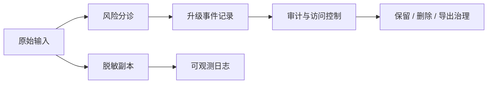

## 心理健康 Agent 是否可用，很多时候取决于数据和事件治理，而不是对话质量
这类系统接触的往往是高度敏感的情绪、事件、关系和危机信息。哪怕模型输出再稳，如果系统在日志里原样保存敏感文本、无法解释谁看过数据、无法响应删除请求、无法复盘高风险事件，它就不适合进入真实用户环境。对心理健康 Agent 来说，隐私和审计不是合规尾巴，而是安全设计主体。

## 解决什么问题
这一页重点补三个经常被忽略的对象：

1. 日志和 trace 如何避免直接暴露敏感个人信息。
2. 高风险事件发生后，系统如何保留足够审计证据又不过度留存原文。
3. 为什么数据保留、导出、删除和第三方访问边界必须被前置设计。

### 为什么这类场景不能默认“多记录一点方便调试”
因为调试便利和隐私保护在这里直接冲突。未经治理的原文日志、长会话存档和第三方模型调用，都可能把最敏感的信息暴露给不该看到的人。

## 核心对象
| 对象 | 作用 | 风险 |
| --- | --- | --- |
| Redaction Layer | 对日志和 trace 做脱敏 | 调试链路泄露用户敏感信息 |
| Audit Record | 保留风险判定、升级和访问痕迹 | 事件后无法复盘 |
| Retention Policy | 规定保存多久、怎么删除 | 系统长期持有高敏数据 |
| Access Boundary | 限制谁能访问会话与事件记录 | 内部越权访问 |

### 为什么原始对话不应默认进入长期日志
因为原始对话里可能包含个人身份、关系、地理位置、既往事件、医疗相关描述和危机语言。长期明文保留这些内容，本身就是重大风险源。

## 执行链路
一个更稳妥的治理链路通常会这样设计：

1. 输入进入系统时先确定是否需要脱敏副本。
2. 风险分诊和升级结果进入审计记录。
3. 高风险事件保留结构化事件记录，而不是无限期保存原始原文。
4. 访问、导出和删除请求进入单独治理流程。



### 为什么审计记录和原文不是一回事
审计记录的目标是让系统能回答“什么时候发生了什么、为什么升级、谁访问过”，而不是保存越多越好。很多情况下，结构化事件记录比完整原文更适合长期留存。

## 一致性与容错
治理失效时常见的问题包括：

1. 脱敏只做展示层，后端日志仍保留原文。
2. 高风险事件只有一条 free-form 说明，没有结构化触发原因。
3. 数据删除请求删除了业务主库，却没删除调试日志和导出缓存。
4. 第三方模型和工具接触了超出必要范围的原始内容。

### 为什么“删除请求”要覆盖所有副本
因为这类系统的数据通常不只存在一个位置：主存储、trace、告警、备份、导出文件和调试快照都可能持有同一段敏感信息。只删一处，治理就不完整。

## 性能模型
隐私治理同样是系统性能的一部分：

1. 脱敏增加额外处理步骤。
2. 审计记录增加存储和查询成本。
3. 精细访问控制增加链路复杂度。
4. 删除和导出能力增加后台治理成本。

### 为什么这些成本在这里不是“可选开销”
因为没有这些治理成本，系统将把代价转移成更严重的后果：敏感信息泄露、无法追责、无法满足删除请求、无法解释高风险事件处理链路。

## 生产排障
如果系统出现隐私或事件治理问题，建议优先检查：

1. 日志和 trace 是否真的经过脱敏。
2. 高风险事件是否有结构化审计记录。
3. 数据访问是否有权限和审批记录。
4. 删除请求是否覆盖所有副本。

### 适合长期保留的治理证据
1. 脱敏前后字段规则。
2. 事件类型与触发原因。
3. 数据保留天数配置。
4. 访问审计记录。

## 样例
下面这个事件记录比明文保存整段高风险对话更适合治理：

```yaml
incident_record:
  incident_type: high_risk_escalation
  session_id: mh_2081
  trigger_reason: self_harm_signal_detected
  escalated_to: human_review_queue
  raw_text_stored: false
```

而这个日志脱敏规则片段，则说明调试系统也要被纳入设计：

```json
{
  "redact_fields": ["name", "phone", "address", "free_text_identity_clues"],
  "store_raw_transcript_in_logs": false
}
```

## 相邻技术边界
这一页讨论的是高敏 Agent 的数据和事件治理，不等于模型回答策略本身，也不等于临床流程。它关心的是这类系统如何在安全与可追责之间取得工程平衡。

## 本页结论
心理健康 Agent 能否进入真实场景，往往不是由“是否会安慰人”决定，而是由脱敏、审计、保留、删除和访问控制是否完整决定。把治理链补上，系统才真正具备现实可行性。
