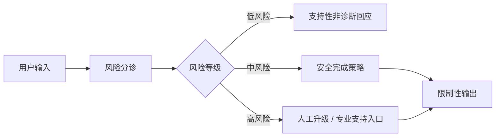

## 这类 Agent 最核心的控制点，不是生成更温柔的话，而是知道什么时候不应该继续普通对话
心理健康支持场景与普通陪伴、问答或任务自动化完全不同。只要系统面对的是潜在危机、强烈绝望、自伤线索、伤人风险或现实紧急危险，它就不能被设计成一个“继续陪聊试试看”的开放式生成器。风险分诊和人工升级，在这里不是附加功能，而是默认先决条件。

## 解决什么问题
这一页主要补高风险场景里最关键的三层边界：

1. 如何把低风险支持和高风险危机信号明确分开。
2. 为什么安全完成策略必须先于普通对话生成。
3. 为什么人工升级和外部专业支持入口必须进入系统状态机。

### 为什么“继续安慰”有时反而是风险
因为一旦已经进入危机或高风险场景，继续用开放式安慰文本维持普通对话，可能会延迟专业支持、掩盖真实风险，甚至让系统给出超出产品边界的错误暗示。

## 核心对象
| 对象 | 作用 | 失控后会出现什么问题 |
| --- | --- | --- |
| Risk Triage | 判断当前请求处于低、中、高哪类风险 | 危机场景被误当普通聊天 |
| Safe Completion Policy | 规定不同风险级别可输出什么 | 模型越界给出不当建议 |
| Escalation Gate | 决定何时触发人工或外部支持 | 高风险场景无人接管 |
| Session State | 记录本轮是否已进入高风险态 | 系统重复回到开放式生成 |

### 为什么分诊必须独立于生成
因为“生成得像是懂了”不等于“判断得真的对了”。风险分类最好拥有独立规则、阈值或专门的判定步骤，而不是让主模型顺手决定是否危险。

## 执行链路
更安全的心理健康 Agent 往往按下面顺序处理：

1. 先对输入做风险识别。
2. 低风险请求进入支持性、非诊断性回应。
3. 中高风险请求触发更严格的安全完成策略。
4. 满足升级条件时，优先引导人工或专业支持流程。
5. 会话状态进入高风险后，不应轻易退回普通模式。



### 什么叫安全完成而不是普通回答
安全完成不是“努力把话说圆”，而是在高风险情况下用更受限、更经过审核的方式结束或转移当前交互，避免系统继续生成未经验证的判断、承诺或处置建议。

## 一致性与容错
高风险系统里最需要防止的错误不是“没答上来”，而是：

1. 低估风险，继续普通聊天。
2. 高估风险，频繁误升级导致可用性极差。
3. 风险已经识别，但升级链路没有真正生效。
4. 升级后会话状态没有锁定，系统又回到开放式生成。

### 为什么误升级和漏升级要一起看
因为只追求召回率可能会让系统变成“动不动就中断”，只追求少打扰又会让真正高风险场景漏掉。这个组件的工程目标不是单一指标最大化，而是风险和体验之间受控平衡。

## 性能模型
心理健康 Agent 的“性能”不能只看延迟，还要看：

1. 高风险识别召回率。
2. 误升级率。
3. 人工响应触达时延。
4. 高风险态下不当生成率。

### 为什么这里的人工响应时延也是系统性能
因为升级如果发生得很快，但人工或外部支持触达很慢，系统安全效果依然不完整。高风险场景下，治理链的响应时间和模型延迟一样重要。

## 生产排障
如果系统在高风险样本上表现不稳，建议先看：

1. 风险判定规则是否覆盖真实高风险表达。
2. 高风险态下是否切换到了不同输出策略。
3. 升级链路是否真的通知到人工或外部支持入口。
4. 会话状态是否把高风险标记持久保存。

### 适合长期保留的排障证据
1. 风险标签。
2. 触发关键词或触发规则。
3. 是否触发升级。
4. 升级耗时。
5. 最终输出类型。

## 样例
下面这个风控策略比“请温柔一点回答用户”更接近真实治理对象：

```yaml
risk_response_policy:
  low_risk: supportive_non_diagnostic
  medium_risk: restrictive_support_with_review_hint
  high_risk: escalation_only
  lock_session_when_high_risk: true
```

而这个升级记录片段，则有助于后续复盘：

```json
{
  "session_id": "mh_2081",
  "risk_level": "high",
  "escalated": true,
  "safe_completion_mode": "escalation_only",
  "handoff_target": "human_review_queue"
}
```

## 相邻技术边界
这一页讨论的是风险分诊和升级链路，不等于医学判断，也不等于心理咨询本身。系统的工程目标是约束和转交，而不是取代专业人员。

## 本页结论
心理健康 Agent 真正的控制力，来自风险分诊、安全完成和人工升级三层一起工作。没有这三层，任何“会聊天”的优势都不足以让系统进入高风险场景。
