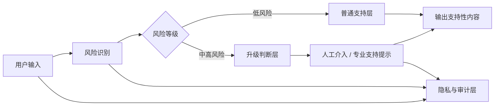

---
kb_id: ai-agent/cases/mental-health-agent-safety-escalation-case
title: 心理健康 Agent 案例：风险分级、升级链路、人工介入与隐私治理为什么比“会聊天”更重要
domain: ai-agent
component: ai-mental-health-agent
topic: mental-health-agent-safety-escalation
difficulty: advanced
status: reviewed
sidebar_position: 2
version_scope: 实践资料 resonant-soul repository, WHO guidance, OpenAI safety guide, and 988 Lifeline website as verified on 2026-05-12
last_verified_at: '2026-05-12'
source_ids:
  - practice-resonant-soul
  - camel-ai-docs
  - who-ai-health-ethics-governance
  - openai-safety-best-practices
  - lifeline-988-official
claim_ids:
  - practice-p1-claim-0009
tags:
  - ai-agent
  - mental-health
  - safety
  - human-in-the-loop
  - privacy
---
## 这类系统最危险的误答，不是内容少，而是把它讲成“AI 会安慰人”
心理健康支持型 Agent 是高风险系统。它不能被讲成“一个更懂共情的话术机器人”，也不能被包装成“AI 治疗师”或“AI 医生”。真正决定这类系统能不能进入真实场景的，是风险分级、升级链路、人工介入和隐私治理，而不是聊天体验本身。

本页只讨论高风险 Agent 系统设计边界，不提供诊断、治疗或危机处置建议。如果用户处于现实紧急危险或危机状态，应联系当地紧急服务或专业危机支持渠道。在美国语境下，988 Suicide and Crisis Lifeline 是官方危机支持入口之一。

## 这类系统到底解决什么问题
一个心理健康支持型 Agent，理论上可以帮助：

- 记录情绪和事件
- 组织日记或自我反思内容
- 提供非诊断性的支持性回应
- 推荐已审核的放松训练或资源
- 在高风险信号出现时触发升级和人工介入

所以它的价值不在“代替专业人员”，而在“支持、记录、筛查、升级”。

## 核心对象怎么拆
### 普通支持层
负责非诊断性的情绪记录、日记整理、放松训练建议和低风险陪伴式回应。这一层的核心约束是：不越界解释，不给出医疗判断。

### 风险识别层
负责识别高风险信号，例如：

- 自伤或伤人表达
- 强烈绝望、失控或危机语言
- 被虐待、被威胁或紧急危险场景
- 药物、过量、武器等危险上下文
- 用户明确请求紧急帮助

这一层不能只靠主模型自由发挥，必须结合规则、分类器、关键词、阈值和人工复核策略。

### 升级与转人工层
负责在高风险场景中停止普通生成，并引导更安全的后续动作，例如：

- 输出危机支持提示
- 建议联系专业人员或当地紧急服务
- 在产品允许且合法合规时触发人工介入
- 记录升级原因和处理链路

### 数据与隐私治理层
负责敏感心理数据的保存、访问、脱敏、删除和审计。没有这一层，系统不应进入真实用户场景。

## 一条更完整的执行链怎么走
1. 用户输入进入系统。
2. 系统先做风险预判，而不是直接生成响应。
3. 低风险内容进入普通支持层。
4. 中高风险内容进入升级判断层。
5. 需要时触发人工介入、危机提示或终止普通聊天逻辑。
6. 全程记录风险标签、触发原因、人工介入状态和数据访问轨迹。



## 为什么风险分级比聊天质量更重要
这类系统里，最关键的不是回答看起来是否温柔，而是：

- 什么时候不能继续普通聊天。
- 什么时候必须停止开放式生成。
- 什么时候必须引导外部专业支持。

这说明 human-in-the-loop 在这里不是体验优化，而是安全控制面。没有明确升级链路，系统再“会聊天”都可能在关键时刻误导用户。

## 量表、统计和模型输出的边界
如果系统里有量表评估，例如 SAS 之类的自评量表，也不能让模型随意把结果解释成诊断结论。更安全的做法是：

- 量表仅作为用户自我记录和风险参考
- 结果解释使用固定、审核过的文本
- 高风险分数触发专业建议或人工升级
- 量表版本、时间、输入和结果全部可审计

这条边界一定要主动讲出来，否则很容易把工具化评估误答成医疗判断。

## 隐私治理到底要回答什么
心理健康相关数据属于高度敏感信息。系统至少要明确：

- 哪些数据会被保存
- 保存多久
- 谁能访问
- 是否用于训练
- 用户能否导出和删除
- trace 与日志是否脱敏
- 第三方模型或工具是否接触原始文本

如果这些问题答不清，系统就算功能再完整，也不应该进真实场景。

## 性能模型和质量指标怎么看
这类系统的指标不能只看用户满意度，还要看：

- 高风险识别召回率
- 误升级率
- 危机提示稳定触发率
- 不当医疗建议率
- 人工介入时延
- 数据删除请求成功率
- 隐私泄露事件数

### 风险治理样例
```yaml
safety_control_snapshot:
  risk_classifier: enabled
  self_harm_keywords: enabled
  crisis_escalation_threshold: high
  human_review_required_for_high_risk: true
  pii_redaction_in_logs: true
  data_retention_days: 30
```

这个样例表达的是：这类系统真正的“配置核心”不是 prompt 文案，而是风险和数据治理策略。

## 生产排障应该怎么做
- 先看风险识别是否失效或阈值不合理。
- 再看升级链路是否真正阻止了普通生成。
- 再看人工介入是否及时、是否可追踪。
- 最后看日志、存储和第三方调用是否越界暴露了敏感数据。

## 本页结论
心理健康 Agent 的重点不是会不会聊天，而是能否把普通支持、风险识别、升级转人工和隐私治理组织成一套安全系统。只有把这些边界讲清，相关案例页才算真正有工程价值。
