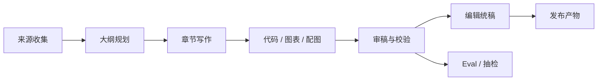

---
kb_id: ai-agent/cases/multi-agent-technical-writing-pipeline-case
title: 多 Agent 技术写作案例：研究、结构、代码、图表、审稿与发布治理为什么必须串成一条证据链
domain: ai-agent
component: multi-agent-writing
topic: multi-agent-technical-writing-pipeline
difficulty: advanced
status: reviewed
sidebar_position: 4
version_scope: 实践资料 vibe-blog repository and official eval docs as verified on 2026-05-12
last_verified_at: '2026-05-12'
source_ids:
  - practice-vibe-blog
  - openai-agent-evals-guide
  - openai-evaluation-best-practices
claim_ids:
  - practice-p1-claim-0011
tags:
  - ai-agent
  - multi-agent
  - writing-agent
  - technical-writing
  - eval
---
## 长文写作系统真正难的，不是让模型写很多字，而是让整条内容生产链可验证、可审稿、可回溯
多 Agent 长文写作很容易被讲成“研究 Agent + 写作 Agent + 审稿 Agent”的漂亮分工，但如果没有证据链和发布治理，这种系统最后常常只会放大错误。技术写作的难点不在字数，而在：

- 资料来源是否可信。
- 大纲是否覆盖问题而不跑题。
- 代码、图表和文字是否一致。
- 审稿意见是否真的回流到最终版本。
- 最终内容是否能追溯到来源和评估结果。

所以这类系统本质上更像内容生产流水线，而不是聊天增强器。

## 这类系统要解决什么问题
成熟的技术写作系统至少要处理：

- 资料检索与证据筛选
- 大纲规划与章节分工
- 分章节写作与风格统一
- 代码示例、图表和插图配套生成
- 事实校验、引用校验和风险审查
- 发布格式化与最终评审

这说明它不是一个单步模型生成任务，而是一条多阶段工作流。

## 核心对象怎么拆
### Source Set
原始来源集合，决定写作内容能不能站得住。来源不清，后续所有 Agent 都可能在错误前提上工作。

### Outline
大纲是结构骨架。好的大纲要覆盖主题、控制篇幅、避免重复，并为后续写作提供章节合同。

### Draft Unit
每个章节或小节都应该被看作独立写作单元，拥有自己的输入来源、输出草稿和校验结果。

### Code / Diagram / Visual Assets
技术长文常常需要代码、Mermaid 图、架构图或配图。它们不应被当作装饰，而应与正文一起被审稿和验证。

### Review Record
审稿结果必须结构化保存，至少包括事实问题、逻辑问题、风格问题、版权或安全风险。

### Final Publish Package
最终产物不只是正文文本，还包括引用、图表、代码附件、发布格式和审稿状态。

## 一条更完整的内容链路
1. Research Agent 收集并筛选资料。
2. Outline Agent 生成大纲并绑定关键来源。
3. Writing Agent 按章节输出草稿。
4. Code / Diagram / Visual Agent 生成配套技术资产。
5. Review Agent 进行事实、逻辑、风格和风险审查。
6. Editor Agent 汇总修改并生成最终发布稿。
7. Eval 与人工抽检对产出质量进行最后确认。



## 为什么证据链是第一原则
多 Agent 分工本身并不保证正确，相反，它还可能让错误被层层放大。所以必须建立证据链：

- 一个观点来自哪个来源。
- 一个段落对应哪组研究笔记。
- 一个图表或代码块服务哪个章节结论。
- 一次审稿修改修正了什么问题。

只有这样，后续才能回答“这一段为什么这么写”“这一张图凭什么这么画”。

## 审稿和 Eval 为什么必须前置
如果只靠肉眼感觉“看起来不错”，多 Agent 写作系统很难稳定迭代。更成熟的做法是把 eval 与人工审稿前置为正式步骤，至少要覆盖：

- 事实正确性
- 引用完整性
- 章节覆盖与结构平衡
- 代码是否可运行
- 图文一致性
- 风格一致性
- 敏感内容与版权风险

这也是为什么官方评估资料有价值，它提醒我们内容系统不能只按“写出来了”验收。

## 一致性与容错要怎么讲
多 Agent 写作系统最常见的一致性问题有：

- Research Agent 和 Writing Agent 使用了不同版本的来源。
- Diagram Agent 画出的结构图和正文描述不一致。
- Code Agent 给出的示例没有通过验证。
- Review Agent 提出的意见没有回流到最终稿。

因此系统需要明确的版本和回写机制，而不是让每个 Agent 自由发挥后再手工拼接。

## 性能模型怎么看
长文写作系统的性能问题通常不在单次生成，而在整条链：

- research 阶段外部检索慢
- 大纲反复迭代
- 代码和图表需要单独验证
- 审稿环节耗时高
- 最终统稿和格式化增加额外成本

### 写作预算样例
```yaml
writing_pipeline_budget:
  source_limit: 20
  outline_revision_rounds: 2
  chapter_parallelism: 4
  code_validation_required: true
  review_gate: factual_and_copyright
  publish_format: markdown_with_mermaid
```

这个样例强调：技术写作系统的预算是全链路预算，而不是“生成多少 token”。

## 生产排障怎么做
- 先看问题出在来源、结构、正文、代码、图表还是审稿回流。
- 再看出错环节是否缺少正式输入输出合同。
- 再看 eval 是否覆盖到了该类问题。
- 最后看是否存在版本漂移或人工审稿未回写的情况。

## 本页结论
多 Agent 技术写作系统的核心，不是把写作拆给多个 Agent，而是把研究、结构、正文、代码、图表、审稿和发布整理成一条有证据链的生产流水线。只有这样，内容系统才既能提高效率，又不会把错误规模化放大。
