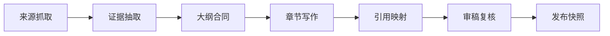

## 多 Agent 写作一旦进入生产，最先暴露的问题往往不是文风，而是来源、版本和引用失控
很多多 Agent 写作系统在演示时都能产出很流畅的长文，但只要开始要求“这句话来自哪里”“这段代码对应哪个版本”“图表是否真的支撑结论”，系统就会迅速暴露短板。原因很简单：写作流水线不只是生成文本，它还要管理来源、证据、版本、引用和发布时的可核对性。

如果没有这些治理对象，系统会出现几类高频故障：同一个结论引用了不同版本资料，正文和图表来自不同轮草稿，审稿阶段修掉的问题又在统稿时被重新带回，最后文章看起来完整，实际上却没有一条可靠的证据链。

## 解决什么问题
这一页聚焦四个基础问题：

1. 资料进入写作流水线后，怎样从“原始来源”变成“可绑定证据”。
2. 为什么章节草稿、代码块、图表和引用必须共享同一套版本语义。
3. 为什么长文系统必须显式管理 citation，而不能只让模型临场生成链接或出处描述。
4. 当文章需要长期维护时，怎样让修改、审稿和回滚都可追溯。

## 核心对象
| 对象 | 作用 | 如果失控会怎样 |
| --- | --- | --- |
| Source Record | 记录原始资料的标题、URL、版本、抓取时间和可信度 | 后续无法确认内容究竟来自哪里 |
| Evidence Unit | 从来源中抽出的可复核证据片段 | 观点无法绑定具体证据 |
| Outline Contract | 大纲层面对章节目标、证据范围和输出格式的约束 | 后续 Agent 各写各的，章节漂移 |
| Draft Revision | 章节草稿的版本快照 | 审稿意见和最终稿无法对齐 |
| Citation Map | 段落、图表、代码与来源证据之间的映射表 | 发布时只能“看起来像有引用” |
| Publish Snapshot | 最终发布包及其依赖版本 | 后期回溯无法复现当时成文状态 |

### 为什么证据单元不能等于整篇来源
因为技术写作真正需要绑定的不是“我看过这篇文档”，而是“这一段结论具体依赖了哪几条证据”。如果只记录整篇来源，后续很难判断某段文字是从规范定义推出来的，还是模型基于多条资料综合生成的。

## 执行链路
多 Agent 写作里的证据治理链路，通常应当先于正文生成：

1. 研究 Agent 抓取来源，并生成标准化 `Source Record`。
2. 证据抽取阶段把关键事实、限制条件、版本边界整理为 `Evidence Unit`。
3. 大纲阶段把证据分配到章节合同，明确每章允许使用哪些来源。
4. 写作阶段输出段落时，不只生成正文，还生成段落与证据的绑定信息。
5. 审稿阶段检查段落、图表、代码和引用映射是否一致。
6. 发布阶段冻结最终快照，记录来源版本、段落版本和审稿状态。



### 证据绑定快照样例
```yaml
citation_map:
  paragraph_id: sec_3_p_2
  claim: "Kafka 同一 consumer group 内一个分区同一时刻只分配给一个消费者"
  evidence_units:
    - kafka_consumer_doc_001
    - kafka_group_doc_004
  draft_version: v7
  review_status: approved
```

这个样例说明，真正可审计的不是“文章整体用了哪些资料”，而是某一条结论在发布时绑定了哪些证据对象。

## 一致性与容错
多 Agent 写作系统最容易出问题的地方，恰恰是对象之间的一致性：

1. Research Agent 更新了资料，但 Outline Agent 仍然沿用旧版本大纲。
2. Diagram Agent 根据旧结论绘图，正文却已经被 Review Agent 改过。
3. Code Agent 更新了示例，Citation Map 却没有同步变更来源描述。
4. 发布环节只冻结正文，没有冻结证据映射和审稿记录。

### 为什么“版本冻结”比“能不能继续生成”更重要
因为生产写作系统不是一次性对话，而是可持续维护的知识资产。只要没有冻结版本，后续任何修订都会让团队不知道“这次改动到底影响了哪些章节和引用”。系统此时最危险的不是生成失败，而是生成看起来成功、但再也回不到一个可复核的状态。

## 性能模型
证据治理会增加复杂度，但这是必要成本，不是可选装饰：

1. 来源抓取和去重会增加前置耗时。
2. 证据抽取和章节分配会引入额外结构化步骤。
3. 审稿时需要对正文、代码、图表和引用做交叉校验。
4. 发布快照需要保存更多元数据，但能大幅降低后期维护成本。

### 为什么写作成本不能只按 token 计算
因为长文系统真正贵的往往不是正文 token，而是反复校对、重新绑定证据、追踪版本漂移和处理发布回滚。一个不做证据治理的系统可能单次生成更便宜，但长期维护时成本通常更高。

## 生产排障
如果文章发布后被质疑“这段话来源不明”或“图文不一致”，排障顺序应当是：

1. 先看段落是否绑定了明确的证据对象。
2. 再看当前段落版本和审稿版本是否一致。
3. 再查图表、代码和正文是否引用了同一轮结论。
4. 最后才判断是不是模型生成质量问题。

### 发布审计样例
```json
{
  "article_id": "spark-runtime-2026-05",
  "publish_snapshot": "release-12",
  "sources_locked": 18,
  "paragraphs_without_evidence": 0,
  "diagrams_out_of_sync": 1,
  "first_action": "rebuild citation map for diagram assets"
}
```

这个样例表达的是：很多表面上的“内容问题”，本质上其实是证据映射和版本同步问题。

## 相邻技术边界
这一页讲的是证据治理，不是写作提示词技巧，也不是排版系统。Prompt 可以提升表达质量，但不能替代证据绑定；向量检索可以帮助找资料，但不能自动决定哪些段落应引用哪条来源；发布系统可以完成导出，但不能替代审稿和版本冻结。

## 本页结论
多 Agent 写作系统想从“会生成长文”走向“能沉淀长期可维护内容”，就必须把来源分层、证据绑定、版本冻结和引用治理放到正文之前设计。只要这条链不完整，内容越长，风险往往越大。
