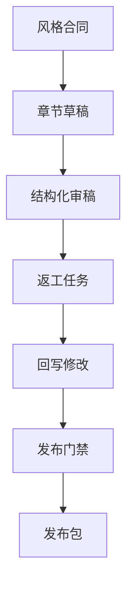

## 技术长文真正难的不是写出一版，而是让多轮修改之后仍然保持结构、语气和事实口径统一
多 Agent 写作系统经常把研究、写作、图表、代码和审稿拆成多个角色协同。拆分之后效率确实可能提升，但同时会带来一个新的系统问题：每个 Agent 都可能在自己的局部目标上表现良好，整篇文章却在风格、口径、术语和信息密度上越来越不一致。

因此，成熟系统必须把“统一性”当成控制面对象处理，而不是指望最后一个总编 Agent 或人工编辑兜底。否则每多一轮修改，返工成本都会指数上升。

## 解决什么问题
这一页回答的是：

1. 多 Agent 写作里，风格统一为什么必须显式建模。
2. 审稿意见为什么必须可回写、可验证，而不是停留在评论区。
3. 为什么发布前需要明确的 gate，而不是“大家看起来都差不多了”。
4. 当返工发生时，怎样定位到底是研究问题、写作问题还是审稿问题。

## 核心对象
| 对象 | 作用 | 典型风险 |
| --- | --- | --- |
| Style Contract | 统一术语、语气、句长、格式和图文规则 | 不同章节像不同人写的 |
| Review Finding | 结构化记录事实、逻辑、风格和风险问题 | 评论散落，无法闭环 |
| Rewrite Task | 审稿意见落地后的返工任务 | 修改责任和范围不清 |
| Acceptance Gate | 发布前的质量门禁规则 | 文章在问题未关闭时直接上线 |
| Publish Checklist | 发布所需的最终检查项 | 代码、图表、引用遗漏 |

### 为什么风格合同必须前置
因为风格不是“最后润色一下”的问题。技术长文中的标题层级、术语译法、代码解释方式、是否给出限制条件，这些都会影响后续所有 Agent 的输出。如果前面没有统一约束，后面只能靠低效率的人肉合并。

## 执行链路
更稳的多 Agent 写作闭环一般包含下面几步：

1. 在大纲阶段生成 `Style Contract`，规定术语、语气、示例结构和图文规范。
2. Writing Agent 按章节生成草稿，并附带自检结果。
3. Review Agent 将问题写成结构化 `Review Finding`，而不是自然语言吐槽。
4. Rewrite Agent 或 Editor Agent 根据 finding 生成返工任务并回写。
5. 质量门禁检查所有 finding 是否关闭、引用是否完整、图文是否一致。
6. 通过 gate 后再生成发布包。



### 审稿记录样例
```json
{
  "finding_id": "review-114",
  "section": "4.2",
  "type": "style-and-logic",
  "issue": "本节先给结论后给限制条件，和全篇写法不一致",
  "owner": "editor-agent",
  "status": "open",
  "must_verify_after_fix": true
}
```

这个样例强调的是：审稿意见要能进入执行链，而不是只停留在“建议改一下”。

## 一致性与容错
多 Agent 写作系统里的统一性问题通常有三种来源：

1. 章节在不同轮生成中使用了不同术语约定。
2. 审稿只指出了问题，但没有形成回写后的复核动作。
3. 发布只检查正文，没有检查图表、代码和引用是否跟着改动一起更新。

### 为什么最后总编兜底通常不够
因为总编或人工编辑面对的是已经长出来的复杂成品。如果前面 8 个章节、3 张图、5 段代码都在不同轮次被改过，最后统一口径的工作量会非常大，而且很容易漏改。系统设计上更稳的做法，是让每次审稿都携带闭环信息，尽早消化偏差。

## 性能模型
风格统一和发布门禁会带来额外时间开销，但它们本质上是在降低返工放大效应：

1. 早期建立风格合同，会减少后续大面积改写。
2. 结构化审稿能减少多轮口头沟通和人工比对。
3. 发布门禁会增加上线前等待，但能明显降低上线后返修。
4. 对长文系统来说，越晚发现风格与结构问题，修复成本越高。

### 为什么这类系统的瓶颈常常不在模型生成
因为长文生产的慢点常常在审稿、统一口径、图文回写和发布校对。模型能很快生成一版草稿，但能否稳定变成可发布成品，取决于后半段治理链路。

## 生产排障
如果发布后发现文章风格散、逻辑跳、同一概念多种叫法，建议这样定位：

1. 先检查是否存在明确的 style contract。
2. 再看问题是否在审稿阶段已经被发现但没有回写。
3. 再查返工任务是否只改了正文，没有改动图表和代码说明。
4. 最后才考虑是不是需要重跑整章写作。

### 发布门禁快照样例
```yaml
publish_gate:
  style_contract_loaded: true
  open_review_findings: 0
  unresolved_term_conflicts: 1
  diagram_sync_check: failed
  final_action: block_publish
```

这个样例说明，成熟系统要敢于阻止发布，而不是把明显未闭环的问题带上线。

## 相邻技术边界
这一页讨论的是内容生产治理，不是编辑器功能本身，也不是单纯的提示词工程。好的 prompt 可以降低风格漂移，但不能替代审稿回写；好的协作框架可以并行生成，但不能天然保证统一性；最终发布系统可以导出 Markdown 或网页，但不能自动判断是否满足质量门禁。

## 本页结论
多 Agent 写作系统若想稳定产出可发布技术长文，必须把风格合同、结构化审稿、回写闭环和发布门禁做成一条正式链路。否则系统越擅长并行生成，最终的返工风险往往越高。
