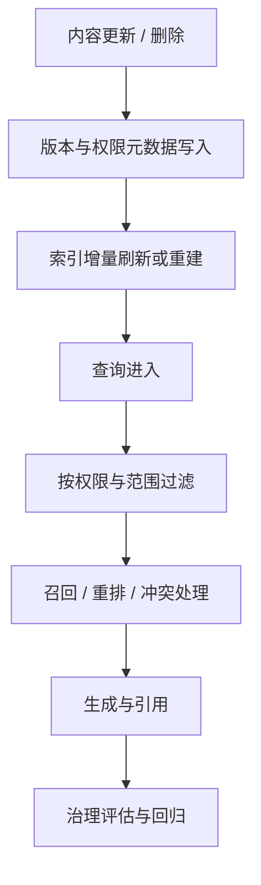

## 很多 RAG 系统不是答不出来，而是答得像真的一样，却在新鲜度、权限或冲突知识上悄悄出错
一个最小 RAG Demo 最容易忽略的事实是：真正进入生产后，最棘手的问题经常不在“能不能召回”，而在“召回的内容该不该被这个用户看到、是不是最新版本、与其他来源有没有冲突、改完系统后效果有没有退化”。这些问题如果没有单独治理层，系统看起来能用，实际上风险很高。

这也是为什么很多团队会在早期觉得 RAG 很顺，到了真实知识库场景却发现故障越来越隐蔽、越来越难复盘。

## 解决什么问题
这一页重点解决四类治理问题：

1. 新鲜度如何进入 RAG 设计，而不是只靠重建一次索引。
2. 权限为什么必须在索引和检索两端一起设计。
3. 当多个来源内容冲突时，系统应该怎样显式处理。
4. 为什么治理效果必须进入评估闭环，而不是只测答案是否通顺。

### 为什么这四类问题要放在同一页
因为它们共同决定“证据是否可信”：

1. 新鲜度决定证据是不是过期。
2. 权限决定证据是否可见。
3. 冲突治理决定证据是否自洽。
4. 评估决定这些规则有没有真的生效。

## 核心对象
| 对象 | 作用 | 如果没有会怎样 |
| --- | --- | --- |
| Version Metadata | 标记文档版本、更新时间和生效范围 | 旧内容可能盖过新内容 |
| Permission Metadata | 标记租户、部门、角色或用户可见范围 | 检索可能越权 |
| Delete / Refresh Signal | 标记删除、失效或重建需求 | 索引里残留脏数据 |
| Conflict Policy | 定义多来源冲突时的处理规则 | 系统会随机引用互相矛盾的证据 |
| Eval Dataset | 覆盖新鲜度、权限、冲突和拒答样例 | 无法证明治理是否有效 |
| Audit Trace | 保存召回证据、过滤条件和最终引用 | 事后很难解释为什么答成这样 |

### 为什么元数据不是附属字段
很多团队把元数据当成“有空再补”的附加信息，但对治理来说，元数据其实是硬边界：

1. 没有版本元数据，新鲜度只能靠猜。
2. 没有权限元数据，检索层无法做正确裁剪。
3. 没有删除或更新信号，索引的正确性无法长期维持。

## 执行链路
治理链路和生成链路一样重要，完整系统至少要回答下面几个问题：

1. 新文档如何进入索引，旧文档如何失效或删除。
2. 权限标签在哪里生成，怎样写入可过滤字段。
3. 查询时如何按用户身份或租户范围做检索裁剪。
4. 多个证据冲突时，系统是选择最新版本、最高信任来源，还是显式提示冲突。
5. 上述规则如何进入评估集，确保每次改动都能回归验证。



### 一个适合治理设计的元数据样例
```json
{
  "doc_id": "policy-2026-0421",
  "version": "v4",
  "updated_at": "2026-04-21T08:00:00Z",
  "tenant": "finance",
  "roles": ["manager", "auditor"],
  "status": "active",
  "supersedes": "policy-2025-1103"
}
```

这个对象的重点在于：新鲜度、权限和冲突治理都需要明确字段支撑，而不是靠检索后再猜。

## 一致性与容错
RAG 的治理一致性主要看四个层面：

1. 新鲜度一致性：索引是否反映当前有效知识。
2. 权限一致性：同样的问题，不同用户得到的证据范围是否合理不同。
3. 冲突一致性：多个来源不一致时，系统是否按同一规则处理。
4. 评估一致性：这些规则是否能在变更后持续被验证。

### 冲突知识为什么不能靠模型自由发挥
因为模型生成能力再强，也无法替代系统级政策：

1. 哪个来源更权威，需要业务规则。
2. 哪个版本更新，需要时间和版本元数据。
3. 哪些冲突应该拒答或提示人工确认，需要显式策略。

如果这些都交给模型临场判断，系统就无法稳定复核。

## 性能模型
治理层也会显著影响性能预算：

1. 权限过滤会增加查询复杂度。
2. 增量索引和重建策略会影响数据进入系统的时延。
3. 冲突治理可能需要额外的信任排序或规则判断。
4. 评估集越完整，回归成本越高，但发布风险会显著降低。

### 为什么新鲜度问题经常被误判成检索问题
因为很多表象都类似：

1. 用户说“系统答错了”，表面像召回错。
2. 实际上是旧版本内容还留在索引里。
3. 或者删除信号没有同步，导致已废弃内容仍被检索到。

所以排障时一定要先问：错的是“找不到”，还是“找到的是旧的或不该看的”。

## 生产排障
RAG 治理故障最适合按下面顺序排查：

1. 先确认文档版本是否已正确进入索引。
2. 再确认权限标签是否存在、是否可过滤、是否被查询使用。
3. 如果同一主题存在多条来源，再确认冲突规则和信任排序是否按预期执行。
4. 最后用评估集验证这次修复是否只修好了一个样例，还是确实修好了整类问题。

### 四类高频治理故障
1. 新制度发布后系统还在答旧制度：先查刷新与重建链路。
2. 不同租户看到彼此内容：先查权限元数据写入和 query filter。
3. 两篇文档观点冲突，系统随机挑一篇：先查冲突规则和信任层。
4. 线上修好后又回归：先查评估集是否把这类样本沉淀下来。

### 一份治理评估样例
```yaml
rag_governance_eval:
  freshness_cases:
    - old_doc_should_not_win
  permission_cases:
    - user_a_cannot_see_tenant_b
  conflict_cases:
    - prefer_latest_policy_version
    - escalate_on_equal_trust_conflict
  regression_rule:
    - run_on_every_index_schema_or_prompt_change
```

这个样例强调的不是格式统一，而是治理规则必须进入回归体系。

## 相邻技术边界
这一页讲的是治理闭环，不是检索算法细节，也不是 UI 体验设计。边界可以这样理解：

1. 和检索对象页的边界：检索对象页解释证据怎么找，这一页解释找到的证据是否可信。
2. 和 memory 的边界：memory 解决长期会话状态，治理层解决共享知识资产的可见性和时效性。
3. 和纯评估页的边界：纯评估页解释通用测法，这一页强调治理规则必须被评估覆盖。

## 本页结论
RAG 进入真实知识场景后，真正决定可靠性的往往不是向量相似度，而是新鲜度、权限、冲突知识和评估闭环。只有把这四层一起设计，系统才能从“会回答”走向“回答可信、可控、可回归”。
