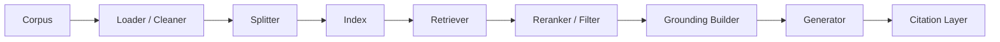

## 把 RAG 讲成“向量库加大模型”，等于把真正决定质量的中间层全部抹掉了
很多人第一次讲 RAG，会用一句很顺口的话概括：把文档向量化，查几个最相似片段，再让模型回答。这个概括能帮助建立最初直觉，但它有一个致命副作用：把所有中间对象都压扁成了一个黑盒。结果就是一旦系统不准，大家只能说“RAG 不行”或者“换个向量库试试”，却说不清到底是哪一层失真。

RAG 真正难的地方，不是“能不能查到一点内容”，而是“证据如何进入、如何筛、如何组、如何约束生成”。这四步每一步都对应独立对象。

## 解决什么问题
这一页聚焦三个问题：

1. 一个完整 RAG 系统至少包含哪些核心对象。
2. 为什么 retrieval 和 grounding 是两条不同但相连的责任链。
3. 当答案不可信时，应该先怀疑哪一层，而不是笼统说“向量检索不好用”。

### 为什么要把 retrieval 和 grounding 分开
retrieval 的任务是找候选证据，grounding 的任务是把候选证据变成真正约束生成的上下文。这两层都重要，但责任完全不同：

1. retrieval 决定你有没有拿到可能相关的内容。
2. grounding 决定模型看到的到底是哪些证据、怎样排序、有没有引用出口。

## 核心对象
| 对象 | 作用 | 失控后会发生什么 |
| --- | --- | --- |
| Corpus | 原始知识集合 | 原文质量差，后面全链路都被污染 |
| Loader | 读取原始资料与附件 | 漏页、乱码、格式缺失 |
| Cleaner | 去噪与结构化 | 页眉页脚、重复段落进入索引 |
| Splitter | 决定 chunk 粒度 | 证据被切碎或噪声过大 |
| Embedding / Index | 形成可检索表示 | 相似搜索无法稳定召回 |
| Retriever | 召回候选证据 | 明显相关内容找不到 |
| Reranker | 在候选集中重新排序 | top_k 被噪声片段占满 |
| Grounding Builder | 选择并压缩最终证据上下文 | 真实证据没有进入模型视野 |
| Generator | 在证据约束下组织答案 | 语言流畅但没有证据支撑 |
| Citation Layer | 让输出能回到原证据 | 回答看似合理但不可复核 |

### 这些对象为什么不能孤立记忆
因为它们必须放回同一条责任链里：谁把原始知识送进系统，谁把候选证据筛成最终证据，谁决定答案能否回到来源。只背对象名，不理解责任链，后续无法排障。

## 执行链路
完整的 RAG 证据链至少要经过下面这些状态变化：

1. 原始知识从 corpus 进入 loader 和 cleaner。
2. 清洗后的内容被 splitter 划分为适合检索与引用的证据块。
3. 证据块和元数据进入索引。
4. 查询到来后，retriever 先召回候选集。
5. reranker 或过滤层把候选集压缩成更可信的证据集。
6. grounding builder 决定哪些证据真正进入 prompt。
7. generator 在这些证据约束下组织回答。
8. citation layer 记录答案如何回到原文。



### 一个最小上下文组装样例
```python
def build_grounding_context(query, retrieved_docs):
    ranked = rerank(query, retrieved_docs)
    selected = ranked[:4]
    return "\n\n".join(
        f"[source={doc['doc_id']}] {doc['text']}" for doc in selected
    )
```

这个伪代码表达的核心不是语言本身，而是 retrieval 结果并不会自动等于最终上下文，中间还需要显式的 grounding 选择。

## 一致性与容错
RAG 的一致性，不是“模型有没有回答”，而是“答案是否真的被可追溯证据支撑”。这要求三层同时成立：

1. 检索一致性：候选证据真的和问题相关。
2. 组装一致性：真正进入上下文的是高价值证据，而不是相似但无关的噪声。
3. 引用一致性：答案里的事实能回到具体来源。

### 为什么仅有向量相似度远远不够
向量相似度只能说明“表达空间里接近”，不能自动说明：

1. 片段是否足够完整。
2. 片段是否满足当前业务域和权限条件。
3. 片段是否就是问题真正需要的证据。
4. 多个片段之间是否互相矛盾。

所以很多系统“召回看起来有点像”，最后仍然答错，根因不是模型不聪明，而是 grounding 失控。

## 性能模型
RAG 的性能主要受三段预算影响：

1. 检索预算：索引、召回、过滤和重排要花多少时间。
2. 上下文预算：最终证据要占多少 token。
3. 生成预算：模型要花多少 token 组织答案。

### 为什么 grounding 经常是被忽略的成本中心
因为很多系统只关注向量库查询时间，却忽略：

1. 重排调用本身可能有额外延迟。
2. 上下文拼装可能把不必要的冗长证据塞给模型。
3. 引用层如果设计不好，会让答案后处理变复杂。

因此性能优化不能只看“检索多快”，还要看“最终送进模型的证据密度高不高”。

## 生产排障
当 RAG 回答不准时，最有效的排障顺序通常是：

1. 先看 retriever 有没有找回正确候选。
2. 如果候选集里有正确证据，再看 reranker 和 grounding 有没有把它丢掉。
3. 如果最终上下文里已有正确证据，再看生成阶段有没有跑偏。
4. 如果答案正确但引用不对，再看 citation layer 的映射和格式化。

### 四种高频故障与第一责任层
1. 完全答非所问：先查 retriever。
2. 找到相关文档但引用的是旁支内容：先查 reranker 和 grounding。
3. 已经给到正确证据，答案仍然胡写：先查 generator 的约束策略。
4. 答案大体正确，但无法追溯来源：先查 citation layer。

### 一份最小诊断记录
```yaml
rag_trace:
  query: "用户问题"
  retrieved_doc_ids:
    - doc_17
    - doc_03
    - doc_09
  grounded_doc_ids:
    - doc_03
    - doc_09
  answer_has_citation: false
  first_suspect: "grounding_or_citation"
```

这类记录非常适合做离线排障，因为它把“检索到什么”和“真正使用什么”分开保存了。

## 相邻技术边界
这一页讲的是 RAG 的对象与证据链，不是所有知识应用都必须按完全相同的形式实现。边界可以这样理解：

1. 和 memory 的边界：memory 解决长期状态连续性，RAG 解决外部知识召回与证据约束。
2. 和 fine-tuning 的边界：fine-tuning 改模型参数，RAG 改外部知识与上下文。
3. 和搜索引擎的边界：搜索引擎负责找文档，RAG 还要把文档转成可生成、可引用的答案上下文。

## 本页结论
RAG 绝不是“向量库加大模型”这么简单。真正决定质量的，是 Loader、Splitter、Retriever、Reranker、Grounding、Generator 和 Citation 这一整条证据链。只有把这些对象拆开，系统才真正具备可解释、可排障和可优化的空间。
