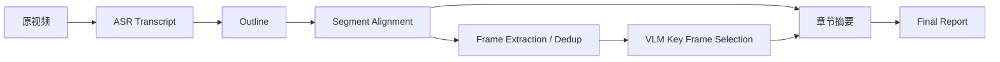

---
kb_id: ai-agent/cases/video-note-agent-asr-vlm-pipeline-case
title: 视频笔记 Agent 案例：ASR、时间戳、章节对齐、关键帧与最终报告为什么必须是同一条证据链
domain: ai-agent
component: video-note-agent
topic: asr-vlm-video-report-pipeline
difficulty: advanced
status: reviewed
sidebar_position: 3
version_scope: 实践资料 video-devour repository as verified on 2026-05-12
last_verified_at: '2026-05-12'
source_ids:
  - practice-video-devour
  - openai-agents-sdk-docs
claim_ids:
  - practice-p1-claim-0010
tags:
  - ai-agent
  - video-agent
  - asr
  - vlm
  - report-generation
---
## 视频报告系统最容易被讲浅，因为很多人只看到“转文字再总结”
如果把视频报告系统理解成“先做 ASR，再让大模型总结”，这个答案会漏掉最关键的工程问题。视频内容进入报告，不只是文本问题，而是一个跨模态对齐问题：

- 文字片段能不能回到原视频时间位置。
- 章节边界和原始内容是否对应。
- 关键帧是否真的代表这一段内容。
- 图像证据和文字摘要是否互相支持。
- 最终报告里的每个结论能不能追溯回原视频。

所以这类系统不是简单摘要器，而是一个多模态证据整理流水线。

## 它到底解决什么问题
成熟的视频笔记或视频报告系统通常要解决：

- 把长视频切成可理解的章节结构。
- 保留语音、时间戳、说话人和关键画面信息。
- 让文字、视频片段和关键帧可互相追溯。
- 生成结构化的学习笔记、报告或复盘材料。

这意味着它的核心问题不是“模型会不会总结”，而是“多模态证据链能不能对齐”。

## 核心对象怎么拆
### Transcript
Transcript 不只是纯文本，它至少应包含：

- 文本内容
- 开始 / 结束时间
- 说话人
- 置信度
- 原片段引用

没有这些字段，后续任何章节、关键帧和报告都很难回到原证据。

### Outline
大纲是结构骨架。它决定视频内容如何被分章节、哪些段落属于同一主题、最终报告怎样组织层级。

### Segment
Segment 是时间段与内容段的绑定对象。它负责把抽象章节映射回原视频位置。

### Key Frame
关键帧不是随手截图，而是章节视觉证据的代表点。它要和文字内容一起支持最终结论。

### Final Report
最终报告应该是结构化产物，而不是单段摘要文本。它通常包含：章节标题、文字摘要、关键帧、时间引用和必要的不确定性提示。

## 一条典型执行链怎么走
1. 语音识别产生带时间戳和说话人的 transcript。
2. LLM 基于 transcript 生成结构化大纲。
3. 系统把 transcript 块对齐到大纲章节。
4. 根据章节边界切分视频 segment。
5. 抽帧、去重、打分，并用 VLM 选关键帧。
6. 生成章节级详细说明和最终报告。
7. 报告中的每一部分保留回原片段的引用能力。



## 为什么“对齐”比“总结”更关键
很多系统的真正失败点不在总结，而在对齐：

- transcript 句子落错章节
- 章节边界和视频实际内容错位
- 关键帧和文字摘要讲的不是同一个重点
- final report 里没有任何回放线索

所以成熟设计一定会先关注对齐能力，再讨论生成质量。

## 一致性与证据边界怎么讲
这类系统必须同时维护几类一致性：

- 文本和时间的一致性
- 章节和 segment 的一致性
- 关键帧和视觉内容的一致性
- 最终报告和原证据的一致性

只要其中任意一层断裂，报告就会变得不可追溯，甚至会让用户产生错误理解。

## 性能模型怎么看
视频笔记系统的成本来自多条链路叠加：

- ASR 时长成本
- LLM 大纲和摘要成本
- FFmpeg / OpenCV 视频处理成本
- VLM 关键帧筛选成本
- 对齐与回放引用维护成本

### 处理预算样例
```yaml
video_report_budget:
  asr_mode: timestamp_and_speaker
  max_outline_sections: 12
  frame_sampling_interval_seconds: 3
  keyframe_candidates_per_section: 10
  final_report_requires_timestamps: true
```

这个样例强调：系统预算不只在生成文本，而在整条视频处理与证据对齐链。

## 生产排障应该怎么做
- 先看 ASR transcript 是否已经失真。
- 再看大纲是否正确切开主题。
- 再看 segment 对齐是否偏移。
- 再看关键帧是不是代表错了章节内容。
- 最后看 final report 是否正确引用了前面这些证据。

## 样例：视频章节证据快照
```yaml
section_debug_snapshot:
  section_title: "模型训练方法"
  transcript_span: ["00:12:30", "00:18:45"]
  speaker_count: 2
  candidate_frames: 14
  selected_keyframe: "frame_08.png"
  citation_anchor: "video://lecture-01#00:13:42"
  suspected_issue: "outline_section_too_broad"
```

这个样例表达的是：视频报告错误，很多时候并不是模型总结坏，而是章节跨度过大或证据锚点选错。

## 本页结论
视频笔记 Agent 的核心不是“转文字再总结”，而是把 transcript、时间戳、章节、segment、关键帧和最终报告组织成一条可追溯证据链。只有这样，视频报告系统才算真正具备工程价值。
