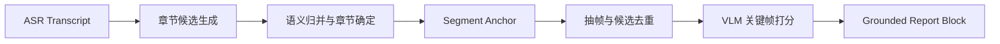

## 视频笔记 Agent 真正的难点，不是“先转写再总结”，而是让每一段总结都能回到原视频证据
视频内容天然跨越语音、文字、时间轴和画面。只要这几条线里任意一条没有对齐，最终报告就会出现一种很危险的假象：文字看上去很像总结，但你点不回原片段，也无法证明关键帧和结论真的是同一件事。对视频笔记 Agent 来说，时间戳对齐和图文 grounding 不是附加能力，而是系统成立的前提。

## 解决什么问题
这一页主要补视频笔记系统里最容易被低估的四个对象：

1. transcript 文本如何和原始时间轴稳定绑定。
2. 章节切分如何既符合主题，又不破坏证据连续性。
3. 关键帧为什么必须服务于章节证据，而不是随机抽图。
4. 为什么最终报告里的每个结论都要能追溯到文本片段和视觉片段。

### 为什么“可回放”比“可读性”更重要
因为视频报告系统并不只是帮助用户“看一遍总结”，还要帮助用户在复杂内容里回到原证据复核重点。没有回放锚点的报告，实际上更接近不可审计摘要，而不是学习或复盘工具。

## 核心对象
| 对象 | 作用 | 失真后会出现什么问题 |
| --- | --- | --- |
| Transcript Span | 绑定文本、时间戳、说话人和置信度 | 章节文字无法回原视频 |
| Chapter Boundary | 把主题切成可管理章节 | 一个章节跨多个主题，摘要失真 |
| Segment Anchor | 让章节对应到具体视频区间 | 章节和视频片段错位 |
| Key Frame Candidate | 作为视觉代表候选 | 随机截图和文本主题不一致 |
| Grounded Report Block | 保存结论、时间锚点、关键帧和来源 | 报告无法被复核 |

### 为什么章节边界不是纯文本任务
因为视频主题切换经常伴随语速变化、页码翻转、屏幕内容变化、说话人切换或演示动作。只看 transcript 文字，可能会把一个视觉上已经切换主题的片段错误并入前一章。

## 执行链路
更可靠的视频笔记 Agent 通常会走下面这条链：

1. ASR 输出带时间戳的 transcript。
2. 系统按停顿、说话人变化、标题信号和主题变化生成章节候选。
3. LLM 对 transcript 块和章节候选做语义归并。
4. 抽帧系统在章节区间内生成关键帧候选并去重。
5. VLM 或规则层对候选关键帧打分，选择最能代表该章节的视觉证据。
6. 最终报告同时输出章节结论、时间锚点、关键帧和回放引用。



### 为什么关键帧筛选不能只按时间间隔抽样
因为固定时间间隔经常会抽到讲者头像、过场动画、空白页或视觉上没有信息量的帧。关键帧真正要回答的是“这张图是否能代表本章节文字结论”，而不是“这张图是否恰好在这一分钟出现过”。

## 一致性与容错
视频笔记系统最常见的错误有四类：

1. transcript 句子边界和时间戳错位，后续所有章节引用都偏移。
2. 章节主题划分过粗，导致一个章节内部混入多个子话题。
3. 关键帧选择偏向视觉显著性，而不是语义相关性。
4. 报告有章节标题和图片，但没有真正的 grounding 锚点。

### 这类系统为什么容易产生“看上去没问题”的错
因为用户只看摘要时，很多对齐错误不会立刻暴露。只有当用户尝试点回视频、核对某个公式、确认某段演示内容时，才会发现章节和关键帧其实并不支撑对应结论。

## 性能模型
时间戳对齐与关键帧 grounding 会明显影响成本：

1. ASR 精度越高，后续章节对齐越稳，但前处理成本越高。
2. 章节切分越细，摘要精度可能更高，但关键帧和回放锚点数量也会增加。
3. 关键帧候选越多，VLM 筛选成本越高。
4. 报告里保留越多 evidence block，阅读体验和 token 成本都要平衡。

### 为什么视频笔记系统要显式预算候选帧数量
因为候选帧过多时，视觉筛选成本会迅速膨胀；过少时又容易错过真正代表章节的画面。系统必须在代表性和成本之间建立明确预算。

## 生产排障
遇到“报告写得对，但图不对”或“章节正确但时间跳错”时，建议按这条顺序排查：

1. 先看 transcript 的时间戳和句子边界是否准确。
2. 再看章节边界是否过宽或过窄。
3. 再看关键帧候选池是否已经漏掉核心画面。
4. 最后看 report block 是否保留了足够的 grounding 元数据。

### 适合长期保留的排障证据
1. 每章起止时间。
2. 原始 transcript span。
3. 关键帧候选及其筛选分数。
4. 最终报告段落到视频锚点的映射。

## 样例
下面这个章节证据块比“纯文字摘要”更接近工程化产物：

```yaml
grounded_report_block:
  chapter: "训练目标与损失函数"
  start_at: "00:14:08"
  end_at: "00:18:22"
  transcript_ids: ["t_182", "t_183", "t_184"]
  keyframe: "frame_14_52.png"
  replay_anchor: "video://lesson-03#00:14:52"
```

而这个关键帧评分示意则说明，筛选逻辑应同时看视觉和语义：

```json
{
  "candidate_frame": "frame_14_52.png",
  "visual_uniqueness": 0.71,
  "chapter_semantic_match": 0.93,
  "ocr_signal_density": 0.88,
  "selected": true
}
```

## 相邻技术边界
时间戳对齐与 keyframe grounding 属于视频笔记 Agent 的证据层，不等于最终写作层，也不等于通用 VLM 问答。它回答的是“多模态证据怎样被稳定地串成可回放报告”，这和单次看图问答完全不是同一个问题。

## 本页结论
视频笔记 Agent 的真正价值，不是输出一份看起来像总结的长文，而是让章节、时间戳、关键帧和最终报告构成一条可回放、可审计、可排障的证据链。谁能把这条链设计稳，谁的视频报告系统才真正可用。
