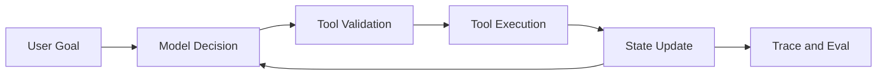

## 一句话定位

Agent Runtime 是把模型、指令、工具、状态、记忆、评估和治理组织成可运行系统的工程层，不是一次模型调用，也不是简单 Prompt 模板。

## 核心对象

- Model 负责生成决策和自然语言结果。
- Instruction 定义任务目标、角色边界和行为约束。
- Tool 暴露外部能力，必须有 schema、权限和副作用说明。
- State 保存当前任务上下文、步骤、工具结果和中间结论。
- Trace 记录模型输入输出、工具调用、成本、延迟和错误。
- Guardrail/Eval 用于上线前后质量与安全控制。

## 执行链路

1. 接收用户目标并构造上下文。
2. 模型基于 instruction、state 和 tool schema 选择动作。
3. 运行时校验工具参数、权限和审批策略。
4. 执行工具并把结果写回 state。
5. 模型决定继续、终止、交给人工或输出 final answer。

## 保证项与边界

- 自主性由工具权限、预算、审批和终止条件限定。
- 记忆服务任务连续性，不等于无限制保存所有信息。
- 工具受 schema、权限和副作用约束，不天然安全可靠。
- 评估要用数据集、trace 和人工抽检验证。

边界是知识库质量的分水岭。一个组件通常只保证自己负责的语义，端到端正确性还依赖调用方、存储层、计算层、权限系统、重试策略和运维流程共同成立。

### 发布检查最容易漏掉的其实是运行时假设
很多系统上线前会检查模型、工具和提示词是否可用，却忘了验证中断恢复、审批回路、trace 采样和状态保留是否真的能在生产里成立。Agent Runtime 的发布质量，本质上是在检查这些运行时假设有没有被明确验证。

## 性能模型

- 延迟由模型调用、工具调用、检索、重试和人工审批共同决定。
- 成本受 token、模型路由、工具次数和失败重试影响。
- 长任务需要 checkpoint、resume 和幂等工具。

性能分析不要从“调大参数”开始，而要先判断瓶颈位于输入、调度、网络、存储、状态、计算、序列化还是下游系统。任何调优动作都应该先有基线指标，再做单变量变更。

### Agent Runtime 的性能问题往往不是单点慢，而是链路累计慢
一次任务是否变慢，可能同时受到模型往返、工具等待、状态持久化和人工审批影响。只有把链路拆开看，才能判断应该优先优化模型路由、工具设计还是恢复与审批策略。

## 状态变化与容量判断

分析 Agent Runtime 时，要把状态变化拆成四层：控制面状态、数据面状态、元数据状态和外部依赖状态。控制面状态决定谁来调度、谁来提交、谁来恢复；数据面状态决定数据是否已经写入、可见、可重放或可清理；元数据状态决定查询和治理能否正确找到对象；外部依赖状态决定端到端链路是否真的完成。

容量判断不能只看平均值。平均值决定长期资源成本，峰值决定限流和扩容，长尾决定用户体验和故障放大概率。任何组件一旦进入生产，都应该有容量基线、增长趋势、保留策略、失败重试上限和降级方案。

## 治理、安全与变更控制

治理不是上线后的附加项，而是架构的一部分。权限、审计、隔离、保留期、变更记录、回滚策略和人工审批应该在设计阶段就明确。否则系统规模扩大后，会出现无法追踪、无法恢复或无法解释的问题。

对于协议、API、表格式、事务、权限和状态恢复这类内容，必须区分官方保证、实现细节和工程经验。官方保证可以写成明确结论；实现细节要标明版本范围；工程经验只能写成适用条件下的建议。

## 发布前验证路径

发布级知识不能只停留在“讲得通”。每个关键结论都要能被验证：第一，用官方文档或已登记来源确认概念边界；第二，用执行计划、日志、指标或 trace 找到运行证据；第三，用一个失败场景检验恢复路径；第四，用一个容量增长场景检验性能模型；第五，用一个相邻技术对比检验职责边界。

如果某个结论无法被这些方式验证，就不要把它写成绝对判断。更稳妥的写法是说明“在什么配置、什么版本、什么数据规模、什么失败条件下成立”。这能避免知识库变成口号，也能让题库答案具备可追溯性。

### 验证路径真正要保护的是可恢复和可解释
Agent 系统最怕的不是偶发失败，而是失败后既恢复不了，也解释不清。只要发布前已经把失败恢复和证据链验证过，很多复杂场景就不会在上线后第一次暴露。

## 学习时的核对清单

学习 Agent Runtime 时至少核对五件事：对象是否讲清、状态是否讲清、链路是否讲清、边界是否讲清、排障证据是否讲清。只要其中一项缺失，回答就容易停在术语层。真正的掌握应该能把一个现象还原成对象状态变化，再把状态变化还原成可观测证据，最后给出有代价说明的处理动作。

还要避免两个极端：一个极端是只背官方定义，无法解释生产问题；另一个极端是只讲经验参数，无法说明为什么有效。发布级知识应该把定义、机制、证据和操作连起来，让读者既知道“是什么”，也知道“为什么这样设计”“什么时候不成立”“出了问题先看哪里”。

因此，每次补充 Agent Runtime 内容时，都要同时补三类材料：机制图、排障证据和边界说明。机制图帮助理解对象如何协作，排障证据帮助定位真实问题，边界说明帮助避免把组件能力夸大成端到端保证。

## 工程样例

```text
Agent step = observe state -> decide action -> validate tool call -> execute -> update state -> trace -> continue/stop
```



## 相邻技术边界

- 普通 LLM 调用只生成一次响应，Agent Runtime 管理多步任务。
- Workflow 强调显式流程，Agent 强调模型在边界内选择动作。
- RAG 提供知识证据，Agent Runtime 决定如何使用证据和工具。

## 延伸检查点

继续阅读这组内容时，最值得反复检查的是四件事：Agent 和普通 LLM 调用的边界是否清楚、工具调用的副作用控制是否清楚、长任务的恢复路径是否清楚、trace 在排障中的证据价值是否清楚。只要这四件事能自洽，Agent Runtime 的知识结构就比较稳了。
