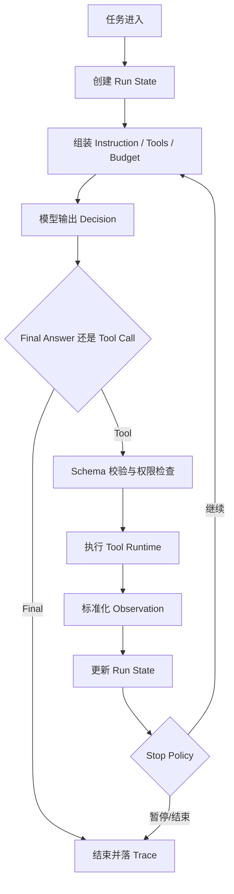

## 从零做 Agent，真正要解决的不是“怎么把模型叫起来”，而是“怎么让一次决策变成可控执行”
很多入门教程能在几十行代码里跑通一个 Agent Demo，但这类 Demo 往往只解决了“模型能不能输出动作意图”，没有解决“动作如何被验证、执行、记录、停止和复盘”。面试里如果只回答“Agent 就是 LLM 加工具”，听起来方向没错，但仍然停留在概念层。

更扎实的回答应该说明：最小 Agent 是一套受控运行时。模型负责提出下一步意图，运行循环负责把意图变成真实动作，并保证动作之后还能继续推理、继续恢复或安全停止。

## 解决什么问题
从零构建 Agent 这页主要解决五个基础问题：

1. 模型输出为什么不能直接等于已经执行的事实。
2. 工具调用为什么必须有结构化合同，而不是让模型随便拼一段 JSON。
3. 工具结果为什么要变成 observation，而不是只写一行日志。
4. 状态为什么必须分层，不能把所有东西都塞进聊天历史。
5. 终止条件为什么是运行时合同，而不是 while loop 的附属判断。

如果这五件事没有理顺，系统很快会出现工具乱调、上下文膨胀、死循环、失败无法重现等问题。

## 核心对象
| 对象 | 在最小 Agent 中的作用 | 先看什么来判断它是否设计合理 |
| --- | --- | --- |
| Instruction | 规定任务目标、输出边界和禁止事项 | 是否把业务状态和行为约束混在一起 |
| Model Decision | 产出 final answer 或 tool call 意图 | 是否可区分候选决策与已执行事实 |
| Tool Schema | 定义工具参数、类型和副作用边界 | 是否足够结构化、是否能校验 |
| Tool Runtime | 真正执行工具、处理异常并返回结果 | 是否支持权限、超时和错误分类 |
| Observation | 把环境反馈变成下一轮推理输入 | 是否结构化、是否包含有效增量 |
| Run State | 保存本次执行的 step、预算、最近错误等 | 是否和 transcript、session 混淆 |
| Stop Policy | 决定继续、结束、暂停或升级人工 | 是否覆盖预算、失败和无进展 |
| Trace | 记录每一步输入、决策、工具和结果 | 是否足以复现问题 |

这些对象不能被孤立记忆。更好的理解方式，是把它们放回同一条执行链上看：任务如何进入、模型如何决策、工具如何执行、结果如何回写、系统何时停止。

## 执行链路
一个最小但合格的 Agent 循环，通常按下面的顺序推进：

1. 入口层接收用户任务，并创建初始 run state。
2. 运行时组装 instruction、当前状态、允许工具和预算信息。
3. 模型只输出两类东西之一：`final answer` 或 `tool call intent`。
4. 如果是 tool call，运行时先按 schema 校验工具名和参数，再决定是否允许执行。
5. 工具执行后，结果被标准化成 observation 写回运行状态。
6. 下一轮模型不直接看原始系统日志，而是看已经整理过的 observation。
7. Stop Policy 判断是否达成目标、是否该暂停、是否该安全结束。



## 一致性与容错
最小 Agent 虽然还没进入复杂工作流，但已经有几个必须讲清楚的容错边界：

1. 模型说“去调用某个工具”，不等于工具已经执行成功。
2. 工具失败后不能只返回一句“error”，否则下一轮模型无法知道是参数错、权限错还是外部系统超时。
3. observation 只能反映当前轮已确认的环境反馈，不能把模型猜测写回状态。
4. stop policy 不能和异常处理混成一类。预算耗尽、等待人工审批、无进展循环，都是正式终止或暂停原因。

也就是说，最小 Agent 的容错重点不是高可用，而是“每一步发生了什么、为什么能继续、为什么该停止”必须可解释。

## 性能模型
从零实现 Agent 时，最容易忽略的不是功能，而是成本模型。最小运行时至少要意识到四个放大器：

1. 工具列表越大，模型选择动作的成本越高。
2. observation 越冗长，下一轮推理越慢，且更容易引入噪声。
3. 没有 stop policy 的循环会把 token 和时延线性甚至指数放大。
4. 状态不分层时，聊天历史会替代 run state，导致每轮上下文越来越重。

```yaml
minimal_runtime_policy:
  max_steps: 6
  max_same_error_retries: 1
  allowed_tools:
    - search_docs
    - read_file
    - summarize
  stop_on:
    - final_answer
    - budget_exhausted
    - repeated_same_error
    - approval_required
```

## 生产排障
就算是最小 Agent，只要进入真实任务，也必须知道从哪里排问题。一个稳妥的排障顺序是：

1. 先看 run state，确认系统是不是卡在 step、预算或错误计数上。
2. 再看模型 decision，确认是错误选了工具，还是根本没有拿到正确上下文。
3. 然后看 tool runtime 的返回，确认是 schema、权限、网络还是业务失败。
4. 最后看 stop policy 和 trace，确认系统是不是本该停下却没有停。

如果一个 Agent 总在同一个工具上循环，优先怀疑 stop policy、observation 设计或 tool schema，而不是先怪模型能力。

## 样例
下面的伪代码强调的是责任分层，而不是某个框架语法：

```python
def run_agent(task, tools, state_store, max_steps=6):
    state = state_store.load_or_create(task_id=task["id"])

    while state["step"] < max_steps:
        decision = call_model(
            instruction=task["instruction"],
            run_state=state,
            tools=[tool.schema for tool in tools],
        )

        if decision["type"] == "final_answer":
            state_store.save_trace(state, decision)
            return decision["content"]

        tool = find_tool(tools, decision["tool_name"])
        args = validate_args(tool.schema, decision["arguments"])
        result = tool.execute(args)
        observation = normalize_observation(result)
        state = update_run_state(state, decision, observation)

        if should_stop(state, observation):
            break

    return {"status": "stopped", "reason": "budget_or_policy"}
```

再看一个最小 observation 结构示例：

```json
{
  "tool": "search_inventory",
  "status": "permission_denied",
  "message": "user has no access to warehouse-a",
  "retry_safe": false
}
```

这个结构比“调用失败”有用得多，因为下一轮模型可以基于它决定换仓库、请求审批还是直接终止。

## 相邻技术边界
`agent-foundations` 讲的是最小运行时为什么成立，关注的是：

1. 决策如何进入执行循环。
2. 工具调用如何被结构化。
3. 状态和停止条件为什么要最早设计。

它和 `agent-runtime` 的边界在于：后者更偏生产工程化，会重点讲 tracing、guardrails、handoff、harness、workflow 和治理；本页只解决“从零起步时最小运行时应长什么样”。

## 从零学习路径
如果把这部分当成学习顺序，最稳的节奏通常是：

1. 先实现一次模型调用。
2. 再给工具定义 schema 和参数校验。
3. 再把工具结果整理为 observation。
4. 再引入 run state 和 stop policy。
5. 最后才补充持久化、审批、幂等和恢复。

这条顺序的意义在于：先建立最小闭环，再逐步加责任边界，而不是一开始就堆很多框架概念。

## 本页结论
从零构建 Agent 的关键，不是写一个更长的 Prompt，而是把模型决策、工具合同、observation、run state 和 stop policy 放进同一个受控循环里。只要这条链路是可解释、可停止、可回写的，系统才算从“能生成文本”迈进了“能执行任务”的阶段。
