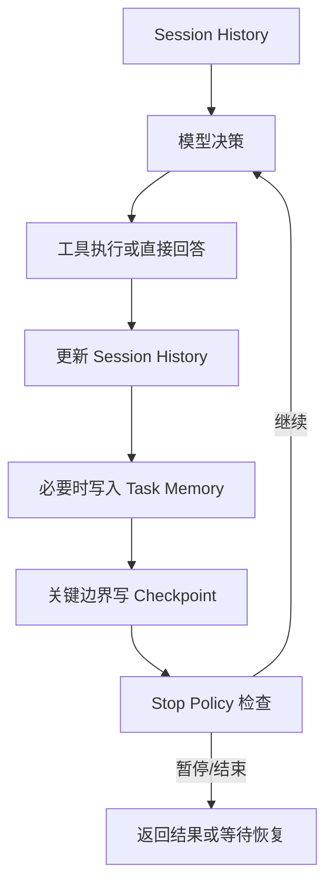

## 很多最小 Agent 一开始能跑，真正一变长就暴露出两个问题：记不住，以及停不下来
这两个问题经常被误以为是模型能力问题。实际上，大多数时候它们属于运行时状态设计问题：系统没有区分 session、memory、checkpoint 和 stop policy 的职责，所以既不知道该记什么，也不知道什么时候该停。

## 解决什么问题
这一页聚焦四类基础状态能力：

1. Session 解决多轮上下文如何延续。
2. Memory 解决哪些信息值得跨轮甚至跨任务保留。
3. Checkpoint 解决中断之后从哪里恢复。
4. Stop Policy 解决什么时候必须停、什么时候必须暂停、什么时候该转人工。

## 核心对象
| 对象 | 主要职责 | 不该承担什么职责 |
| --- | --- | --- |
| Session History | 保存当前会话轮次的上下文连续性 | 不该替代长期记忆和恢复点 |
| Task Memory | 保存跨轮可复用事实或偏好 | 不该把每次试错都永久写入 |
| Checkpoint | 保存可恢复的执行边界状态 | 不该等于整段聊天历史快照 |
| Stop Policy | 定义结束、暂停、转人工和失败条件 | 不该被塞进随手的 if 判断 |
| Durable State | 落盘的可信运行状态 | 不该只在异常后临时补写 |

## 执行链路
这四层一起工作时，一个最小 Agent 的状态链路大致是：

1. Session History 负责让当前会话知道“刚刚聊到了哪里”。
2. Task Memory 负责把少量有价值信息抽出来，供后续任务或后续阶段复用。
3. Checkpoint 在关键边界保存“执行到了哪里、当前控制状态是什么”。
4. Stop Policy 每一轮都检查是否应该继续、暂停或结束。



## 一致性与容错
状态分层的最大价值在于避免“所有状态都长成一个东西”：

1. Session History 只保证对话连续，不保证执行恢复。
2. Memory 只保留值得长期保留的信息，不该把未验证结论永久沉淀。
3. Checkpoint 保证能从可信边界恢复，但不能替代真实业务幂等控制。
4. Stop Policy 保证系统可控，不让运行时在无进展状态下继续消耗预算。

如果这四层不拆开，常见后果是：

1. 历史越来越长，但真正控制信息越来越模糊。
2. 失败恢复时只能重放整段历史，无法知道上次究竟卡在哪里。
3. 系统明明应该暂停审批，却继续尝试自主执行。

## 性能模型
状态设计同时决定性能和成本：

1. Session 全量追加会直接推高每轮上下文长度。
2. Memory 写得太多，会让召回噪声越来越大。
3. Checkpoint 太粗，恢复成本高；太细，落盘开销大。
4. Stop Policy 不严格，会让无进展循环持续消耗 token 和时间。

```yaml
stop_policy:
  max_steps: 6
  max_seconds: 180
  max_repeated_errors: 1
  pause_on:
    - approval_required
    - waiting_external_event
  stop_on:
    - final_answer
    - no_progress
    - budget_exhausted
```

## 生产排障
一旦最小 Agent 出现“上下文丢失”“中断后接不上”“死循环”这类问题，可以按这个顺序定位：

1. 查 session，确认当前会话历史是否真的被保留。
2. 查 memory，确认系统是不是把错误结论反复召回。
3. 查 checkpoint，确认恢复边界是否足够清楚。
4. 查 stop policy，确认系统是不是本该暂停或结束却没有停。

如果一个系统每次恢复都像从头再来，通常是 checkpoint 不存在或没有保存控制状态；如果一个系统明明没有新信息还一直转圈，通常是 stop policy 缺少无进展检测。

## 样例
下面是一个最小的 checkpoint 结构示例：

```json
{
  "run_id": "run_003",
  "step": 4,
  "status": "waiting_for_approval",
  "last_observation": "tool requested refund over threshold",
  "remaining_budget": 2
}
```

下面是一个基础的状态分层伪代码：

```python
state = {
    "session_history": load_session(thread_id),
    "task_memory": recall_memory(task_id),
    "checkpoint": load_checkpoint(run_id),
    "stop_policy": {"max_steps": 6, "max_errors": 1},
}
```

这个例子强调的不是字段多少，而是四层职责被显式区分。

## 相邻技术边界
这一页讨论的是最小 Agent 的状态分层，不是完整生产级持久化平台。`agent-runtime` 那组内容会继续展开 tracing、workflow、harness 和生产治理；本页只要求读者在最小系统里先讲清楚：会话连续性、长期记忆、恢复边界和停止合同是四件不同的事。

## 本页结论
Session、Memory、Checkpoint 和 Stop Policy 不能等系统复杂后再补，因为它们决定了 Agent 最基础的连续性、恢复性和可控性。最小 Agent 只要想跑超过一轮，就必须先知道哪些信息属于会话、哪些值得长期保留、从哪里恢复，以及何时停止。
