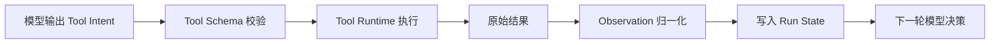

## 很多入门 Agent 一开始就不稳，不是模型弱，而是把 Tool、Observation 和 State 全混在了一起
从零写 Agent 时，最常见的代码味道是：模型直接输出一段工具参数，代码直接执行，然后把原始结果拼回聊天历史。短任务偶尔能跑通，但一旦任务稍微长一点，系统马上就会出现三个问题：参数不可验证、结果不可解释、状态不可恢复。

这背后的根因，往往不是模型本身，而是核心对象没有分层。

## 解决什么问题
这一页主要解决三个基础对象边界问题：

1. Tool Schema 应该定义什么，为什么它不是一句自然语言描述。
2. Observation 应该长什么样，为什么它不是原始日志转储。
3. Run State 应该保存什么，为什么它不能等于整段聊天历史。

## 核心对象
| 对象 | 作用 | 失控后会出现什么问题 |
| --- | --- | --- |
| Tool Schema | 定义工具名、参数、类型、返回结构和副作用边界 | 模型会构造不可执行参数 |
| Tool Runtime Result | 记录一次真实工具执行的结果 | 无法判断动作是否真正发生 |
| Observation | 给下一轮模型看的标准化反馈 | 模型看不懂失败语义或被日志噪声淹没 |
| Run State | 保存 step、预算、最近错误、当前任务局部状态 | 无法知道系统现在在哪个阶段 |
| Transcript | 保存用户、模型、工具的交互轨迹 | 变得过长、无法承担运行控制职责 |

## 执行链路
基础对象分层之后，一次工具调用的责任链才会清楚：

1. 模型先选择工具意图，而不是直接触发真实动作。
2. Tool Schema 对工具名、参数和类型做正式校验。
3. Tool Runtime 执行真实动作，并产出原始结果。
4. 原始结果经过归一化，变成适合模型继续消费的 Observation。
5. Run State 保存这次调用的关键信息，但不承担全文日志存储。



## 一致性与容错
这三个对象一旦混淆，就会出现典型容错问题：

1. 没有 schema，模型输出错参数时，系统无法区分是模型错还是工具错。
2. observation 直接塞原始日志时，模型无法知道哪些字段是真正关键事实。
3. run state 如果只保聊天历史，失败恢复时就无法判断“当前 step 到哪了、最近一次错误是什么、是否已经触发审批”。

更可靠的做法是：

1. schema 负责静态校验。
2. runtime result 负责描述动作真实执行情况。
3. observation 负责为下一轮决策提供结构化证据。
4. run state 负责保存控制信息，而不是承担所有内容。

## 性能模型
对象分层同时也是性能优化手段：

1. schema 越清晰，模型试错次数越少。
2. observation 越精炼，下一轮推理成本越低。
3. run state 越聚焦控制信息，越不需要每轮带上整段长历史。
4. 原始大日志可以留在 trace 或外部存储里，不必直接放进模型上下文。

```yaml
tool_contract:
  name: search_inventory
  input_schema:
    warehouse: string
    sku: string
  side_effect: none
  timeout_seconds: 5
  retry_safe: true
```

## 生产排障
排基础对象问题时，最稳的顺序是：

1. 先看 schema，确认是不是参数合同不清导致模型总是输错。
2. 再看 observation，确认下一轮模型是不是根本没拿到有效反馈。
3. 再看 run state，确认系统是否记录了 step、预算和最近错误。

如果系统反复调用同一个工具但每次参数都不对，优先怀疑 schema 太松或 tool description 太模糊；如果模型每次都像“没看到刚才发生什么”，优先怀疑 observation 设计失真。

## 样例
一个适合模型消费的 observation 通常应更像这样：

```json
{
  "tool": "search_inventory",
  "status": "success",
  "found": false,
  "warehouse": "beijing-a",
  "next_hint": "try_other_warehouse"
}
```

而不是把原始 SDK 日志整段塞进去：

```python
run_state = {
    "step": 3,
    "remaining_budget": 2,
    "last_tool": "search_inventory",
    "last_status": "not_found",
    "pending_approval": False,
}
```

这个 `run_state` 的重点是控制面信息，而不是保存所有业务详情。

## 相邻技术边界
这一页讲的是最小运行时对象分层，不是生产级 trace、checkpoint 或多 Agent 通信。Trace 负责全链路事实记录，checkpoint 负责恢复，handoff 负责控制权交接；而这里关心的是最基础的三个对象为什么要先拆开，否则后面的高级能力都无从建立。

## 本页结论
从零构建 Agent 时，Tool Schema、Observation 和 Run State 是最早必须拆开的三层。Schema 保证动作可验证，Observation 保证结果可继续推理，Run State 保证执行过程可控。对象分不清，后面的循环、恢复和治理都会一起变形。
