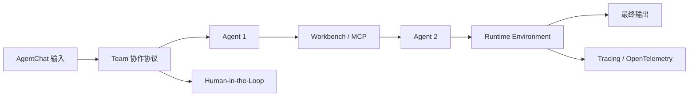

---
kb_id: ai-agent/frameworks/autogen-agentchat-teams-runtime-and-observability
title: AutoGen 系统化深拆：AgentChat、Teams、Workbench、Runtime、Tracing 怎么拼成完整运行时
domain: ai-agent
component: autogen
topic: agentchat-teams-runtime-workbench-hitl-tracing
difficulty: advanced
status: reviewed
sidebar_position: 10
version_scope: AutoGen stable docs as verified on 2026-05-12
last_verified_at: '2026-05-12'
source_ids:
  - autogen-agentchat-docs
  - autogen-teams-docs
  - autogen-human-in-the-loop-docs
  - autogen-tracing-docs
  - autogen-workbench-docs
  - autogen-runtime-docs
claim_ids:
  - autogen-claim-0001
  - autogen-claim-0002
  - autogen-claim-0003
  - autogen-claim-0004
  - autogen-claim-0005
  - autogen-claim-0006
  - autogen-claim-0007
  - autogen-claim-0008
tags:
  - ai-agent
  - autogen
  - agentchat
  - runtime
  - workbench
  - tracing
---
## 讲清 AutoGen，不能只讲 Team，还要讲“高层入口、协作协议、工具作用域、底层 runtime 和观测链”
AutoGen 很容易被答成“多个 Agent 轮流聊天”。真正的系统化答案，应该能把以下几层拼起来：

- `AgentChat` 负责高层任务组织。
- `Teams` 负责协作协议。
- `Workbench` 负责共享工具和资源作用域。
- `runtime environment` 负责消息、身份、生命周期和安全边界。
- `HITL` 提供人工反馈入口。
- `Tracing` 负责把整条链变成可观察系统。

只有把这些对象放进同一张图里，AutoGen 的运行时定位才会真正清楚。

## 从分层角度理解 AutoGen
### 第一层：AgentChat
这是最自然的入口层。它让开发者先组织 Agent、Team 和任务，而不是先处理底层消息系统。

### 第二层：Teams
这一层定义多 Agent 协作协议，例如共享上下文、轮流响应和终止条件。

### 第三层：Workbench
这一层决定工具和资源怎么被团队共享，以及外部能力如何稳定接入。

### 第四层：Runtime Environment
底层 runtime 抽象 standalone 与 distributed 部署中的消息投递、agent identity、生命周期和安全边界。正是这层存在，使 AutoGen 具有“运行时体系”的性质。

### 第五层：Tracing / OpenTelemetry
观测层把运行事实暴露出来。没有这层，多 Agent 复杂度会迅速超过人类能手动理解的范围。

## 为什么 AgentChat 与 runtime 的分层很关键
如果只讲 AgentChat，AutoGen 会很像一层便捷 API；如果把 runtime 一起讲出来，就能解释：

- 为什么多 Agent 不只是 prompt 套件。
- 为什么会出现 identity、lifecycle 和 message delivery 这类系统词汇。
- 为什么 distributed deployment 不只是把脚本复制几份。

这也是 AutoGen 和纯前端式 Agent 演示最大的区别之一。

## Teams、Workbench、Runtime 如何串成一条链
1. AgentChat 接收高层任务。
2. Team 根据协作协议推进轮次。
3. Agent 通过 Workbench 调用共享工具或 MCP 资源。
4. runtime environment 负责在执行面维持消息和身份边界。
5. tracing 把每次轮次、工具调用和异常变成可复核事件。



## Runtime 为什么是生产排障的关键背景
很多问题表面看起来像“Agent 说错了”，实际根因却在运行层：

- 消息是否正确送达。
- 某个 agent 是否持有正确身份与上下文。
- 生命周期是否在错误时被正确清理。
- distributed 模式下资源边界是否被正确隔离。

如果不把 runtime layer 讲进去，AutoGen 的答案就很难上升到工程层。

## Tracing 为什么必须和 Team 一起讲
多 Agent 的可观测性不是可选项。Tracing 至少要回答：

- 第几轮开始偏离目标。
- 哪个 Agent 的输出导致后续失真。
- 哪次工具调用失败或耗时异常。
- HITL 是否让流程挂起。
- runtime 层有没有出现消息与身份错误。

这也是为什么 OpenTelemetry 兼容很重要，它代表 AutoGen 把 tracing 看成正式运维面，而不是辅助开发调试的小功能。

## 一致性与容错要怎么回答
AutoGen 这一层最值得主动补的边界有：

- Team 的共享上下文不等于长期一致状态。
- HITL 阻塞模式不等于 durable pause/resume。
- Workbench 提供共享能力，但不自动解决副作用幂等。
- runtime environment 管消息和生命周期，但业务级恢复仍要应用层设计。

这些边界主动讲出来，会比只列功能点更成熟。

## 性能模型怎么看
AutoGen 的性能常见瓶颈有：

- 轮次多导致上下文爆炸。
- Team 协作协议过重，终止条件不清。
- Workbench 外部调用成为瓶颈。
- tracing 记录过深影响吞吐。
- runtime environment 在分布式下引入额外通信成本。

### 运行预算样例
```yaml
autogen_runtime_snapshot:
  deployment_mode: distributed
  team_protocol: round_robin
  active_agents: 4
  message_hops: 18
  workbench_calls: 7
  hitl_blocking: false
  trace_export_backend: otel
```

这个样例强调：分布式消息跳数、团队轮次、外部工具和 trace 导出都会影响端到端性能。

## 最小样例
```python
autogen_stack = {
    "entry": "AgentChat",
    "coordination": "Teams",
    "shared_capabilities": "Workbench / McpWorkbench",
    "human_feedback": "UserProxyAgent",
    "runtime_core": "message delivery + identity + lifecycle",
    "observability": "Tracing + OpenTelemetry",
}
```

这段配置式示意比单独某个 API 更能表达 AutoGen 的体系结构。

## 本页结论
AutoGen 真正的系统价值，在于它把 AgentChat、Teams、Workbench、HITL、Runtime Environment 和 Tracing 拼成了一套完整多 Agent 运行时。只讲 Team，不讲 runtime 与观测，答案会很浅；把这几层一起讲清，才算真正理解 AutoGen。
