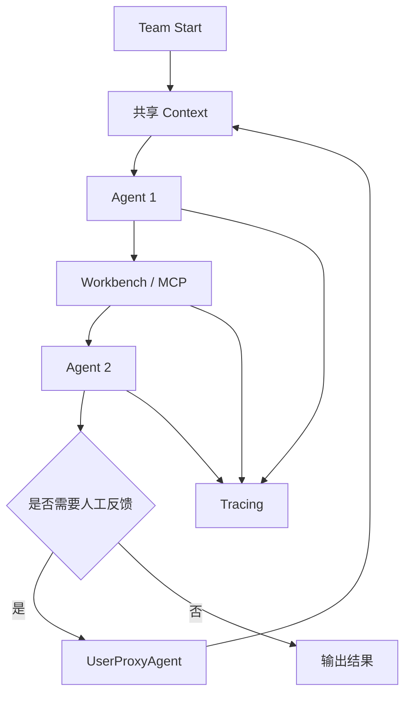

---
kb_id: ai-agent/frameworks/autogen-teams-workbench-and-hitl
title: AutoGen 深水区：Teams、Workbench、HITL 为什么共同定义了多 Agent 的工程边界
domain: ai-agent
component: autogen
topic: teams-workbench-hitl
difficulty: advanced
status: reviewed
sidebar_position: 9
version_scope: AutoGen stable docs as verified on 2026-05-12
last_verified_at: '2026-05-12'
source_ids:
  - autogen-teams-docs
  - autogen-workbench-docs
  - autogen-human-in-the-loop-docs
  - autogen-tracing-docs
claim_ids:
  - autogen-claim-0002
  - autogen-claim-0003
  - autogen-claim-0004
  - autogen-claim-0005
  - autogen-claim-0006
  - autogen-claim-0007
tags:
  - ai-agent
  - autogen
  - teams
  - workbench
  - hitl
---
## 多 Agent 系统真正难的，不是多几个角色，而是协作协议、工具作用域和人工介入边界
如果把 AutoGen 讲成“多个 Agent 分工完成任务”，答案会非常浅。真正决定系统能不能落地的，是三条边界：

- Team 协作协议如何组织共享上下文和轮次。
- Workbench 如何约束和复用工具与资源。
- human-in-the-loop 如何插入执行链，以及它不解决什么。

这三件事一起，才定义了多 Agent 系统的工程边界。

## Teams 代表协作协议，不代表人数
以 `RoundRobinGroupChat` 为例，官方文档的关键点不是“轮流发言”这么简单，而是：

- 所有 Agent 共享同一 message context。
- 每个 Agent 按顺序接收和响应。
- 协作协议是运行时对象，而不是 prompt 约定。

这说明 Team 的核心不是“有几个人”，而是“上下文怎么共享，顺序怎么推进，终止条件怎么生效”。如果没有这层协议，所谓多 Agent 很容易退化成不可控的聊天链。

## Workbench 代表共享作用域
Workbench 的价值，不是又多一个工具容器，而是它给多 Agent 提供了共享 state、resources 和 configuration 的作用域。这样做的意义是：

- 多个 Agent 可以在同一能力边界内工作。
- 工具访问更容易做统一治理。
- 外部资源不会散落在各个 Agent 的私有 prompt 里。

这也是为什么 `McpWorkbench` 很重要，因为它让 MCP server 提供的能力以同样的作用域方式接入运行时。

## HITL 为什么不能讲成“弹个确认框”
AutoGen 的 human-in-the-loop 能力确实支持人工反馈，但它的典型模式是阻塞式的。官方对 `UserProxyAgent` 的提醒非常重要：等待人工输入时，并不是完整的 durable pause/resume 语义。

这意味着：

- 它适合短期交互式人工反馈。
- 它不自动等于长期审批流恢复能力。
- 如果产品需要长时间等待人类决策，仍要自己补状态持久化和恢复设计。

这条边界一旦讲清，就能把 AutoGen 和图式状态机框架区别开。

## 执行链应该怎么串
1. Team 负责协作协议。
2. Agent 在共享上下文下轮流行动。
3. Workbench 暴露共享工具和资源。
4. 必要时通过 MCP 接外部能力。
5. 遇到人类反馈需求时，通过 HITL 入口阻塞等待。
6. tracing 记录整条协作与工具链。



## 一致性与容错怎么看
这一层的核心问题，不是模型会不会回答，而是：

- 共享上下文会不会越来越乱。
- 多轮 Team 是否可能无法自然终止。
- Workbench 中的工具是否会造成副作用或权限越界。
- 人工反馈中断后，系统是否还能可靠回到正确执行点。

AutoGen 在这方面提供了很好的组织能力，但 durable workflow 仍然需要额外设计。

## 性能模型怎么看
AutoGen 在这一层的主要性能成本来自：

- Team 轮次增长导致上下文越来越长。
- Workbench 工具调用拉高外部依赖时延。
- HITL 等待直接拉长端到端响应时间。
- tracing 明细导出带来额外开销。

### 性能观察样例
```yaml
autogen_team_snapshot:
  protocol: round_robin
  agents: 3
  rounds_executed: 5
  shared_context_tokens: 18000
  workbench_calls: 6
  human_feedback_waiting: false
  trace_enabled: true
```

这个样例表达的是：多 Agent 的成本主要和轮次、共享上下文、工具调用与人工等待相关。

## 生产排障主线
建议按这个顺序排：

1. 先看 Team 是否陷入过长轮次或循环。
2. 再看共享上下文是否污染，导致后续 Agent 基于错误前提行动。
3. 再看 Workbench / MCP 工具调用是否失败或超时。
4. 最后看人工反馈是否让主链路长时间挂起。

## 本页结论
Teams、Workbench 和 HITL 共同决定了 AutoGen 多 Agent 系统的工程边界：Teams 管协作协议，Workbench 管共享能力作用域，HITL 管人工介入入口与限制。把这三者一起讲，才算真正理解了 AutoGen 的多 Agent 运行机制。
