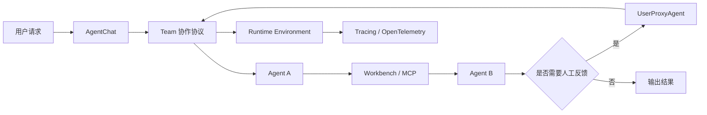

---
kb_id: ai-agent/frameworks/autogen
title: AutoGen：它为什么更像多 Agent 运行时，而不是“几个 Agent 轮流聊天”
domain: ai-agent
component: autogen
topic: overview
difficulty: advanced
status: reviewed
sidebar_position: 8
version_scope: AutoGen stable docs as verified on 2026-05-12
last_verified_at: '2026-05-12'
source_ids:
  - autogen-agentchat-docs
  - autogen-teams-docs
  - autogen-human-in-the-loop-docs
  - autogen-tracing-docs
  - autogen-workbench-docs
  - autogen-runtime-docs
claim_ids:
  - autogen-claim-0001
  - autogen-claim-0002
  - autogen-claim-0003
  - autogen-claim-0004
  - autogen-claim-0005
  - autogen-claim-0006
  - autogen-claim-0007
  - autogen-claim-0008
tags:
  - ai-agent
  - autogen
  - multi-agent
  - runtime
  - teams
---
## AutoGen 最值得讲的，不是“多 Agent”，而是“多 Agent 任务怎么被正式运行起来”
很多人介绍 AutoGen，会直接说它是一个让多个 Agent 互相对话完成任务的框架。这个说法不算错，但如果只停在这里，会把 AutoGen 讲成一个聊天编排 demo。更准确的说法是：AutoGen 更像一个围绕 `AgentChat`、`Teams`、`Workbench`、`human-in-the-loop`、`tracing` 和底层 runtime environment 组织起来的多 Agent 运行时体系。

所以它真正解决的，不只是“让多个 Agent 说话”，而是“这些 Agent 如何共享上下文、如何被调度、如何接入工具、如何等待人类、如何把执行链暴露出来”。

## 它解决什么问题
一旦任务不是单轮问答，而是多角色协作、多轮工具调用或需要人类介入的系统，就会立刻遇到这些问题：

- 多个 Agent 的上下文怎么共享。
- 协作协议由谁决定。
- 工具和资源怎么被多 Agent 一起使用。
- 人工输入如何插入运行链。
- 多步执行失败后如何看清是谁出了问题。

AutoGen 的一系列对象，基本就是围绕这些问题搭起来的。所以它的重点不是“聊天形式”，而是运行机制。

## 核心对象怎么讲
### AgentChat
`AgentChat` 是高层入口。官方明确把它描述成 high-level API，适合快速原型和常见多 Agent 场景。它的重要性在于：它让开发者能先从任务组织层进入系统，而不是直接碰底层 runtime 细节。

### Teams
`Teams` 代表协作对象层。它不是简单把几个 Agent 放进数组，而是带协作协议的团队运行对象。`RoundRobinGroupChat` 这样的 team 结构，清楚说明 Agent 不是随机插话，而是共享上下文并按规则轮流响应。

### Workbench
`Workbench` 是工具和资源组织层。官方把它描述成共享 state、resources 和 configuration 的作用域。它的价值在于让工具不再是零散函数，而是可治理、可复用、可分域的能力集合。

### McpWorkbench
`McpWorkbench` 把 MCP server 提供的能力接到 AutoGen 的 workbench 体系里。它说明 AutoGen 的工具面不是封闭的，而是可以通过标准协议纳入外部工具生态。

### UserProxyAgent / HITL
AutoGen 的 human-in-the-loop 能力以 `UserProxyAgent` 等阻塞式人工反馈模式为代表。它说明人类介入在 AutoGen 中是正式入口，但也带来一个重要边界：等待人工输入时，应用状态并不是完整 durable pause/resume 语义。

### Runtime Environment
底层 runtime environment 处理消息投递、agent identity、生命周期和安全边界等问题。正是这层存在，才让 AutoGen 不只是表层聊天框架，而是运行时体系。

### Tracing
`Tracing` 把多 Agent 执行链暴露成可观察对象，并支持 OpenTelemetry 兼容后端。没有 tracing，多 Agent 的复杂度只会放大，几乎无法稳定排障。

## 一条典型执行链怎么走
1. 应用入口创建 Agent 或 Team。
2. AgentChat 层接收请求并组织高层任务对象。
3. Team 根据协作协议决定轮到谁响应。
4. Agent 可能调用 Workbench 中的工具或 MCP 能力。
5. 如果需要人工输入，UserProxyAgent 或类似入口阻塞等待。
6. runtime environment 负责消息传递、身份和生命周期管理。
7. tracing 把消息轮次、工具调用和状态推进串成完整执行链。



## 为什么“先单 Agent，后 Teams”很重要
AutoGen 官方 guidance 明确建议：能用单 Agent 解决，就先用单 Agent；只有任务复杂到单 Agent 不够时，再上 Teams。这句话非常有工程价值，因为它说明：

- 多 Agent 不是默认更高级。
- 多 Agent 会带来上下文同步和终止条件复杂度。
- trace 更长，排障更难。
- 协作协议不清时，多 Agent 只会把问题放大。

所以成熟答案一定会主动带上这句判断，而不是默认“多 Agent 就更先进”。

## Teams 为什么不是“多几个 Agent”
Teams 的关键在协作协议。以 `RoundRobinGroupChat` 为例，官方文档明确说明所有 Agent 共享同一 message context，并按顺序轮流响应。这代表：

- 上下文模型是显式的。
- 响应顺序是可预期的。
- 协作不是随意轮流聊天，而是运行协议的一部分。

这点很适合拿来回答“AutoGen 和普通多角色 prompt 有什么区别”。

## Workbench 为什么是高价值知识点
很多框架只讲函数注册，AutoGen 的 Workbench 更进一步，它把工具和资源放进共享作用域。这样做的好处是：

- 多 Agent 可以共享同一组能力。
- 资源和配置有明确边界。
- 工具接入更接近运行时资源管理，而不是纯 prompt 约定。

如果再结合 `McpWorkbench`，就可以继续讲 AutoGen 如何把 MCP 生态纳入自己的工具层。

## Human-in-the-loop 的边界
AutoGen 确实支持人类介入，但不能误答成完整 durable workflow。官方文档对阻塞式人工反馈模式的提醒很重要：等待人工输入时，应用状态并不是天然可保存、可恢复的长期暂停语义。

这意味着：

- AutoGen 有 HITL 入口。
- 但它和 LangGraph 式 checkpoint / thread / resume 不是同一层能力。
- 如果生产里需要长时间等待审批，系统还要额外设计持久化和恢复策略。

这句边界如果能主动讲出来，基本就已经进入原理层了。

## 性能模型怎么看
AutoGen 的性能瓶颈通常来自：

- 团队轮次太多，导致 token 和时延成倍放大。
- Workbench 外部资源调用成为慢节点。
- HITL 阻塞让端到端时延失控。
- tracing 过深带来额外吞吐压力。
- runtime 中消息传递与上下文维护成本上升。

### 性能预算样例
```yaml
autogen_runtime_budget:
  team_members: 3
  max_rounds: 6
  shared_context_mode: full
  tool_calls: 4
  human_feedback_timeout_minutes: 20
  tracing_export: opentel_minimal
```

这个样例强调：真正限制吞吐的，往往是团队轮次、共享上下文和外部工具，而不是单次模型调用速度。

## 生产排障应该看什么
- 先看 Team 协作协议是否导致循环或过长轮次。
- 再看哪个 Agent 的响应偏离目标。
- 再看 Workbench / MCP 工具是否成为慢点或错误源。
- 再看 HITL 是否卡住主链路。
- 最后用 tracing 和 OpenTelemetry 还原整条消息流。

## 和相邻框架的边界
AutoGen 更偏多 Agent 运行时与团队协作协议。

相比 CrewAI，它没有那么强调 Crew / Flow 的双层分工，而是更突出 Team 协作与 runtime。

相比 LangGraph，它对图式状态机和恢复原语的强调更弱，但对多 Agent 交互协议和工具作用域更突出。

## 最小样例
```python
team_design = {
    "start_simple": True,
    "upgrade_to_team_when": ["需要多角色校验", "需要专家分工"],
    "team_protocol": "RoundRobinGroupChat",
    "tool_scope": "Workbench + MCP",
    "human_feedback": "UserProxyAgent",
    "observability": "Tracing + OpenTelemetry",
}
```

这段示意不是 API 教程，而是 AutoGen 的运行时检查表。

## 本页结论
AutoGen 最值得讲的不是“多个 Agent 聊天”，而是它如何通过 AgentChat、Teams、Workbench、HITL、Tracing 和 runtime environment，把多 Agent 任务正式运行起来。只要把这条主线说清，AutoGen 就不会再被误答成聊天演示框架。
