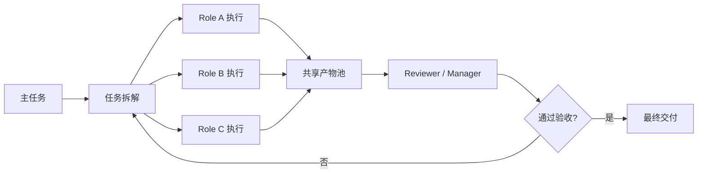

---
kb_id: ai-agent/frameworks/camel-ai-and-agent-society
title: CAMEL-AI / Agent Society：多智能体不是多人聊天，而是角色、任务、共享产物和验收链共同组成的协作运行时
domain: ai-agent
component: camel-ai
topic: camel-ai-agent-society
difficulty: advanced
status: reviewed
sidebar_position: 22
version_scope: CAMEL-AI docs, CAMEL Workforce docs, and 实践资料 handy-multi-agent repository as verified on 2026-05-12
last_verified_at: '2026-05-12'
source_ids:
  - camel-ai-docs
  - camel-ai-workforce-docs
  - practice-handy-multi-agent
claim_ids:
  - practice-p0-claim-0005
  - practice-p0-claim-0006
  - practice-p0-claim-0008
  - agent-runtime-claim-0004
tags:
  - ai-agent
  - camel-ai
  - multi-agent
  - workforce
  - agent-society
---
## CAMEL-AI 最值得讲的不是“多个 Agent 一起干活”，而是协作运行时怎样把角色、任务和验收链组织起来
多智能体最容易被讲成角色扮演：一个 Agent 当产品经理，一个当程序员，一个当测试。这样的回答几乎没有解释任何运行原理。CAMEL-AI 真正有价值的地方，是它把多智能体问题拉回到协作系统视角：谁负责什么、任务如何分派、共享什么产物、谁来验收结果，以及失败后如何收敛。

### 解决什么问题
单 Agent 在复杂任务上常见的问题是上下文过重、目标过宽、结果缺乏交叉检查。多智能体看似能分担这些问题，但如果没有运行时约束，系统只会从“一个大黑箱”变成“多个互相放大错误的小黑箱”。CAMEL-AI 这类框架真正要解决的是：

1. 如何把复杂目标拆成可分配的任务单元。
2. 如何给不同 Agent 明确职责和工具边界。
3. 如何通过共享产物而不是纯对话来传递状态。
4. 如何在多个 Agent 之间形成最终验收链和终止条件。

### 核心对象
| 对象 | 作用 | 观察重点 |
| --- | --- | --- |
| Role | 定义职责、工具权限和输出边界 | owner 是否明确、上下文是否受限 |
| Task | 定义输入、输出、依赖和验收标准 | 成功条件、超时、失败处理 |
| Workforce | 组织多个 worker 协作执行 | 调度方式、分工粒度、收敛能力 |
| Shared Artifact | 保存需求、证据、设计、代码或报告 | 是否可检查、是否可回放 |
| Reviewer / Manager | 负责验收、调度或冲突协调 | 是否是瓶颈、是否可审计 |

### 执行链路
成熟的多智能体链路不是大家轮流聊天，而是一条正式协作链：

1. 请求先被拆成主任务与子任务。
2. Workforce 按 Role 分派任务，而不是让所有 Agent 都看完整上下文。
3. 各 Agent 输出结构化共享产物，而不是只输出自然语言评论。
4. Manager 或 Reviewer 根据验收标准决定是否合并、重做或终止。
5. 最终输出由一个明确 owner 负责汇总，而不是“谁最后说话就算谁对”。



### 一致性与容错边界
CAMEL-AI 并不会自动保证多智能体结论一致。真正的一致性依赖以下设计：

1. Role 的输入输出格式要稳定，否则共享产物无法合并。
2. Task 要有明确 owner，否则失败后没人知道该由谁接手。
3. Shared Artifact 要比聊天消息更稳定，因为文本对话很难作为后续 Agent 的正式依赖。
4. 如果 Reviewer 或 Manager 出错，系统要能看到错误是在哪个协作环节引入的。

### 性能模型
多智能体的性能瓶颈主要来自协作成本，而不是单个模型速度：

1. Agent 数量增加会带来上下文同步成本。
2. Manager 协调过多，会形成集中瓶颈。
3. 共享产物过大，会增加读取和理解成本。
4. 多轮讨论过多，会让协作从“并行加速”变成“串行拖慢”。

```yaml
camel_workforce_budget:
  worker_count: 3
  manager_enabled: true
  max_review_rounds: 2
  required_artifacts:
    - requirement_note
    - evidence_bundle
    - final_summary
```

### 生产排障
多智能体系统出问题时，建议先看：

1. 任务拆解是否合理，是否所有 Agent 都在做重复工作。
2. 共享产物是否结构化，还是只是零散对话。
3. Manager 或 Reviewer 是否成为瓶颈或错误传播点。
4. 最终失败是因为角色边界不清，还是验收标准缺失。

### 最小样例
```python
work_items = [
    {"role": "researcher", "goal": "collect evidence"},
    {"role": "analyst", "goal": "compare options"},
    {"role": "reviewer", "goal": "accept or reject draft"},
]

for item in work_items:
    assign_to_role(item)
```

### 和相邻技术的边界
CAMEL-AI 与单 Agent 框架的区别，在于它更强调协作系统而不是单体 loop；与纯工作流系统相比，它保留了更强的角色自治空间。真正的理解重点，是协作运行时和共享产物，而不是“谁的 persona 更像人”。

## 本页结论
CAMEL-AI 的 Agent Society 不是多人群聊，而是一个由 Role、Task、Workforce、Shared Artifact 和 Reviewer 共同构成的协作运行时。把这些对象和它们的验收链讲清楚，才算真正理解了多智能体原理。
