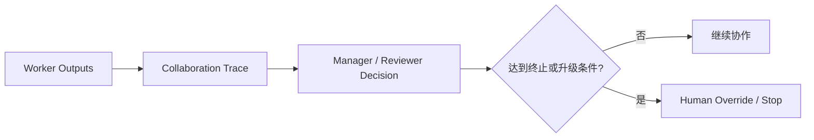

---
kb_id: ai-agent/frameworks/camel-ai-production-governance-observability-and-human-override
title: CAMEL 生产治理：多智能体为什么更需要观测、人工覆盖和终止语义
domain: ai-agent
component: camel-ai
topic: production-governance-observability-human-override
difficulty: advanced
status: reviewed
sidebar_position: 24
version_scope: CAMEL-AI docs, CAMEL Workforce docs, and 实践资料 handy-multi-agent repository as verified on 2026-05-12
last_verified_at: '2026-05-12'
source_ids:
  - camel-ai-docs
  - camel-ai-workforce-docs
  - practice-handy-multi-agent
claim_ids:
  - practice-p0-claim-0005
  - practice-p0-claim-0006
  - agent-runtime-claim-0006
tags:
  - ai-agent
  - camel-ai
  - observability
  - hitl
  - governance
---
## 多智能体系统的治理要求通常高于单 Agent，因为错误会沿协作链扩散
单 Agent 出错时，问题通常集中在一个 loop 里；多智能体出错时，错误可能在多个角色和多轮共享产物之间传播。所以 CAMEL 这类系统如果要进入生产，核心问题会从“会不会协作”迅速转向“怎样看清协作、怎样及时中止、怎样人工覆盖”。

### 解决什么问题
多智能体场景里最常见的生产问题包括：

1. 某个角色的错误被后续角色不断引用。
2. Manager 反复分配无效任务，系统迟迟不收敛。
3. reviewer 没有发现共享产物中的关键错误。
4. 需要人工介入时，没有明确终止或接管机制。

### 核心对象
| 对象 | 作用 | 关键问题 |
| --- | --- | --- |
| Collaboration Trace | 记录不同角色的决策链 | 错误从哪一环扩散 |
| Termination Rule | 定义何时结束或中止协作 | 最大轮次、失败阈值 |
| Human Override | 允许人工接管或修改结论 | 从哪一层接入 |
| Escalation Policy | 定义何时升级给人工 | 高风险动作、反复失败 |
| Review Log | 记录 reviewer / manager 的判定依据 | 是否可复核 |

### 执行链路
进入生产的多智能体协作，通常需要把下面几件事内建进去：

1. 每个 role 的输出都进入 collaboration trace。
2. 共享产物每次变更都有 reviewer 或 manager 判定记录。
3. 达到最大轮次、连续失败或高风险动作时，触发 escalation policy。
4. Human override 能修改共享产物、停止某个 worker 或直接终结任务。



### 一致性与容错
治理层最重要的边界是：

1. trace 要足够细，才能定位错误传播起点。
2. termination rule 要足够刚性，避免无限讨论。
3. human override 要能作用到共享产物和任务状态，而不是只在聊天里给建议。
4. escalation policy 要和风险级别绑定，不能所有问题都让系统自己扛。

### 性能模型
治理能力也会带来成本：

1. trace 过细会增加存储和分析开销。
2. reviewer 次数过多会增加整体延迟。
3. escalation 过于敏感会降低自动化收益。
4. termination rule 过松会造成无效 token 消耗。

```yaml
multi_agent_governance:
  max_rounds: 5
  escalate_on:
    - repeated_conflict
    - high_risk_tool_request
    - reviewer_reject_twice
  human_override:
    can_edit_artifact: true
    can_stop_workforce: true
```

### 生产排障
CAMEL 系统出问题时，排障顺序通常是：

1. 先看 collaboration trace，确认错误最早来自哪个角色。
2. 再看 reviewer / manager 是否及时识别异常。
3. 再看 termination rule 有没有生效。
4. 最后看 escalation policy 是否该早一点把问题交给人。

### 最小样例
```python
if repeated_conflict(trace) or high_risk_requested(task):
    escalate_to_human(task)
```

### 和相邻技术的边界
这页讨论的是多智能体治理，不是基础协作抽象。单 Agent 也需要 trace 和 HITL，但多智能体更强调错误传播、终止语义和人工覆盖链。

## 本页结论
CAMEL 这类多智能体系统一旦进入生产，真正的门槛不在角色设计，而在治理：是否有 collaboration trace、是否有 termination rule、是否能 human override、是否能在错误扩散前及时中止。把这些边界讲清，才能说明你理解的是生产级多智能体，而不是 Demo。
