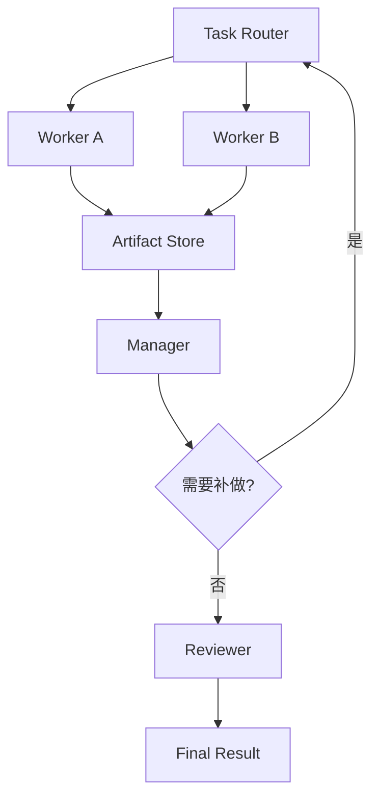

---
kb_id: ai-agent/frameworks/camel-ai-workforce-task-routing-and-shared-artifacts
title: CAMEL Workforce 深水区：Task Routing、共享产物、Manager / Reviewer 和失败收敛怎么设计
domain: ai-agent
component: camel-ai
topic: workforce-task-routing-shared-artifacts
difficulty: advanced
status: reviewed
sidebar_position: 23
version_scope: CAMEL-AI docs, CAMEL Workforce docs, and 实践资料 handy-multi-agent repository as verified on 2026-05-12
last_verified_at: '2026-05-12'
source_ids:
  - camel-ai-docs
  - camel-ai-workforce-docs
  - practice-handy-multi-agent
claim_ids:
  - practice-p0-claim-0005
  - practice-p0-claim-0006
  - agent-runtime-claim-0004
tags:
  - ai-agent
  - camel-ai
  - workforce
  - task-routing
  - artifact
---
## 多智能体真正难的是路由和收敛，而不是再增加几个角色
当系统从“两个 Agent 互相对话”走向更复杂的 Workforce 时，问题会立刻变成调度问题：哪个任务该交给谁，结果怎样回收，错误出现后怎么收敛。CAMEL Workforce 的学习重点，不是角色数量，而是任务路由和共享产物如何支持正式协作。

### 解决什么问题
没有任务路由和共享产物设计，多智能体通常会遇到：

1. 多个 Agent 重复分析同一问题。
2. 没有 owner，出了问题不知道谁负责修正。
3. 输出格式不一致，最后无法汇总。
4. 错误结论被一个 Agent 提出后，被其他 Agent 连续引用和放大。

### 核心对象
| 对象 | 作用 | 关键边界 |
| --- | --- | --- |
| Task Router | 决定任务发给哪个角色 | 路由规则、上下文裁剪 |
| Worker | 执行具体子任务 | 角色职责、工具权限 |
| Shared Artifact Store | 保存中间结果 | 格式稳定、可复核 |
| Manager | 负责调度和二次分派 | 是否集中瓶颈 |
| Reviewer | 负责验收和打回 | 验收标准、回退逻辑 |

### 执行链路
比较稳妥的 Workforce 链路通常是：

1. Task Router 根据目标和子任务类型选定 worker。
2. Worker 只接收完成当前子任务所需的最小上下文。
3. 输出统一写入共享产物仓，而不是只回到聊天流里。
4. Manager 判断是否还需拆分、补做或换人执行。
5. Reviewer 根据验收规则做最终通过或打回。



### 一致性与容错
这里最重要的容错点有三类：

1. Artifact 必须有统一结构，否则不同 worker 的结果无法合并。
2. Router 需要有最小化上下文策略，避免所有 worker 都背负完整历史。
3. Manager 和 Reviewer 的意见必须可追踪，否则你无法判断错误来自路由、执行还是验收。

### 性能模型
Workforce 的性能成本来自调度和同步：

1. Router 太复杂，会引入额外规划延迟。
2. Worker 之间共享的信息太多，会抬高 token 成本。
3. Reviewer 轮次太多，会把并行协作重新串行化。
4. Artifact Store 结构过大，会降低检索与汇总效率。

```json
{
  "task_router": {
    "max_parallel_workers": 3,
    "shared_context_policy": "minimal"
  },
  "review": {
    "max_revision_rounds": 2
  }
}
```

### 生产排障
如果一个 Workforce 系统表现很差，优先看：

1. Router 是否分派了错误角色。
2. Artifact 是否没有结构化，导致 reviewer 无法判断。
3. Manager 是否不断重复拆任务而没有真正推进。
4. Reviewer 是否标准过宽或过严，导致系统要么放错要么一直打回。

### 最小样例
```python
artifact = {
    "task_id": "t-101",
    "owner": "researcher",
    "status": "draft",
    "payload": {"evidence": []}
}
```

### 和相邻技术的边界
这一页讲的是多智能体的调度与收敛，不是讲单 Agent 工具调用。和普通 workflow 的区别在于 worker 仍保留局部自治，但调度与验收链必须是显式的。

## 本页结论
CAMEL Workforce 的关键不是“能不能让多个 Agent 同时工作”，而是 Task Router、Artifact Store、Manager 和 Reviewer 如何共同保证协作系统能收敛、能验收、能排障。
