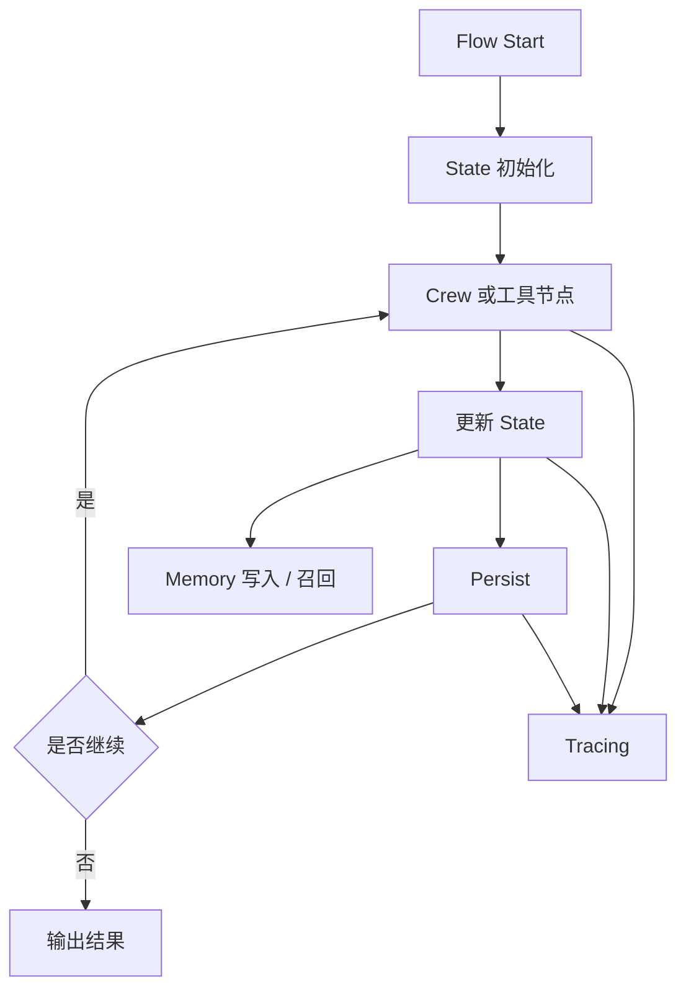

---
kb_id: ai-agent/frameworks/crewai-flows-memory-and-tracing
title: CrewAI 深水区：Flow 状态、persist、Memory、Tracing 为什么决定它能不能真正上线
domain: ai-agent
component: crewai
topic: flows-memory-tracing
difficulty: advanced
status: reviewed
sidebar_position: 11
version_scope: CrewAI docs v1.14.x as verified on 2026-05-12
last_verified_at: '2026-05-12'
source_ids:
  - crewai-flows-docs
  - crewai-memory-docs
  - crewai-tracing-docs
  - crewai-processes-docs
claim_ids:
  - crewai-claim-0003
  - crewai-claim-0004
  - crewai-claim-0005
  - crewai-claim-0007
  - crewai-claim-0008
  - crewai-claim-0009
tags:
  - ai-agent
  - crewai
  - flow
  - memory
  - tracing
---
## 真正决定 CrewAI 能不能进生产的，往往不是角色设计，而是状态、恢复和观测
很多人介绍 CrewAI 时会花大量篇幅讲 Agent 角色、任务描述和协作方式，但生产系统真正容易出问题的地方，往往不在那里。系统能不能上线，更取决于三件事：

- Flow 的状态有没有正式建模。
- 中断后能不能依靠 persist 继续执行。
- 任务失败时能不能通过 tracing 还原事实链。

所以这页的重点不是“怎么写一个很酷的 Crew”，而是“如何让 Crew 外层的运行骨架可恢复、可观察、可治理”。

## Flow 为什么是生产骨架
CrewAI 文档把 `Flow` 定义成 event-driven workflow，这件事的意义非常大。它说明 Flow 不是普通的步骤串联，而是拥有：

- 明确的状态对象
- 路径推进规则
- 可触发、可等待、可恢复的执行语义

只要系统是长任务、审批流或多步骤工具调用，Flow 就比纯 Agent 协作更接近生产需要的控制层。

## State 不只是聊天历史
Flow 里的 `State` 不是对话 transcript，而是任务推进的正式合同。一个更成熟的状态对象通常会包含：

- request_id
- 当前阶段
- 已完成节点
- 外部工具结果
- 审批状态
- 错误信息
- 输出摘要或中间结论

如果状态结构设计得很散，后面的节点就会变成依赖隐式上下文的黑箱函数，恢复、回放和排障都会非常困难。

## persist 解决的到底是什么
CrewAI 文档里的 `persist` 不是锦上添花，而是恢复语义的入口。它让 Flow 状态在进程中断后仍能存续，并在之后继续推进。

它主要解决：

- 长任务执行到一半时，进程重启不至于全部丢失。
- 人工审批、异步等待、定时继续这类场景有明确恢复点。
- 状态变更有了稳定落点，排障时可以知道流程断在哪里。

但它不自动解决：

- 工具副作用是否已经发生。
- 重放时外部系统会不会被重复写入。
- 历史状态字段变更是否兼容。
- 审批动作是否已经被确认。

所以 persist 是恢复基础，不是完整幂等方案。

## Memory 为什么不能讲成“记住上下文”
如果只说 Memory 用来“记住上下文”，答案会很浅。更准确的说法是：CrewAI 当前 memory 系统更偏任务经验和长期上下文层，它会依赖统一 Memory 类，以及 LLM 参与判断什么值得保存和召回。

因此 Memory 更像：

- 任务复用经验
- 长期偏好或背景知识
- 跨任务可用的事实片段

它不是用来取代 Flow State 的。Flow State 决定当前任务如何继续，Memory 决定未来任务能否带着历史经验开始。前者解决执行一致性，后者解决上下文延续性。

## Tracing 为什么是最后一道证据链
多 Agent 系统一旦出错，最怕只剩最终坏结果，而看不到中间发生过什么。CrewAI tracing 的价值就在这里：它把 agent 决策、任务时间线、工具使用和 LLM 调用暴露成可检查轨迹。

这意味着我们能回答：

- 哪个任务步骤最慢。
- 哪次工具调用失败。
- manager 或某个角色是怎么做出错误判断的。
- Memory 是否把错误上下文引进了后续流程。

没有 tracing，团队通常只能靠日志碎片猜问题；有 tracing，执行链才真正可审计。

## 一条更完整的生产链路
把这几个对象放在一起，一条生产级 CrewAI 流程会更像这样：

1. Flow 创建结构化 state。
2. 节点按事件和路径规则推进。
3. 需要开放式子任务时，Flow 调用 Crew。
4. Crew 协作结果写回 state。
5. persist 在关键节点保留恢复点。
6. Memory 选择性写入可复用经验。
7. tracing 记录整条执行事实链。
8. 如果出现中断、等待或错误，系统基于 state 与 persist 继续或排障。



## 一致性与容错该怎么讲
Flow + persist 给了恢复能力，但恢复不等于正确。真正成熟的回答会继续补：

- 有副作用的工具调用必须设计幂等键或外部去重逻辑。
- 审批节点必须记录决策结果，而不是只记录“等待过审批”。
- 状态 schema 变更要考虑历史状态如何兼容读取。
- Memory 写入要避免把错误结论沉淀为长期知识。

这说明 CrewAI 的生产治理不是开一个 persist 开关就完成，而是要把状态、恢复和副作用边界一起设计。

## 性能模型怎么看
CrewAI 深水区的性能问题，通常出现在以下几个层面：

- persist 点太多，导致状态写入开销过高。
- Crew 协作轮数太多，模型调用和上下文同步成本放大。
- tracing 明细过全，导致吞吐下降或排障数据过载。
- Memory 检索和总结开销叠加到主链路延迟。
- 等待审批或外部工具时，端到端 SLA 被拉长。

### 排障样例
```yaml
flow_debug_snapshot:
  current_step: "approval_gate"
  state_version: 12
  last_persist_id: "cp-20260512-0042"
  waiting_for_human: true
  memory_write_enabled: false
  trace_span_count: 37
  suspected_bottleneck: "manager_llm_retry"
```

这个样例强调：排障时要先看流程停在哪、状态是否已持久化、是否卡在人类审批、trace 是否能证明瓶颈来自 manager 或工具层。

## 生产排障应该先看什么
当 CrewAI 任务失败时，建议按下面顺序排：

1. 先看 Flow state 是否进入了错误阶段还是等待阶段。
2. 再看最近 persist 点能否恢复出完整状态。
3. 再看 tracing 里是哪次 agent 决策或工具调用偏离了预期。
4. 最后看 Memory 是否把错误上下文带入后续执行。

这个顺序很关键，因为它先分清“控制层出错”还是“知识层出错”。

## 最小样例
```python
flow_state = {
    "request_id": "req-002",
    "current_stage": "research",
    "summary": None,
    "approval": "pending",
}

persist_checkpoint(flow_state)

crew_result = run_analysis_crew(flow_state)
flow_state["summary"] = crew_result

write_memory_if_reusable(flow_state)
record_trace(flow_state)

if needs_human_review(flow_state):
    wait_for_review(flow_state)
```

这个例子想表达的是：状态、持久化、记忆和 trace 都是运行骨架的一部分，而不是可有可无的配件。

## 本页结论
CrewAI 真正能不能进生产，关键不在角色写得多漂亮，而在 Flow state 是否正式、persist 是否能恢复、Memory 是否有边界、Tracing 是否能还原事实链。把这四层讲清，才能算真正理解了 CrewAI 的生产语义。
