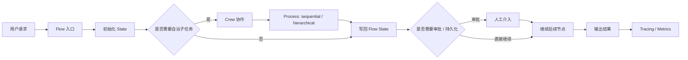

---
kb_id: ai-agent/frameworks/crewai
title: CrewAI：它为什么要把 Crews 和 Flows 分成两层运行语义
domain: ai-agent
component: crewai
topic: overview
difficulty: advanced
status: reviewed
sidebar_position: 10
version_scope: CrewAI docs v1.14.x as verified on 2026-05-12
last_verified_at: '2026-05-12'
source_ids:
  - crewai-introduction-docs
  - crewai-crews-docs
  - crewai-flows-docs
  - crewai-processes-docs
  - crewai-memory-docs
  - crewai-tracing-docs
claim_ids:
  - crewai-claim-0001
  - crewai-claim-0002
  - crewai-claim-0003
  - crewai-claim-0004
  - crewai-claim-0005
  - crewai-claim-0006
  - crewai-claim-0007
  - crewai-claim-0008
  - crewai-claim-0009
tags:
  - ai-agent
  - crewai
  - crews
  - flows
  - runtime
---
## CrewAI 最该先讲清的，不是“多 Agent 协作”，而是“自治层”和“控制层”怎么分工
很多人介绍 CrewAI 时，会先说它能让多个 Agent 协同完成任务。这只能算表面现象。真正把 CrewAI 和普通 multi-agent demo 拉开差距的，是它明确把 `Crews` 和 `Flows` 拆成两层：`Crew` 更偏自治协作，`Flow` 更偏事件驱动、状态化、可恢复的执行骨架。

如果一句话说准，CrewAI 更像一个把“开放式 Agent 协作”放进“可控流程外壳”里的框架，而不是单纯鼓励所有步骤都交给 Agent 自由发挥。

## 它想解决什么问题
复杂 Agent 系统往往有两个互相冲突的目标：

- 任务需要模型自主拆解、分工和协作。
- 生产系统又必须保留路径控制、状态边界、恢复能力和排障抓手。

如果全部走自治协作，系统会很难审计和恢复；如果全部写成死板工作流，又会失去 Agent 的灵活性。CrewAI 的核心设计，就是把这两个目标拆成不同控制层：

- `Crew` 负责角色化协作和开放式子任务。
- `Flow` 负责执行路径、状态、恢复和事件驱动控制。

这也是官方为什么明确建议生产级场景优先从 `Flows` 开始，再把 `Crews` 放进 `Flows` 里处理更复杂自治任务。

## 核心对象怎么讲
### Crew
`Crew` 是协作单元。它代表多个具备不同角色、目标和职责的 Agent 为同一个任务共同工作。它更适合用来承接开放式问题，例如研究、方案比较、内容生成、分析汇总等。

### Flow
`Flow` 是执行骨架。官方把它定位成 event-driven workflow，强调路径控制和状态管理。它的价值不在“能画流程”，而在于它让 Agent 系统拥有明确的启动、推进、暂停、恢复和结束边界。

### State
`State` 是 Flow 的核心对象。它不只是聊天历史，而是任务推进所依赖的正式状态数据。状态设计决定了哪些结果被保留、哪些节点共享、哪些数据需要持久化。

### Process
`Process` 是 Crew 内部协作策略。官方文档给出的典型模式包括 `sequential` 和 `hierarchical`。其中 hierarchical 需要 `manager_llm` 或自定义 `manager_agent`，这说明更复杂的自治协作并不是免费得到的，而是引入了额外控制主体。

### Memory
`Memory` 不是简单拼接聊天记录。CrewAI 的当前 memory 系统强调统一 Memory 类，以及由 LLM 参与判断哪些内容该存、哪些内容该取回。它更像任务经验和长期上下文层，而不是“把全部聊天记录存下来”。

### Tracing
`Tracing` 是生产可观测能力。它把 crews 和 flows 的执行细节暴露出来，包括 agent 决策、任务时间线、工具使用和 LLM 调用。没有 tracing，多 Agent 系统故障时只剩一个坏结果，很难定位中间哪一层出了问题。

## 一条典型执行链怎么走
一个更成熟的 CrewAI 执行链可以这样理解：

1. 用户请求进入 Flow。
2. Flow 初始化结构化状态，记录 request_id、目标、权限、审批状态等控制信息。
3. Flow 决定哪些步骤是固定顺序，哪些步骤要交给 Crew 自治协作。
4. Crew 内部按 sequential 或 hierarchical process 运行多个 Agent。
5. Crew 输出结果写回 Flow state。
6. Flow 再决定是否需要人工审批、补充工具调用、状态持久化或后续节点推进。
7. Memory 为跨步骤和跨任务的上下文提供可选支持。
8. Tracing 全程记录执行链，供调试、回放和治理使用。



## 为什么官方建议 Flow-first
这不是一句使用偏好，而是很强的工程判断。Flow-first 的含义是：

- 生产系统先建立可控路径和状态容器。
- 自治协作只放到合适的子任务边界里。
- Agent 的不确定性必须被流程边界包起来。

如果技术复盘里能主动讲出这层含义，回答会比“CrewAI 支持多 Agent”高一个层级。因为你讲的是运行时设计哲学，而不是 API 列表。

## Crew 和 Flow 的责任边界
成熟回答里一定要把这两层切开：

- `Crew` 负责多角色分工、开放式子任务和协作判断。
- `Flow` 负责路径推进、状态承载、事件驱动、恢复和审批边界。

所以 `Crew` 不应被理解成完整应用外壳，`Flow` 也不应被理解成只是换一种写法的 Crew。二者代表的是不同粒度的控制语义。

## Process 为什么不能只背概念
`sequential` 和 `hierarchical` 的差别，不能只回答“一个顺序执行，一个分层执行”。更深一层的回答是：

- `sequential` 更适合依赖关系清晰、步骤固定的协作任务。
- `hierarchical` 引入 manager 统一调度，更适合任务需要动态拆解和集中协调的场景。
- 但 hierarchical 会带来新的复杂度，例如 manager 决策错误、任务转派不透明、排障链变长。

这就是为什么 process 不是语法选项，而是协作控制策略。

## Memory 和 Persistence 的边界
CrewAI 文档里 Memory 和 Flow persist 都很重要，但不能混成一个东西：

- `Memory` 更偏经验、上下文和任务知识层。
- `persist` 更偏 Flow 执行状态跨进程存续。

前者帮助长期任务延续上下文，后者帮助故障恢复和长流程继续推进。一个负责“记住什么”，一个负责“从哪继续”，职责完全不同。

## 性能模型应该怎么看
CrewAI 的性能瓶颈通常不在“框架本身”，而在运行链的几个放大器：

- Crew 内多 Agent 往返会放大 token 成本和延迟。
- hierarchical process 引入 manager，会增加额外模型调用和协调开销。
- Flow 中的外部工具、审批等待和持久化会拉长端到端时延。
- Memory 检索和 tracing 输出也会增加执行面成本。

因此成熟设计不会盲目“多 Agent 化”，而是把自治步骤限制在真正需要的局部任务里。

### 性能排查样例
```yaml
crewai_runtime_budget:
  planning_rounds: 3
  crew_llm_calls: 8
  manager_calls: 2
  tool_calls: 5
  persist_points: 4
  approval_wait_sla_minutes: 30
  tracing_mode: essential_only
```

这个样例强调：CrewAI 的吞吐与延迟取决于协作轮数、manager 调度、外部工具和审批等待，而不是只看单次模型响应速度。

## 生产里最容易出问题的地方
- 把所有逻辑都塞进 Crew，导致路径失控。
- 状态 schema 设计松散，后续节点之间互相污染。
- hierarchical process 引入 manager，却没有做足 tracing 和权限限制。
- 误把 memory 当成完整恢复方案。
- 开启 persist 之后，没有补幂等和副作用治理。

## 和相邻框架的边界
和 LangGraph 相比，CrewAI 更强调 Crews 与 Flows 的分层协作表达；LangGraph 更偏状态图运行时。

和 AutoGen 相比，CrewAI 更明确地区分自治协作层和流程控制层；AutoGen 更偏多 Agent 运行时与团队协作协议。

和纯 workflow 平台相比，CrewAI 的价值在于保留自治空间，而不是把所有路径写死。

## 最小样例
下面这个例子只表达“Flow 控主路径，Crew 处理自治子任务”的最小结构，不追求可直接运行：

```python
flow_state = {
    "request_id": "req-001",
    "user_goal": "整理一份调研结论",
    "approval_status": "pending",
    "crew_output": None,
}

# Flow 负责主路径和状态
validate_scope(flow_state)

# Crew 只负责开放式子任务
crew_output = run_research_crew(flow_state["user_goal"])
flow_state["crew_output"] = crew_output

# 高风险步骤回到 Flow 控制
if requires_approval(crew_output):
    request_human_approval(flow_state)

publish_result(flow_state)
```

这个例子真正要表达的是责任边界，而不是某个具体 API 名字。

## 本页结论
CrewAI 最值得讲的，不是“多个 Agent 协作”，而是它把 `Crew` 和 `Flow` 明确拆成自治层和控制层：Crew 负责协作，Flow 负责路径、状态、恢复和审批。只要把这条主线讲清，CrewAI 就不会再被误答成普通 multi-agent demo。
