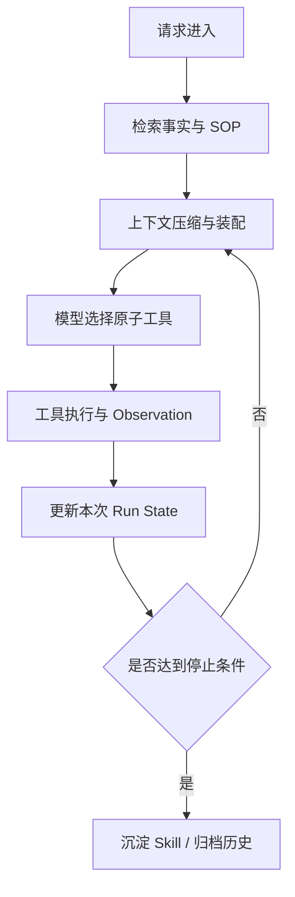

---
kb_id: ai-agent/frameworks/generic-agent-context-density-memory-and-self-evolution
title: GenericAgent：上下文信息密度、原子工具、分层记忆与技能沉淀为什么必须放在同一条运行链上
domain: ai-agent
component: generic-agent
topic: context-density-memory-self-evolution
difficulty: advanced
status: reviewed
sidebar_position: 16
version_scope: GenericAgent repository, OpenAI context engineering guides, and 实践资料 hello-generic-agent repository as verified on 2026-05-12
last_verified_at: '2026-05-12'
source_ids:
  - generic-agent-github
  - practice-hello-generic-agent
  - openai-conversation-state-guide
  - openai-compaction-guide
claim_ids:
  - practice-p1-claim-0005
  - agent-runtime-claim-0002
  - agent-runtime-claim-0003
  - agent-runtime-claim-0009
  - agent-runtime-claim-0010
tags:
  - ai-agent
  - generic-agent
  - context-engineering
  - memory
  - autonomous-loop
---
## GenericAgent 真正想解决的不是“上下文太短”，而是长期 Agent 怎么用更少的上下文做更稳定的动作
GenericAgent 这类框架经常被说成“带记忆的通用 Agent”或者“能自我进化的 Agent”。这些描述没有错，但都没有落到运行原理。更准确的理解方式是：它把长期 Agent 的问题拆成四件事一起处理，分别是高密度上下文、最小原子工具、分层记忆和技能沉淀。四者缺一不可，因为它们共同决定一条执行链能否在多轮任务里持续收敛。

### 解决什么问题
长任务 Agent 的常见失败，不是模型不会回答，而是系统把不该同时出现的信息全部塞进上下文里，导致下一步动作越来越不稳定。典型表现包括：

1. 任务历史越来越长，但真正相关的信息反而被淹没。
2. 一个工具承担过多动作，模型不知道是参数错了、权限错了还是副作用已经发生。
3. 聊天历史被当成 memory，导致长期状态、临时状态和事实知识混在一起。
4. 某次成功执行没有沉淀成 SOP，后续相似任务还要从头规划。

因此 GenericAgent 的第一性原理不是扩上下文，而是提高上下文信息密度，并把可执行经验从“临时推理”变成“结构化产物”。

### 核心对象
| 对象 | 作用 | 观察重点 |
| --- | --- | --- |
| Autonomous Loop | 负责 plan、act、observe、stop 的主循环 | 每轮输入、停止条件、最大步数 |
| Atomic Tool | 承担单一职责的最小动作单元 | 参数 schema、副作用、失败语义 |
| Context Pack | 当前轮真正装入 prompt 的高密度上下文包 | token 占用、相关性、压缩比 |
| Layered Memory | 把事实、SOP、索引、归档分层存放 | 命中率、污染率、过期策略 |
| Skill Artifact | 从成功任务中沉淀出的 SOP、脚本、模板 | 版本、评估、回滚 |
| Compaction Result | 对历史执行链进行压缩后的摘要或状态 | 是否丢关键信息、是否可恢复 |

这些对象不能孤立理解。更稳妥的方式，是把它们放进“任务进入、上下文装配、工具执行、结果沉淀、后续复用”这条执行链中观察。

### 执行链路
GenericAgent 一条典型执行链可以拆成下面几个阶段：

1. 请求进入运行时，系统先识别任务目标、风险等级和允许使用的工具范围。
2. 记忆层先通过索引检索与当前目标最相关的事实、SOP 和历史产物。
3. 上下文装配层执行 compaction，只把高密度信息放进当前 prompt。
4. 模型在最小原子工具集合中选择下一步动作，而不是直接生成长串副作用命令。
5. 工具返回 observation 后，系统把临时结果写回 run state，而不是直接写进长期记忆。
6. 当任务成功结束，系统再决定哪些内容应该沉淀为 skill artifact，哪些只应进入归档层。



### 一致性与容错边界
GenericAgent 不是数据库，也不是事务执行器，它不天然保证外部副作用的一致性。成熟实现必须明确下面几层边界：

1. 当前轮 run state 只表示系统认为已经发生了什么，不等于外部世界一定完成了相同动作。
2. 原子工具必须标明是否幂等，不能把“发消息”“写文件”“创建工单”这类副作用动作当成可无限重试的普通步骤。
3. compaction 只能压缩上下文，不能代替 checkpoint；如果要从中断处恢复，还需要正式的恢复点或状态快照。
4. 长期 memory 写入必须晚于关键事实确认，否则错误 observation 会被沉淀成长期污染。

### 性能模型
GenericAgent 的性能瓶颈通常来自四个放大器：

1. 检索层：召回太多无关记忆，会让上下文装配成本上升。
2. 压缩层：每轮都做复杂总结，会额外增加模型调用延迟。
3. 工具层：大工具输入复杂、返回冗长，会抬高失败率和 token 成本。
4. 技能层：如果 skill 过多但没有索引和版本治理，系统会花更多时间判断该复用哪个技能。

因此性能调优不应只看上下文窗口大小，更要看信息密度、技能命中率和每轮动作粒度。

```yaml
generic_agent_budget:
  max_steps: 8
  memory_recall_items: 5
  compaction_every_n_steps: 2
  allowed_tools:
    - open_page
    - read_file
    - search_workspace
    - summarize_result
  side_effect_tools_require_approval: true
```

### 生产排障
排 GenericAgent 问题时，建议按下面顺序看证据：

1. 先看本轮 context pack 里到底装了哪些信息，确认是不是“记忆太多”而不是“模型太弱”。
2. 再看模型选中的 Atomic Tool 是否合理，确认是检索错误、规划错误还是工具边界过大。
3. 再检查 compaction 结果是否把关键事实压丢了。
4. 最后再判断是否有错误技能被重复复用，或者长期 memory 已经污染。

如果 trace 里看到每轮都在重复同样的动作，通常不是模型随机性问题，而是停止条件、run state 更新或 skill 命中策略出了边界错误。

### 最小样例
下面的示意代码只表达 GenericAgent 的责任分层，不追求可直接运行：

```python
run_state = {
    "goal": "整理某服务发布失败的根因",
    "steps": 0,
    "observations": [],
    "approved_tools": ["search_logs", "read_runbook", "draft_summary"],
}

memory_hits = recall_memory(goal=run_state["goal"], top_k=5)
context_pack = compact_context(memory_hits, run_state)

action = model_select_tool(context_pack, run_state["approved_tools"])
observation = execute_atomic_tool(action)
run_state["observations"].append(observation)

if task_succeeded(run_state):
    crystallize_skill_if_reusable(run_state)
```

### 和相邻技术的边界
GenericAgent 与工作流平台的区别，不在于能不能调用工具，而在于它把“高密度上下文 + 原子动作 + 长期经验沉淀”视为核心运行机制。与单纯聊天机器人相比，它多了执行链、状态和技能沉淀；与重型状态图框架相比，它更强调上下文工程和技能演化，而不是复杂恢复语义本身。

## 本页结论
理解 GenericAgent 时，不能只记“有记忆、会进化”。真正值得掌握的是：上下文信息密度决定模型是否拿到正确依据，原子工具决定动作是否可控，分层记忆决定长期运行是否稳定，技能沉淀决定系统是否会从一次成功执行里学到可复用产物。四者组合起来，才构成长期 Agent 的真实运行机制。
