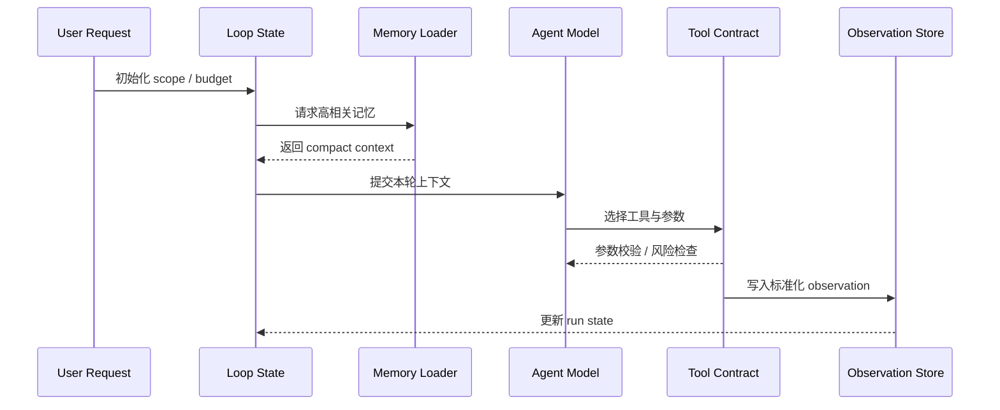

---
kb_id: ai-agent/frameworks/generic-agent-runtime-loop-tool-contracts-and-memory-loading
title: GenericAgent 运行时深拆：Loop、Tool Contract、Memory Loading 和 Stop Condition 如何共同收敛任务
domain: ai-agent
component: generic-agent
topic: runtime-loop-tool-contract-memory-loading
difficulty: advanced
status: reviewed
sidebar_position: 17
version_scope: GenericAgent repository, OpenAI context engineering guides, and 实践资料 hello-generic-agent repository as verified on 2026-05-12
last_verified_at: '2026-05-12'
source_ids:
  - generic-agent-github
  - practice-hello-generic-agent
  - openai-conversation-state-guide
  - openai-compaction-guide
claim_ids:
  - practice-p1-claim-0005
  - agent-runtime-claim-0002
  - agent-runtime-claim-0003
  - agent-runtime-claim-0005
  - agent-runtime-claim-0009
tags:
  - ai-agent
  - generic-agent
  - runtime-loop
  - tool-contract
  - memory-loading
---
## GenericAgent 的稳定性，更多来自 Loop Contract，而不是来自某个更强的模型
很多实现把 Agent loop 写成“不断把历史对话喂回模型”。这种做法短期能跑，长期几乎一定失控。GenericAgent 更值得学习的地方，在于它把 loop 看成正式的运行时协议：每一轮到底读取什么状态、模型可以选择什么动作、Observation 怎样写回、何时停机，都应该有明确合同。

### 解决什么问题
如果 loop contract 不清楚，长期 Agent 会出现三类典型问题：

1. 工具调用越来越像临时拼接，模型并不知道哪些工具安全、哪些工具幂等。
2. 记忆装载没有准入标准，导致每轮 prompt 都越来越重。
3. 停止条件缺失，系统不断重试已无意义的动作，形成 token 与延迟黑洞。

因此这一页的核心不是“Agent 会循环”，而是“循环的每个边界是不是被正式定义”。

### 核心对象
| 对象 | 主要职责 | 判断抓手 |
| --- | --- | --- |
| Loop State | 保存本次 run 的临时控制状态 | 当前 step、预算、最近错误 |
| Tool Contract | 定义工具输入输出、副作用和失败语义 | schema、risk、idempotency |
| Memory Loader | 决定本轮装载哪些长期记忆 | top_k、过滤条件、过期策略 |
| Observation Normalizer | 把不同工具返回值归一成统一 observation | 结构完整性、可追踪性 |
| Stop Condition | 判断是否停止、降级或转人工 | 目标达成、预算耗尽、审批等待 |

### 执行链路
真正可维护的 GenericAgent loop 往往遵循下面这条链：

1. 入口阶段先生成 request scope，包括目标、允许工具集、预算和风险级别。
2. Memory Loader 按目标和 scope 召回最相关记忆，而不是无条件装全部历史。
3. 模型只基于当前 loop state 和高密度 context 选择一个动作。
4. Tool Contract 在执行前验证参数、权限和副作用类型。
5. Observation Normalizer 把工具结果写成统一结构，便于下一轮推理和 trace。
6. Stop Condition 判断是继续、结束、等待审批还是直接失败退出。



### 一致性与容错
Loop 本身不自动带来容错，真正的容错来自合同化设计：

1. Tool Contract 需要说明重试是否安全，不能把所有错误都放进统一重试器。
2. Observation 写回必须区分“工具返回失败”“工具执行未知”“工具成功但业务不满足”三种状态。
3. 如果 Memory Loader 召回内容版本过旧，系统应能识别并降权，而不是继续把旧 SOP 当作最新事实。
4. Stop Condition 需要显式支持人工接管和等待审批，否则 HITL 只会变成 prompt 中的一句空话。

### 性能模型
这个层面的性能问题主要不是模型推理，而是 loop 的无效迭代。常见瓶颈包括：

1. 同一个问题在多轮里被重复检索和重复压缩。
2. 工具 schema 过大，导致模型在参数构造上反复失败。
3. Observation 过度冗长，下一轮推理又要重新阅读大段无关信息。
4. 停止条件过宽，导致明明应该转人工的任务仍继续消耗预算。

```yaml
loop_control:
  max_steps: 6
  max_same_tool_retries: 1
  memory_loader:
    recall_top_k: 4
    stale_skill_action: downgrade
  stop_conditions:
    - task_succeeded
    - approval_required
    - repeated_same_error
    - budget_exhausted
```

### 生产排障
排 GenericAgent loop 时，可以直接沿着协议边界查：

1. 查 loop state 是否正确更新，判断是不是状态卡住。
2. 查 tool contract 校验日志，判断是不是参数构造失败或权限不够。
3. 查 memory loader 召回结果，判断是不是旧记忆误导了新动作。
4. 查 stop condition，判断是不是应该结束却没有结束。

如果一个 Agent 总在相同工具上循环，往往优先不是调 prompt，而是缩小 tool surface、缩短 observation 或收紧 stop condition。

### 最小样例
```python
tool_contract = {
    "name": "search_logs",
    "input_schema": {"service": "string", "keyword": "string"},
    "side_effect": "none",
    "retry_safe": True,
}

loop_state = {
    "step": 0,
    "budget": 6,
    "last_error": None,
    "pending_approval": False,
}

while loop_state["step"] < loop_state["budget"]:
    memory = load_relevant_memory(loop_state)
    action = choose_next_action(loop_state, memory, tool_contract)
    result = run_tool_with_contract(action, tool_contract)
    write_observation(loop_state, result)
    if should_stop(loop_state, result):
        break
```

### 和相邻技术的边界
这一页讨论的是 Agent Runtime Contract，而不是知识库设计本身。知识库负责长期知识组织，Loop Contract 负责每轮任务如何安全推进；工作流平台负责更上层的编排边界，而 GenericAgent 的 loop 更关注每一个自主步骤如何可控。

## 本页结论
GenericAgent 的 runtime loop 不只是“模型循环调用工具”，而是一套正式的执行合同。只有把 Loop State、Tool Contract、Memory Loading、Observation 和 Stop Condition 一起定义清楚，长期 Agent 才可能在多轮任务里保持收敛，而不是越跑越重、越跑越不稳定。
