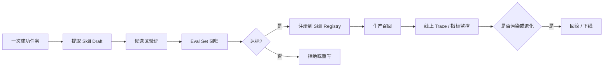

---
kb_id: ai-agent/frameworks/generic-agent-skill-crystallization-evals-and-governance
title: GenericAgent 工程治理：Skill Crystallization、Eval、版本回滚与记忆污染治理如何闭环
domain: ai-agent
component: generic-agent
topic: skill-crystallization-evals-governance
difficulty: advanced
status: reviewed
sidebar_position: 18
version_scope: GenericAgent repository, OpenAI context engineering guides, and 实践资料 hello-generic-agent repository as verified on 2026-05-12
last_verified_at: '2026-05-12'
source_ids:
  - generic-agent-github
  - practice-hello-generic-agent
  - openai-conversation-state-guide
  - openai-compaction-guide
claim_ids:
  - practice-p1-claim-0005
  - agent-runtime-claim-0003
  - agent-runtime-claim-0006
  - agent-runtime-claim-0009
  - agent-runtime-claim-0010
tags:
  - ai-agent
  - generic-agent
  - skill
  - eval
  - governance
---
## 自我进化如果没有评估、版本和回滚，只会把一次偶然成功放大成长期风险
很多社区项目会把“自我进化”写得很吸引人，但工程上最需要问的是：Agent 究竟沉淀了什么，谁来验证它真的值得复用，出问题后如何回滚。GenericAgent 的技能沉淀价值，只有在治理闭环完整时才成立。

### 解决什么问题
长期 Agent 的经验复用如果没有治理，会带来三类风险：

1. 一次偶然成功被错误固化成 SOP，后续任务不断重复错误路径。
2. 技能不断堆积，但没有版本和适用范围说明，召回命中率持续下降。
3. 记忆写入没有审计，导致个人偏好、敏感信息和错误事实一起进入长期层。

所以技能沉淀真正要解决的，不只是“保存经验”，而是“把经验转成可评估、可回滚、可约束的系统资产”。

### 核心对象
| 对象 | 作用 | 关键边界 |
| --- | --- | --- |
| Skill Draft | 候选 SOP、模板或脚本 | 来源任务、适用范围 |
| Eval Set | 用于验证技能是否真正提升表现 | 成功率、步骤数、成本 |
| Skill Registry | 管理技能版本和启用状态 | owner、版本、灰度开关 |
| Memory Filter | 控制哪些信息允许进入长期层 | 脱敏、去噪、去重 |
| Rollback Plan | 出现错误时撤回技能与记忆 | 版本回退、索引失效 |

### 执行链路
技能沉淀更合理的链路，不是“任务成功就写入 memory”，而是下面这条治理链：

1. 从一次完整执行中提取可复用步骤，生成 skill draft。
2. 先把 draft 放入候选区，而不是立即进入生产召回池。
3. 用固定 eval set 比较启用前后成功率、步骤数、token 和人工介入次数。
4. 通过验证后再注册到 skill registry，并记录 owner、版本和适用场景。
5. 后续如果 trace 证明某技能带来错误放大，系统能立即关闭或回滚。



### 一致性与容错
Skill Crystallization 的关键容错点包括：

1. 候选技能不能绕过人工或自动评估直接上线。
2. 技能引用的外部依赖、工具参数和环境前置条件必须写明，否则跨环境复用会失败。
3. 长期记忆层要区分事实、偏好和流程，不能把临时试错过程当成稳定知识。
4. 一旦发现 recall 命中的技能与当前任务版本不兼容，系统应自动降权或失效，而不是继续使用。

### 性能模型
技能沉淀也会带来性能开销：

1. 候选技能过多，会增加索引、检索和排序成本。
2. Eval 集过大，会增加发布前验证延迟。
3. 记忆过滤过弱，会让召回阶段负担越来越重。
4. 版本切换不当，会让多个相似技能互相竞争，降低上下文信息密度。

```yaml
skill_registry_entry:
  skill_id: incident-summary-v3
  owner: sre-agent
  scope:
    service_type: stateless-api
    environment: prod
  eval_gate:
    min_success_rate: 0.85
    max_avg_steps: 5
    max_cost_increase_pct: 10
  rollback:
    disable_on_repeated_failure: true
```

### 生产排障
排查技能层问题时，先不要急着看模型输出，先确认三件事：

1. 当前任务命中了哪个 skill，它的版本和适用范围是什么。
2. 这个 skill 最近的 eval 结果有没有明显退化。
3. trace 中的问题是技能本身错误，还是技能被错误地召回到了不适用场景。

如果线上成功率突然下降，而基础工具与模型都没变，很多时候根因就是新上线的 skill draft 没经过足够验证。

### 最小样例
```json
{
  "skill_id": "release-note-summary-v2",
  "trigger": "summarize_deployment_result",
  "steps": [
    "load_release_metadata",
    "extract_changed_services",
    "generate_risk_summary"
  ],
  "status": "candidate",
  "eval_status": "pending"
}
```

### 和相邻技术的边界
Skill Crystallization 不等于模型微调，也不等于普通知识库写入。它更像把一次任务执行抽象成可重用操作资产。微调改的是模型参数，知识库管理的是可检索事实，技能沉淀管理的是可复用执行路径和经验约束。

## 本页结论
GenericAgent 的“自我进化”只有在 Skill Draft、Eval、Registry、Filter 和 Rollback 构成完整闭环时才成立。否则所谓自我进化，只是把偶然成功和偶然错误一起写进长期系统状态，最终损害而不是提升长期稳定性。
