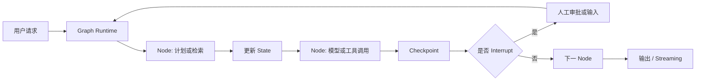

---
kb_id: ai-agent/frameworks/langgraph
title: LangGraph：为什么它更像状态机式 Agent 编排运行时
domain: ai-agent
component: langgraph
topic: overview
difficulty: advanced
status: reviewed
sidebar_position: 4
version_scope: LangGraph docs as verified on 2026-05-12
last_verified_at: '2026-05-12'
source_ids:
  - langgraph-overview-docs
  - langgraph-persistence-docs
  - langgraph-streaming-docs
  - langgraph-human-in-the-loop-docs
claim_ids:
  - langgraph-claim-0001
  - langgraph-claim-0002
  - langgraph-claim-0003
  - langgraph-claim-0004
  - langgraph-claim-0005
  - langgraph-claim-0006
  - langgraph-claim-0007
tags:
  - ai-agent
  - langgraph
  - orchestration
  - stateful
  - runtime
---
## LangGraph 最该先讲清楚的，不是“有图”，而是“图里的状态如何推进、暂停和恢复”
很多人第一次介绍 LangGraph，会说它是一个把节点和边组织起来的 Agent 框架。这个说法不算错，但还远远不够。真正让 LangGraph 和简单 Prompt 链、普通 workflow、甚至部分高层 Agent SDK 拉开差距的，不是“能画图”，而是它把长运行任务的状态推进、checkpoint、暂停恢复、人工介入和流式反馈纳入了一套统一运行时。

如果一句话要说准，LangGraph 更像一个面向长运行、有状态、可恢复任务的状态机式 Agent 编排运行时，而不是只负责把几段模型调用串起来的工具层封装。

## 为什么它特别适合复杂 Agent
复杂 Agent 系统很快会遇到几个共同问题：

- 一次任务不是单轮文本生成，而是多轮推理加工具调用。
- 执行路径不是固定直线，而是会分支、循环、暂停和恢复。
- 任务中间态不能只存在内存里，否则一中断就全丢。
- 某些高风险步骤需要人工审批，而不是完全自动执行。
- 运行过程需要对外暴露进度、状态更新和调试信息。

LangGraph 的设计，几乎就是围绕这些问题展开的。所以它适合拿来回答“复杂 Agent 运行时应该长什么样”，而不只是“如何再封装一次模型调用”。

## 核心对象要怎么讲
### Graph
`Graph` 是执行结构本身，负责组织节点和边，让任务不再是单个函数顺序执行，而是有可表达的路径结构。它真正的价值不是形式上的图，而是把“接下来可能去哪一步”显式化。

### Node
`Node` 承载具体工作单元，可能是模型调用、工具调用、数据整理、人工审批、条件判断或子图执行。Node 本身不是核心难点，难点在于它如何与状态、边和恢复能力联动。

### State
`State` 是 LangGraph 的第一等公民。它不是普通对话历史，而是任务推进所依赖的正式运行时状态。设计 LangGraph 应用时，状态 schema 决定了哪些数据跨节点共享、哪些结果被保留、哪些中间信息可用于恢复和回放。

### Checkpoint
`Checkpoint` 是 persistence 的核心落点。LangGraph 会在执行推进过程中产出可恢复状态快照，这些快照不是为了“顺手存一下”，而是为了支撑断点续跑、time travel、人工介入和容错恢复。

### Thread
`Thread` 用来组织一串 checkpoint 和执行历史。可以把它理解成某次长期任务的持续身份。没有 thread，很多暂停恢复和状态追踪语义就很难稳定成立。

### Interrupt
`Interrupt` 是 human-in-the-loop 的关键原语。它让图在某个节点明确停下来，等待人工输入或审批，再从同一条执行历史继续推进。

## 一条最小执行链怎么走
一个简化的 LangGraph 执行链通常是这样：

1. 用户请求进入 graph。
2. 运行时根据当前 state 进入起始 node。
3. node 执行模型调用、工具调用或数据处理。
4. 结果写回 state。
5. 运行时沿边决定下一步走向。
6. 每个 super-step 可通过 persistence 形成 checkpoint。
7. 如果遇到 interrupt，执行暂停，等待人工处理。
8. 如果任务恢复，运行时基于 thread 和 checkpoint 继续推进。
9. 如果需要对外展示过程，streaming 把 token、状态更新或调试信息流式暴露出去。

把这条链讲出来，比单纯说“它支持 graph / checkpoint / interrupt”更像原理答案。



## 为什么说它更像状态机式运行时
虽然官方未必把“状态机”作为营销中心，但从 graph、state、checkpoint、thread、interrupt 这些核心概念看，LangGraph 的实际设计非常接近状态机式系统：

- 当前在哪个节点，是显式的。
- 当前状态是什么，是正式建模的。
- 下一步去哪里，由边和条件决定。
- 中断后从哪里恢复，不靠手工拼历史，而靠 checkpoint 和 thread。

所以技术复盘里讲 LangGraph，重点不该是“节点和边很灵活”，而该是“自然语言系统终于被装进一个可恢复、可观测、可暂停的运行图里”。

## 持久化为什么不是附属能力，而是核心设计
很多工程师第一次看 persistence，会把它理解成“给运行结果存个数据库”。这是太浅的理解。LangGraph 的 persistence 价值，在于它改变了运行时语义：

- 没有持久化时，任务只是一次性进程内调用。
- 有了 checkpoint 和 thread，任务才真正变成长运行、可恢复、可回放系统。

也正因为如此，memory、human-in-the-loop、time travel、fault tolerance 这些能力，本质上都不是单独外挂出来的，而是建立在 persistence 之上的。

## Human-in-the-loop 为什么在 LangGraph 里成立得更自然
很多框架也能做人工审批，但往往是“在外面再包一层业务逻辑”。LangGraph 的不同点在于：`interrupt` 和恢复语义是正式运行时能力。也就是说，人工介入不是额外旁路，而是执行图的一部分。

这会直接影响系统设计：

- 审批点可以被明确建模。
- 等待人工输入不会破坏执行历史。
- 恢复时不需要重新从头跑一遍。

这就是它在 HITL 场景里比简单链式调用更稳的原因。

## Streaming 真正解决的是什么
LangGraph 的 streaming 不只是“打字机效果”。更重要的是它能把多步任务的运行过程暴露给外部：

- token 级输出
- node 级进展
- state 更新
- 调试信息

所以 streaming 同时服务两类需求：用户体验和运行时观测。对长任务来说，这一点尤其关键，因为如果系统运行几十秒甚至更久，完全黑箱会让用户和开发者都失去判断力。

## 它适合什么，不适合什么
更适合 LangGraph 的场景：

- 多步骤推理和工具调用。
- 任务会分支、循环或多次暂停。
- 需要 persistence、恢复和人工介入。
- 需要把执行链做成可观测、可调试系统。

不一定优先用 LangGraph 的场景：

- 只有单轮模型调用。
- 只是固定几步 API 编排，没有复杂状态。
- 没有清晰状态 schema，图会把混乱放大而不是收敛。

## 最小样例
下面这个例子只演示“状态推进 + 条件分支”的最小骨架，不追求可直接运行：

```python
from typing import TypedDict
from langgraph.graph import StateGraph, END

class AgentState(TypedDict):
    question: str
    route: str
    answer: str


def route_question(state: AgentState) -> AgentState:
    question = state["question"]
    if "数据库" in question:
        state["route"] = "db"
    else:
        state["route"] = "general"
    return state


def answer_db(state: AgentState) -> AgentState:
    state["answer"] = "走数据库专家路径"
    return state


def answer_general(state: AgentState) -> AgentState:
    state["answer"] = "走通用问答路径"
    return state


graph = StateGraph(AgentState)
graph.add_node("router", route_question)
graph.add_node("db", answer_db)
graph.add_node("general", answer_general)
graph.set_entry_point("router")
graph.add_conditional_edges(
    "router",
    lambda state: state["route"],
    {"db": "db", "general": "general"},
)
graph.add_edge("db", END)
graph.add_edge("general", END)

app = graph.compile()
result = app.invoke({"question": "数据库连接失败怎么办", "route": "", "answer": ""})
print(result)
```

这个例子真正要看的不是 Python 语法，而是：状态先被路由节点更新，再由 conditional edge 决定后续路径。这就是 LangGraph 的最小运行语义。

## 生产里最容易出错的地方
- 状态 schema 设计过于随意，后面节点彼此污染。
- 工具节点有副作用，但图里没有幂等和重试边界。
- 想做 HITL，却没有设计 thread 和 checkpoint 策略。
- 把 graph 当流程图工具，没有做失败恢复和观测设计。

## 相邻框架边界
和高层 Agent SDK 相比，LangGraph 更偏低层 orchestration runtime。

和普通 workflow 相比，LangGraph 更强调状态化、长运行和恢复。

和简单 Prompt chaining 相比，它解决的是“复杂系统怎么运行”，而不是“Prompt 怎么更方便组织”。

## 本页结论
LangGraph 最重要的不是“能画图”，而是它把 graph、state、checkpoint、thread、interrupt 和 streaming 组织成了一套真正可恢复、可暂停、可观测的 Agent 运行时。只要把这条主线讲清楚，LangGraph 就不会再被误答成普通工作流画布。
