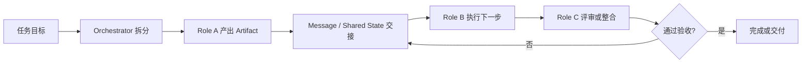

---
kb_id: ai-agent/frameworks/metagpt-lagent-code-level-multi-agent-development
title: MetaGPT / Lagent / LangGraph 学习线：多智能体要从代码级 Role、Action、State 和协作边界讲
domain: ai-agent
component: multi-agent-frameworks
topic: metagpt-lagent-code-level-multi-agent
difficulty: advanced
status: reviewed
sidebar_position: 18
version_scope: MetaGPT, Lagent, LangGraph docs, and 实践资料 P2 repositories as verified on 2026-04-26
last_verified_at: '2026-04-26'
source_ids:
  - metagpt-github
  - lagent-github
  - langgraph-overview-docs
  - practice-hugging-multi-agent
  - practice-easy-langent
claim_ids:
  - practice-p2-claim-0004
  - practice-p2-claim-0005
tags:
  - ai-agent
  - metagpt
  - lagent
  - langgraph
  - multi-agent
---
## 多智能体最容易讲浅的地方，不是框架名字不够多，而是协作链路没有被说清楚
很多人回答多 Agent 题时，喜欢先列一排框架名：MetaGPT、Lagent、LangGraph、AutoGen、CrewAI。这样容易显得“见过”，但并不能解释系统为什么需要多个主体、它们如何传递状态、谁对结果负责、失败后谁来接管。

MetaGPT、Lagent、LangGraph 这条学习线真正值得掌握的，不是具体 API，而是代码级多智能体协作的基础抽象：Role、Action、State、Message、Artifact、Workflow 和验收边界。

## 解决什么问题
这组框架主要解决三类单 Agent 很容易做差的任务：

1. 任务天然可拆分，需要不同角色从不同视角并行或串行推进。
2. 任务产物不是一句答案，而是需求文档、代码草稿、测试结果、评审意见等可回放工件。
3. 任务执行时间较长，需要显式状态、角色责任和可恢复控制，而不是让一个 Agent 一直自说自话。

但多 Agent 并不天然更优。它会引入更多通信、更多上下文复制、更多错误放大点，所以必须把协作协议讲清楚。

## 核心对象
| 对象 | 作用 | 观察重点 |
| --- | --- | --- |
| Role | 定义一个 Agent 的职责、可见上下文和输出边界 | 是否和其他角色职责重叠 |
| Action | 描述角色能执行的动作及其输入输出 | 是否足够原子、是否可验证 |
| Private State | 单个角色自己的局部状态 | 是否泄漏到不该共享的地方 |
| Shared State | 团队协作必须共同看到的信息 | 谁能写、谁能读、何时更新 |
| Message | 角色间传递任务、引用产物和状态变化 | 协议是否稳定、是否可审计 |
| Artifact | 文档、代码、测试结果、计划等中间产物 | 版本、owner、验收状态 |
| Orchestrator | 决定任务如何分派、汇总、终止或重试 | 控制权、失败恢复、预算 |

## 执行链路
代码级多 Agent 链路通常不应被说成“大家一起聊”，而更像一条受控产物流水线：

1. Orchestrator 接收目标并拆分子任务。
2. Role A 基于自身上下文产出第一版 artifact。
3. Role B 读取 artifact 和共享状态，执行下一步动作，例如实现、补充、质检或评审。
4. 每次角色切换都通过 message 或 artifact 引用显式交接，而不是隐式共享整段历史。
5. 验收节点决定继续、返工、切换角色还是结束任务。



## 一致性与容错
多 Agent 相比单 Agent 更容易出现“每个角色都像做了点事，但系统整体没有收敛”的问题。常见根因包括：

1. Role 边界不清，多个角色重复推理同一问题。
2. Shared State 过大，导致后续角色读到太多旧信息和噪声。
3. Message 没有明确产物引用，角色之间只能靠自然语言猜对方在说什么。
4. Artifact 没有 owner 和验收状态，系统不知道该继续、返工还是直接结束。

因此容错的关键，不是让每个角色更聪明，而是让协作协议更清楚：谁负责、谁接收、谁验收、失败后回到哪一步。

## 性能模型
多 Agent 的成本模型与单 Agent 不同，核心放大器主要有四个：

1. 角色越多，消息传递和上下文复制次数越多。
2. 中间 artifact 越大，后续角色的上下文装配成本越高。
3. 没有明确验收时，返工轮次会快速放大 token 与延迟成本。
4. 共享状态过宽时，每个角色都在阅读自己并不需要的内容。

```yaml
multi_agent_budget:
  max_roles: 4
  max_review_rounds: 2
  artifact_summary_required: true
  shared_state_fields:
    - task_goal
    - accepted_artifacts
    - open_issues
```

这也是为什么多 Agent 架构不能只问“能不能分工”，还要问“分工会不会比单 Agent 更慢、更贵、更难调”。

## 生产排障
如果一个多 Agent 系统表现很差，通常按下面顺序排：

1. 先看 orchestrator 是否拆错任务，导致后面角色全部在错误方向上协作。
2. 再看 message 和 artifact 协议，确认角色切换时有没有丢关键信息。
3. 再看 shared state，确认是不是上下文膨胀或不同角色在覆盖彼此状态。
4. 最后才看单个角色模型质量，因为很多问题并不是某个角色不会做，而是协作合同设计错了。

## 样例
下面的角色定义示意的是职责边界，而不是 persona 文案：

```json
{
  "role": "reviewer",
  "inputs": ["artifact_ref", "test_result_ref"],
  "allowed_actions": ["read_artifact", "comment_issue", "approve_artifact"],
  "output_contract": ["review_summary", "decision"]
}
```

下面的 message 示例强调“引用产物”而不是只发自然语言：

```python
message = {
    "from": "planner",
    "to": "implementer",
    "artifact_ref": "spec_v2",
    "expected_output": "code_patch",
    "open_issues": ["missing retry policy", "need timeout handling"],
}
```

## 相邻技术边界
这一页讲的是多 Agent 的基础协作抽象，不是完整生产治理。MetaGPT 更适合角色型产物流水线，Lagent 更适合轻量组件化 Agent 开发，LangGraph 更适合显式状态图和恢复控制。它们不是简单替换关系，而是不同关注重点的实现路线。

## 本页结论
多智能体开发不应停在“多个角色一起工作”这种口号上。更可靠的表达，是把协作系统拆成 Role、Action、State、Message、Artifact 和 Orchestrator 六层，并讲清每层如何共同决定任务分派、产物交接、失败恢复和最终验收。
