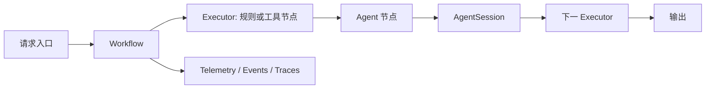

---
kb_id: ai-agent/frameworks/microsoft-agent-framework
title: Microsoft Agent Framework：为什么它更像企业级 Agent 平台骨架
domain: ai-agent
component: microsoft-agent-framework
topic: overview
difficulty: advanced
status: reviewed
sidebar_position: 6
version_scope: Microsoft Agent Framework docs as verified on 2026-05-12
last_verified_at: '2026-05-12'
source_ids:
  - microsoft-agent-framework-overview
  - microsoft-agent-framework-workflows
  - microsoft-agent-framework-conversations
  - microsoft-agent-framework-observability
  - microsoft-agent-framework-workflow-events
claim_ids:
  - microsoft-agent-framework-claim-0001
  - microsoft-agent-framework-claim-0002
  - microsoft-agent-framework-claim-0003
  - microsoft-agent-framework-claim-0004
  - microsoft-agent-framework-claim-0005
  - microsoft-agent-framework-claim-0006
  - microsoft-agent-framework-claim-0007
  - microsoft-agent-framework-claim-0008
tags:
  - ai-agent
  - microsoft
  - workflow
  - enterprise
  - observability
---
## Microsoft Agent Framework 最重要的，不是“它也能做多 Agent”，而是它试图把企业级运行时能力收拢进一套骨架
如果只把 Microsoft Agent Framework 讲成“微软版多 Agent 工具箱”，答案会很浅。更准确的理解方式是：它试图把 workflow、state、conversation context、telemetry 和 observability 这些企业场景里经常分散处理的能力，正式收进统一框架里。

它的官方叙述本身就带着这个倾向。一方面，它被描述为 Semantic Kernel 和 AutoGen 的 direct successor；另一方面，它强调的是 workflow、state、conversations、OpenTelemetry 这类运行时能力，而不是单纯秀多 agent 协作效果。

## 为什么 preview 状态本身也是答案的一部分
这一点一定要主动讲。官方明确说明它仍处于 `public preview`。这意味着：

- 设计方向值得关注。
- 架构思路有很强代表性。
- 但严格生产选型时必须把版本稳定性和生态成熟度一起算进去。

所以高质量回答里不能只吹能力，还要主动补一句：这是一个非常值得研究的企业级框架方向，但 preview 边界本身就是系统设计判断的一部分。

## 核心对象要怎么讲
### Workflow
`Workflow` 是第一层关键对象。它不是“多几步 Prompt”，而是预定义执行逻辑的正式容器。它回答的问题是：哪些路径应该固定、哪些步骤必须受治理、哪些节点允许进入 LLM 驱动的动态决策。

### Agent
`Agent` 是第二层关键对象。它代表带 LLM 动态推理能力的执行单元。和 workflow 的关系不是谁替代谁，而是 workflow 负责控制主路径，agent 负责在特定节点承担智能决策。

### Executor 与 Edge
`Executor` 和 `Edge` 让 workflow 不再只是抽象概念，而是正式执行模型。Executor 代表一个执行单元，Edge 代表路径和状态连接关系。也正因为如此，模型节点、工具节点、审批节点、外部集成节点才能进入同一个统一路径模型里。

### AgentSession
`AgentSession` 是状态层关键对象。它承载的不只是聊天历史，而是 conversation context 的正式运行时表示。它让长期会话、恢复、序列化和跨进程续跑更自然，因此它比普通“message history list”更接近系统状态对象。

### Observability / Telemetry
可观测性不是外围插件，而是框架内建视角。OpenTelemetry、workflow events、logs、metrics、traces 被正式纳入框架能力，这一点非常企业化。

## 一条更稳的执行链怎么讲
一个典型的 Microsoft Agent Framework 执行链可以这样理解：

1. 请求进入 workflow。
2. workflow 根据预定义逻辑决定先走哪些 executor。
3. 某些 executor 是确定性业务节点，某些 executor 会调用 agent 进行动态推理。
4. conversation context 通过 AgentSession 保持和传递。
5. 执行过程中产生 workflow events、logs、metrics 和 traces。
6. 如果流程涉及工具、审批或外部系统，仍然由 workflow 统一控制主路径。



这条链真正想表达的是：agent 并不是系统的全部。企业级框架要先把 workflow、state 和 observability 立住，再决定哪些节点交给模型自由决策。

## Workflow 和 Agent 的边界为什么特别重要
这是 Microsoft Agent Framework 最该主动讲清的原理点。

- `Workflow` 负责预定义路径。
- `Agent` 负责动态决策。

这个分层非常关键，因为企业系统不是所有步骤都适合交给模型自由规划。审批、合规、外部动作、资金相关流程、权限检查这些节点，通常更适合由 workflow 显式定义；而开放式理解、策略选择、工具挑选这类节点，才更适合交给 agent。

所以它不是简单“把所有东西都做成 agent”，而是强调：系统可控性来自 workflow 与 agent 的明确分工。

## 为什么它更像企业级平台骨架
因为它试图同时覆盖几类企业系统最在意的东西：

- 路径控制
- 会话状态
- 事件和观测
- 可恢复性
- 与外部系统的统一集成方式

这就是它和很多 demo 型 Agent 框架的差别。后者更强调“多 Agent 能聊起来”，前者更强调“多 Agent 系统能不能被治理、被监控、被恢复、被审计”。

## Observability 为什么很关键
这不是“顺手打点日志”那么简单。官方把 observability 明确纳入框架能力，并且对接 OpenTelemetry，这意味着：

- 事件不是业务方自己补的。
- traces、logs、metrics 是框架级产物。
- workflow 事件本身也成为观测对象。

这会直接影响排障方式。一个企业级 Agent 系统如果没有正式 telemetry，很快就会在多节点、多步执行、多 agent 协作里失去可见性。所以这部分不是加分项，而是它之所以像企业级平台骨架的核心证据之一。

## 最小样例
下面这个伪代码只展示“workflow 控主路径，agent 负责任务内推理”的结构：

```python
class ReviewSession:
    def __init__(self):
        self.messages = []
        self.status = "pending"


def classify_request(session: ReviewSession, text: str):
    if "审批" in text:
        session.status = "needs_agent"
    else:
        session.status = "simple"
    return session


def agent_step(session: ReviewSession):
    # 这里在真实系统里会调用 agent 执行动态推理
    session.messages.append("agent handled request")
    session.status = "done"
    return session

session = ReviewSession()
session = classify_request(session, "请审批这次例外访问")
if session.status == "needs_agent":
    session = agent_step(session)
print(session.status, session.messages)
```

这个例子不代表真实 API，只是说明它的架构重心：workflow 先决定路径，agent 再在适合的节点参与动态执行。

## 它适合什么，不适合什么
更适合的场景：

- 企业内部多步骤 Agent 系统
- 要求 observability、workflow 控制、会话状态和恢复能力
- 需要把审批、集成、agent 推理统一纳入一套治理骨架

不一定优先的场景：

- 只是做轻量 demo 或非常简单的单 Agent 应用
- 团队现在只想快速验证交互，不想先承受平台骨架复杂度
- 对 preview 边界非常敏感、需要更成熟稳定生态

## 相邻框架边界
和 AutoGen 相比，它更强调 workflow、state 和企业观测骨架。

和 Semantic Kernel 相比，它更像 direct successor 方向上的更高层企业 Agent 运行时。

和简单 workflow 引擎相比，它不是只做路径控制，而是把 LLM agent 正式纳入路径体系。

## 本页结论
Microsoft Agent Framework 最值得讲的，不是“它也支持多 Agent”，而是它把 workflow、AgentSession、observability 和 preview 边界一起构成企业级 Agent 平台骨架。只要把这条主线讲清，它就不会再被误答成“微软版 AutoGen”。
