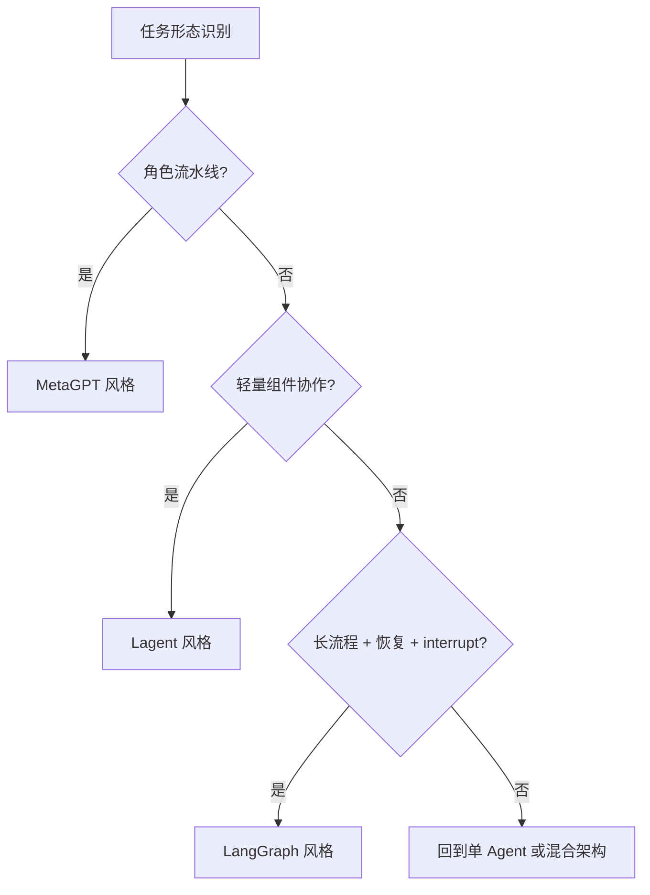

---
kb_id: ai-agent/frameworks/multi-agent-framework-selection-performance-and-troubleshooting
title: 多 Agent 框架选型与运维：什么时候选 MetaGPT、Lagent、LangGraph，以及协作退化时先查什么
domain: ai-agent
component: multi-agent-frameworks
topic: multi-agent-framework-selection-performance-troubleshooting
difficulty: advanced
status: reviewed
sidebar_position: 20
version_scope: MetaGPT, Lagent, LangGraph docs, and 实践资料 P2 repositories as verified on 2026-04-26
last_verified_at: '2026-04-26'
source_ids:
  - metagpt-github
  - lagent-github
  - langgraph-overview-docs
  - practice-easy-langent
  - practice-handy-multi-agent
claim_ids:
  - practice-p2-claim-0004
  - practice-p2-claim-0005
  - agent-runtime-claim-0006
  - agent-runtime-claim-0008
tags:
  - ai-agent
  - multi-agent
  - framework-selection
  - performance
  - troubleshooting
---
## 多 Agent 框架选型的关键，不是“谁功能更多”，而是谁的运行时假设最接近你的任务形态
很多比较文章会直接列框架功能：有没有多角色、有没有 graph、能不能接工具、能不能持久化。这样做容易形成“堆功能选型”，却忽略一个更重要的问题：你的任务到底是角色型产物流水线、轻量组件协作，还是需要显式状态图和恢复的长流程系统。

## 解决什么问题
这一页主要回答三个问题：

1. MetaGPT、Lagent、LangGraph 分别更适合哪类多 Agent 任务。
2. 多 Agent 成本为什么常常高于预期，以及哪些地方最容易退化。
3. 系统一旦出现协作失控、返工变多、成本飙升，第一批证据应该看哪里。

## 核心对象
| 路线 | 更适合的问题 | 最容易踩的坑 |
| --- | --- | --- |
| MetaGPT 风格 | 角色型分工明确、围绕产物流水线推进 | 角色过多、流程过重、返工放大 |
| Lagent 风格 | 轻量组件化 Agent、快速试验协作模式 | 状态和恢复边界不够显式 |
| LangGraph 风格 | 需要显式状态图、恢复、interrupt、长流程控制 | 图设计过重，学习和维护成本高 |

## 执行链路
选型时不要先问“框架能做什么”，而要先问任务链路长什么样：

1. 如果任务主要围绕需求稿、代码稿、评审稿这类 artifact 逐步流转，优先考虑 MetaGPT 风格的角色型流水线。
2. 如果重点是把多个 Agent 能力快速组件化、快速组装，Lagent 更容易落地。
3. 如果任务长、状态多、需要显式恢复和审批插入，LangGraph 风格会更自然。



## 一致性与容错
多 Agent 框架选型失败，常常表现为“功能都支持，但系统并没有更稳定”。根因一般是任务形态和框架假设不匹配：

1. 把需要显式恢复的长流程放到轻量协作框架里，恢复语义会很弱。
2. 把短平快任务放进重型状态图框架里，会带来不必要的建模负担。
3. 把角色产物流水线硬塞进“所有角色都自由发言”的模式里，最终只会得到高成本群聊。

## 性能模型
多 Agent 成本主要体现在三种放大上：

1. 角色放大：角色数越多，消息和上下文复制越多。
2. 回合放大：角色之间每增加一轮评审，延迟和 token 成本都上升。
3. 状态放大：共享状态和 artifact 越大，每个角色的阅读成本越高。

```yaml
selection_checklist:
  task_artifact_driven: true
  requires_checkpoint_recovery: false
  max_roles: 3
  acceptable_review_rounds: 2
  latency_budget_seconds: 90
```

如果这个清单里“需要恢复”“需要审批中断”“需要长期状态”明显为真，就不该只追求轻量。

## 生产排障
多 Agent 系统退化时，最有效的排障入口一般不是先看模型，而是先看系统结构：

1. 返工轮次突然增加：先查 acceptance gate 是否过松或角色边界是否重叠。
2. token 成本快速上升：先查 shared state 和 artifact 是否膨胀。
3. 任务经常卡住：先查 orchestrator 和状态转换，而不是先调角色 prompt。
4. 某个框架实现总是难恢复：先查它是否天生不适合你的任务形态。

## 样例
下面的选型伪代码表达的是“按问题选框架”而不是“按流行度选框架”：

```python
def choose_multi_agent_runtime(task):
    if task["artifact_pipeline"] and not task["needs_graph_recovery"]:
        return "metagpt_style"
    if task["lightweight_component_composition"]:
        return "lagent_style"
    if task["needs_checkpoint"] or task["needs_interrupt"]:
        return "langgraph_style"
    return "single_agent_or_hybrid"
```

下面的退化信号示例强调的是协作成本而不是单轮正确率：

```json
{
  "roles": 4,
  "avg_review_rounds": 3,
  "avg_artifact_chars": 9200,
  "token_cost_growth_pct": 68
}
```

## 相邻技术边界
框架选型不是替代架构判断。你仍然要先决定任务是否真的需要多 Agent，再决定用哪条实现路线。很多时候最佳答案不是“三选一”，而是单 Agent 加少量确定性 workflow，或者单 Agent 外挂一个 reviewer role，而不是完整多角色流水线。

## 本页结论
MetaGPT、Lagent、LangGraph 不是简单的功能对比项，而是三种不同的多 Agent 运行时假设。选型要从任务形态、恢复需求、成本预算和协作协议出发；排障也要先查协作结构、状态与验收，而不是一上来就怪模型不够聪明。
