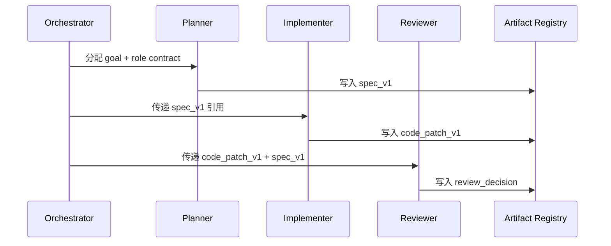

---
kb_id: ai-agent/frameworks/multi-agent-role-protocol-shared-state-and-artifact-handover
title: 多 Agent 协议设计：Role Contract、Shared State、Artifact Handover 与验收节点如何避免协作失控
domain: ai-agent
component: multi-agent-frameworks
topic: multi-agent-role-protocol-state-artifact-handover
difficulty: advanced
status: reviewed
sidebar_position: 19
version_scope: MetaGPT, Lagent, LangGraph docs, and 实践资料 P2 repositories as verified on 2026-04-26
last_verified_at: '2026-04-26'
source_ids:
  - metagpt-github
  - lagent-github
  - langgraph-overview-docs
  - practice-hugging-multi-agent
  - practice-handy-multi-agent
claim_ids:
  - practice-p2-claim-0004
  - practice-p2-claim-0005
  - agent-runtime-claim-0004
tags:
  - ai-agent
  - multi-agent
  - role-contract
  - shared-state
  - artifact
---
## 多 Agent 一旦没有协议层，系统看起来像协作，实际上像多人同时改同一份草稿
单 Agent 最大的问题通常是视角单一；多 Agent 最大的问题则是协议失真。只要 role contract、shared state 和 artifact handover 设计不清楚，多个 Agent 不会自然形成协同，反而会重复劳动、相互覆盖、不断返工。

## 解决什么问题
协议层设计主要解决四个问题：

1. 每个角色到底看到什么、能改什么、交付什么。
2. 多个角色共享哪些状态，哪些状态只能私有保存。
3. 中间产物如何被引用、评审和升级，而不是在聊天里散掉。
4. 谁来判定某一阶段已经通过验收，可以进入下一角色。

## 核心对象
| 对象 | 作用 | 关键边界 |
| --- | --- | --- |
| Role Contract | 规定角色输入、允许动作和输出合同 | 不能模糊到“什么都能做” |
| Shared State | 协作必要的公共事实和进度 | 不能无限膨胀成公共垃圾桶 |
| Private Scratchpad | 角色的局部推理和中间草稿 | 不应被其他角色无条件读取 |
| Artifact Registry | 管理需求、代码、评审等中间产物 | 版本、owner、状态、引用关系 |
| Acceptance Gate | 决定当前 artifact 是否合格 | 通过、返工、升级人工 |

## 执行链路
多 Agent 协议设计的理想链路通常是：

1. Orchestrator 为每个角色分配 role contract。
2. 角色读取必要的 shared state 和指定 artifact，而不是读取全部历史。
3. 角色完成 action 后，把结果写成新 artifact 或给现有 artifact 增加审阅状态。
4. Acceptance Gate 决定该 artifact 是进入下一角色、回退重做，还是转人工确认。



## 一致性与容错
协议层的容错重点不是“每个角色都重试一次”，而是控制协作一致性：

1. Shared State 只应保留团队共同事实，不能把每个角色的全部推理都暴露出去。
2. Artifact 必须有 owner 和版本，否则很难知道后续角色基于哪个版本继续工作。
3. Acceptance Gate 缺失时，系统往往会把半成品继续传下去，最终每个角色都在修上游问题。
4. 一旦某角色失败，要明确回退到哪个 artifact 版本、由哪个角色接管，而不是所有人重新开始。

## 性能模型
协议层做不好，多 Agent 性能通常会呈现出明显退化：

1. Shared State 太大，所有角色都在读与自己无关的信息。
2. Artifact 太细碎，交接成本大于真正工作成本。
3. 验收门槛不清，返工轮次和重复评审会快速上升。
4. 角色 contract 过宽，模型会浪费更多步骤在“我到底该做什么”上。

```json
{
  "artifact": "spec_v2",
  "owner": "planner",
  "status": "ready_for_implementation",
  "accepted_by": "reviewer",
  "depends_on": ["task_goal", "constraints_v1"]
}
```

## 生产排障
多 Agent 协议问题通常很像“系统总在返工，但说不出谁错了”。排障时优先看：

1. role contract 是否重叠，是否多个角色在做同一类动作。
2. artifact registry 是否清楚记录版本、状态和 owner。
3. acceptance gate 是否存在，是否把不合格产物继续向下游传播。
4. shared state 是否被滥用成所有内容的公共池。

## 样例
下面的角色合同示例突出的是输入输出边界：

```yaml
role_contract:
  role: reviewer
  inputs:
    - spec_ref
    - patch_ref
  allowed_actions:
    - read_artifact
    - annotate_issue
    - approve
  output_contract:
    - review_summary
    - decision
```

```python
def accept_artifact(artifact, checklist):
    if all(item in artifact["checks"] for item in checklist):
        artifact["status"] = "accepted"
    else:
        artifact["status"] = "needs_revision"
    return artifact
```

## 相邻技术边界
Role Contract 不等于 Prompt Persona，Artifact Registry 不等于普通文件夹，Shared State 也不等于每个人都共享整段聊天记录。这些对象一起构成的是多 Agent 协议层，而不是单个框架的语法糖。

## 本页结论
多 Agent 不是多开几个模型实例，而是建立一套明确的角色合同、共享状态规则、产物交接方式和验收节点。协议层不清，多角色协作就会从“分工”迅速退化成“互相干扰”。
