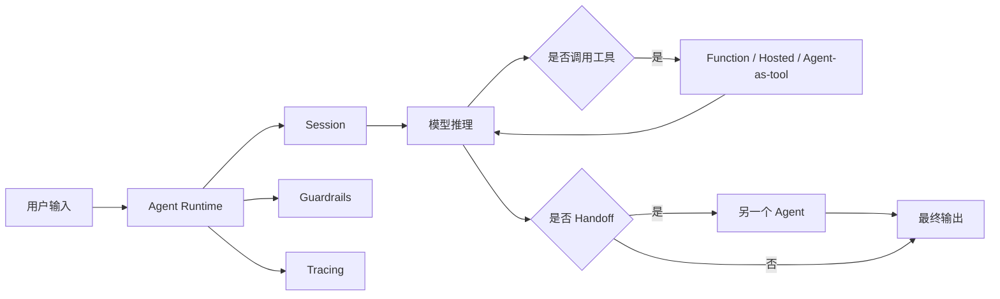

---
kb_id: ai-agent/frameworks/openai-agents-sdk
title: OpenAI Agents SDK：它更像轻量 Agent 运行时，而不是 Prompt 封装器
domain: ai-agent
component: openai-agents-sdk
topic: overview
difficulty: advanced
status: reviewed
sidebar_position: 1
version_scope: OpenAI Agents SDK docs as verified on 2026-05-12
last_verified_at: '2026-05-12'
source_ids:
  - openai-agents-sdk-docs
  - openai-platform-agents-overview
  - openai-agents-sdk-tools
  - openai-agents-sdk-handoffs
  - openai-agents-sdk-sessions
  - openai-agents-sdk-tracing
  - openai-agents-sdk-guardrails
claim_ids:
  - openai-agents-claim-0001
  - openai-agents-claim-0002
  - openai-agents-claim-0003
  - openai-agents-claim-0004
  - openai-agents-claim-0005
  - openai-agents-claim-0006
  - openai-agents-claim-0007
  - openai-agents-claim-0008
  - openai-agents-claim-0009
  - openai-agents-claim-0010
  - openai-agents-claim-0011
  - openai-agents-claim-0012
tags:
  - ai-agent
  - openai
  - agents-sdk
  - runtime
  - tools
---
## OpenAI Agents SDK 最重要的，不是“帮你更方便调模型”，而是把多步骤 Agent 运行时收敛起来
如果把 OpenAI Agents SDK 理解成 Prompt 封装器，基本就把它讲浅了。更准确的说法是：它提供了一套围绕 `agents`、`tools`、`handoffs`、`sessions`、`guardrails` 和 `tracing` 组织起来的轻量 Agent 运行时。它关注的不是“一次模型调用怎么更省事”，而是“多步骤、多工具、多 Agent 的任务怎么被稳定地跑起来”。

所以它擅长解决的是模型调用外面的工程问题，而不是替代底层模型 API 的所有使用方式。

## 为什么它不该被讲成 Prompt 包装器
很多人第一次看 SDK，会觉得它只是：

- 包一下指令
- 注册几个工具
- 跑一次模型

这还只是最表层。更深一层的理解是：

- 一个 `Agent` 不只是 prompt，而是指令、工具面和行为边界的组合。
- 一次执行过程不是单个 completion，而是运行时驱动的多轮 loop。
- 复杂系统里自然会出现 handoff、sessions、guardrails 和 tracing。

也就是说，它真正统一起来的是 Agent 运行时工程，而不是单条提示词语法。

## 核心对象怎么讲
### Agent
`Agent` 是运行时基本主体。它不是单纯提示词模板，而是由：

- 指令
- 可调用工具
- 行为边界
- 可能的 delegation 方向

共同定义出来的执行主体。

### Tools
工具层是 OpenAI Agents SDK 的核心之一。官方文档把工具分成：

- `function tools`
- `hosted tools`
- `agents as tools`

这点非常重要，因为它说明 SDK 不是只支持本地 Python 函数，而是把不同执行位置、不同控制语义的能力都纳入统一调用面。

### Handoffs
`Handoff` 是正式 delegation 机制。它和工具很像，但语义不同：

- 工具调用通常是“拿结果回来”。
- handoff 是“把后续控制权交出去”。

这条边界如果能讲清，说明你已经不只是会用 SDK，而是理解它的运行时语义。

### Sessions
`sessions` 负责自动维护多轮历史和基础状态。它解决的是“多轮任务不想每次都手工拼完整消息历史”的问题。

但也要主动带边界：session history 不是完整工作流 checkpoint。它更像对话与执行上下文层，而不是长运行流程恢复层。

### Guardrails
`guardrails` 负责边界控制。官方把它拆成：

- input guardrails
- output guardrails
- tool guardrails

这意味着策略控制不是单一钩子，而是沿输入、输出和工具调用面分布的正式拦截点。

### Tracing
`tracing` 负责把 generation、tool call、handoff、guardrail 等步骤串成可观测执行链。它不是 print 日志，而是 Agent 任务的事实链。

## 一条典型运行链怎么走
一个更稳的 OpenAI Agents SDK 执行链可以这样讲：

1. 应用入口创建或选择 agent。
2. 运行时接收用户输入。
3. session 负责取回或维护当前多轮上下文。
4. 模型在 agent 指令和工具面约束下做推理。
5. 如需能力，运行时调用 function tool、hosted tool 或 agent-as-tool。
6. 如需正式 delegation，触发 handoff，把后续执行交给另一个 agent。
7. guardrails 在输入、输出和工具边界做策略拦截。
8. tracing 把整条执行链记录成可调试视图。



这条链最重要的意义是：一次 agent 运行通常不是单步决定的，而是多次推理、工具、交接和边界检查共同形成的结果。

## 为什么它适合某些场景，而不是所有场景
更适合 OpenAI Agents SDK 的场景：

- 多轮工具调用
- 多 Agent 任务交接
- 需要 sessions 管理上下文
- 需要 tracing 和 guardrails
- 想把 Agent runtime 工程统一起来

不一定优先上的场景：

- 只是非常简单的单轮生成
- 不需要工具，也不需要状态或交接
- 团队暂时只想直接控制底层模型 API

高质量回答里最好主动补一句：底层调用并没有被 SDK 完全替代。对于简单单轮任务，直接用模型 API 仍然可能是更轻的选择。

## Tool、Handoff、Agent-as-tool 的边界
这是 OpenAI Agents SDK 最容易被追问的点之一。

- `function tool`：本地函数，通过 schema 暴露参数和返回边界。
- `hosted tool`：平台托管能力，也进入统一工具接口。
- `agent-as-tool`：把另一个 agent 当子能力调用，完成后控制权回到原 agent。
- `handoff`：正式把控制权转交给另一个 agent。

所以 `agent-as-tool` 和 `handoff` 不能混着讲。前者是子能力调用，后者是执行所有权交接。

## Session、Guardrails、Tracing 为什么应该一起回答
因为三者正好组成生产运行时的三条主线：

- `sessions`：状态
- `guardrails`：边界
- `tracing`：观测

如果只讲工具注册，不讲这三者，答案通常还停留在 demo 级。真正生产化的 Agent 系统，关心的不只是能不能调用工具，而是：

- 历史怎么维护
- 哪些输入输出可以被拦截
- 出问题时怎么把整条链回放出来

## 最小样例
下面这个例子只演示“agent + function tool”的最小结构：

```python
from agents import Agent, function_tool, Runner

@function_tool
def get_weather(city: str) -> str:
    return f"{city} 晴，25 摄氏度"

assistant = Agent(
    name="weather-assistant",
    instructions="你是天气助手，需要时调用天气工具。",
    tools=[get_weather],
)

result = Runner.run_sync(assistant, "北京今天天气怎么样？")
print(result.final_output)
```

这个例子真正要看的不是装饰器，而是：工具被正式纳入 agent 运行时，而不是靠模型自由生成一段伪调用文本。

## 生产里最容易混淆的边界
- 把 SDK 当成所有 OpenAI 调用的默认入口。
- 把 handoff 和 agent-as-tool 当成同义词。
- 把 session 等同于长运行流程 checkpoint。
- 把 tracing 理解成打印几行日志。
- 忽略 tool guardrails 和输入输出 guardrails 的分层语义。

## 相邻框架边界
和底层模型 API 相比，它提供的是 Agent runtime。

和偏低层图编排框架相比，它更轻、更偏运行时收敛，不强调复杂状态图建模。

和只做工具注册的小库相比，它额外把 sessions、handoffs、guardrails、tracing 收进正式框架能力。

## 本页结论
OpenAI Agents SDK 最值得讲的，不是“更方便调模型”，而是它把 agents、tools、handoffs、sessions、guardrails 和 tracing 组织成了一套轻量但完整的 Agent 运行时。只要把这条主线讲清，它就不会再被误答成 Prompt 包装器。
