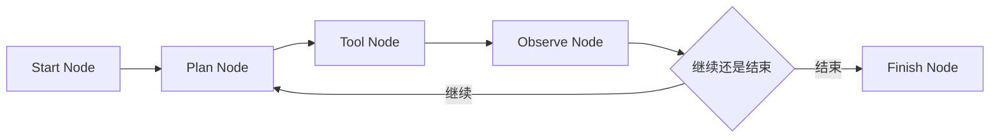

---
kb_id: ai-agent/frameworks/pocketflow-node-flow-and-minimal-orchestration
title: PocketFlow：极简 Node / Flow 抽象为什么适合拿来理解 Agent、Workflow 与图编排的共同骨架
domain: ai-agent
component: pocketflow
topic: pocketflow-node-flow-orchestration
difficulty: intermediate
status: reviewed
sidebar_position: 19
version_scope: PocketFlow docs, PocketFlow GitHub repository, LangGraph overview docs, and 实践资料 easy-pocket repository as verified on 2026-05-12
last_verified_at: '2026-05-12'
source_ids:
  - pocketflow-docs
  - pocketflow-github
  - practice-easy-pocket
  - langgraph-overview-docs
claim_ids:
  - practice-p1-claim-0006
  - agent-runtime-claim-0002
  - agent-runtime-claim-0004
  - agent-runtime-claim-0010
tags:
  - ai-agent
  - pocketflow
  - node
  - flow
  - orchestration
---
## PocketFlow 最有价值的地方，不是“代码少”，而是把 LLM 应用还原成最小图编排骨架
PocketFlow 常被拿来当极简框架示例，但如果只停在“100 行”“零依赖”，学习价值会很有限。它真正适合做知识库主题的原因，是它把很多复杂系统共同拥有的骨架抽象暴露得很直接：节点、状态、转移、分支和结束条件。理解这一点后，Agent、RAG、Workflow 甚至多 Agent 协作都可以放进同一套图编排视角中分析。

### 解决什么问题
复杂 LLM 应用往往容易被 API 和工具细节掩盖结构。PocketFlow 的价值，是把结构先抽出来，再让我们看清：

1. 一个局部任务到底应该是一个 Node，还是多步复合逻辑。
2. 什么时候应该用显式分支，而不是把所有判断都交给模型。
3. 共享状态应该保存什么，才能支持下一步决策。
4. 为什么很多 Agent loop 本质上也是一种 Flow。

### 核心对象
| 对象 | 作用 | 观察重点 |
| --- | --- | --- |
| Node | 承载一个局部执行步骤 | 单一职责、输入输出 |
| Flow | 负责节点连接、分支和结束 | 起点、转移条件、终止条件 |
| Shared State | 节点之间共享的数据载体 | 结构是否稳定、字段是否最小化 |
| Transition | 决定下一个节点走向 | 条件判断、错误分流 |
| Loop | 在同一条 Flow 内重复执行某组节点 | 最大轮次、停止条件 |

### 执行链路
PocketFlow 的主链路非常适合作为教学模板：

1. Flow 从入口节点接收输入。
2. Node 执行本地逻辑，例如检索、模型调用、工具执行或结果评估。
3. Node 把结果写入 shared state。
4. Transition 根据 state 决定下一步走向。
5. 如果目标未完成，Flow 可以回到前序节点形成 loop。
6. 达到结束条件后，Flow 输出最终结果。



### 一致性与容错边界
PocketFlow 是编排骨架，不是完整恢复运行时，因此它能帮你表达控制结构，但不会自动解决所有一致性问题：

1. Shared state 的字段怎么版本化，需要你自己定义。
2. Tool Node 出现副作用后能否重试，需要你自己判断幂等性。
3. 长任务中断后从哪里恢复，需要外部 checkpoint 或持久化机制配合。
4. 人工审批、权限校验和审计，不会因为用了 Flow 结构就自动出现。

### 性能模型
PocketFlow 的瓶颈通常不在框架本身，而在 Flow 设计是否造成无效往返：

1. 节点粒度过粗，会让一次失败难以定位。
2. 节点粒度过细，会让状态写入和转移开销上升。
3. 分支判断全部依赖模型，会让延迟和不确定性变大。
4. Shared state 过大，会让后续节点反复读取无关数据。

```python
state = {
    "goal": "collect release evidence",
    "evidence": [],
    "max_rounds": 3,
    "round": 0,
}

while state["round"] < state["max_rounds"]:
    plan_node(state)
    tool_node(state)
    observe_node(state)
    if should_finish(state):
        break
    state["round"] += 1
```

### 生产排障
PocketFlow 的排障顺序通常比重型框架更直接：

1. 先看 shared state 哪个字段在第几步被写坏。
2. 再看 transition 是不是把流程带到了错误分支。
3. 再看 Node 是逻辑过大还是副作用边界没拆开。
4. 最后再判断是否需要额外的 trace、checkpoint 或审批层。

### 和相邻技术的边界
PocketFlow 与 LangGraph 的区别，不是都能画图，而是后者更强调长运行、持久化、线程和恢复；PocketFlow 更像极简教学骨架。与低代码工作流平台相比，PocketFlow 更偏代码级可控编排；与通用 Agent 框架相比，它故意不内置太多运行时责任。

## 本页结论
PocketFlow 之所以值得单独学习，不是因为它“轻”，而是因为它把 Node、Flow、State 和 Transition 这些最基础的编排原语直接暴露出来。学会用这组原语解释 Agent、Workflow 与 RAG 的共同骨架，后续再看更复杂的运行时框架时会更扎实。
