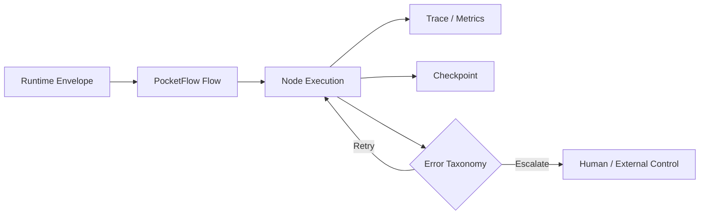

---
kb_id: ai-agent/frameworks/pocketflow-production-boundaries-observability-and-recovery
title: PocketFlow 的生产边界：为什么它适合作为原型编排框架，却必须额外补齐观测、恢复与副作用治理
domain: ai-agent
component: pocketflow
topic: production-boundaries-observability-recovery
difficulty: advanced
status: reviewed
sidebar_position: 21
version_scope: PocketFlow docs, PocketFlow GitHub repository, LangGraph overview docs, and 实践资料 easy-pocket repository as verified on 2026-05-12
last_verified_at: '2026-05-12'
source_ids:
  - pocketflow-docs
  - pocketflow-github
  - practice-easy-pocket
  - langgraph-overview-docs
claim_ids:
  - practice-p1-claim-0006
  - agent-runtime-claim-0003
  - agent-runtime-claim-0006
  - agent-runtime-claim-0010
tags:
  - ai-agent
  - pocketflow
  - observability
  - recovery
  - production
---
## PocketFlow 进入生产前，最重要的不是再加几个节点，而是承认哪些运行时责任它本来就没有承担
PocketFlow 是极简编排框架，这个定位本身没有问题。问题只会出现在误判它已经具备完整生产运行时语义的时候。真正的工程判断，不是拿它和重型框架争高低，而是明确：哪些责任它已经处理了，哪些责任必须由外层系统补齐。

### 解决什么问题
在原型阶段，PocketFlow 足以帮助团队快速表达控制结构；但进入生产后，系统会立刻面对新的要求：

1. 任务中断后能否恢复。
2. 节点失败后能否分类处理和审计。
3. 有副作用的工具能否安全重试。
4. 线上问题能否用 trace 和指标快速定位。

这些都不是“多写几个 Node”就能自动解决的问题。

### 核心对象
| 对象 | 作用 | 关键问题 |
| --- | --- | --- |
| Execution Trace | 记录节点级执行链 | 哪一步慢、哪一步错 |
| Checkpoint | 保存关键恢复点 | 从哪继续、恢复什么 |
| Error Taxonomy | 区分可重试与不可重试错误 | 是否需要人工介入 |
| Side-effect Fence | 给副作用节点加保护边界 | 幂等、审批、回滚 |
| Runtime Envelope | 外层治理壳，承接权限、预算和审计 | 谁能调用、预算多少 |

### 执行链路
当 PocketFlow 被放进生产系统，它通常应该运行在一个外层 Envelope 中：

1. 入口层先做权限、预算和租户隔离。
2. PocketFlow 只负责编排节点与状态推进。
3. 关键节点前后由外层系统记录 checkpoint 与 trace。
4. 如果节点失败，错误分类器决定是重试、降级还是转人工。
5. 对有副作用的 Node，必须通过 side-effect fence 做审批、幂等键和审计。



### 一致性与容错
PocketFlow 能表达流程，但一致性仍要依赖外部机制：

1. Checkpoint 需要明确保存哪些状态字段，而不是只保留最终输出。
2. 有副作用的节点需要幂等键或外部去重，否则恢复会重复执行。
3. Error Taxonomy 必须区分模型错误、工具错误、权限错误和上游数据错误。
4. 如果 Flow 会跨进程或跨时区运行，还需要外层系统保证调度和状态可见性。

### 性能模型
PocketFlow 进入生产后，延迟与吞吐的瓶颈更容易出现在外层治理壳，而不是 Flow 代码本身：

1. Trace 记录过于详细，可能造成 I/O 压力。
2. Checkpoint 频率过高，会拉长关键路径。
3. 人工审批或预算控制会引入明显等待时间。
4. 节点设计过细，会放大调度和状态传递成本。

```yaml
production_envelope:
  checkpoint_every: 2
  tracing_mode: essential
  require_approval_for:
    - write_file
    - send_message
  retry_classifier:
    transient_errors: [timeout, rate_limit]
    terminal_errors: [permission_denied, invalid_schema]
```

### 生产排障
当 PocketFlow 在生产里出问题，建议这样看：

1. 先看 trace，确认卡在哪个 Node。
2. 再看最近 checkpoint，确认恢复点是否完整。
3. 再看 error taxonomy 是否把不可重试错误误判成可重试。
4. 最后看 side-effect fence 是否缺失，导致外部动作重复发生。

### 和相邻技术的边界
PocketFlow 和 LangGraph 的主要区别，不是能否表达图，而是后者更强调长运行、持久化和恢复语义。PocketFlow 更适合作为原型或教学骨架；一旦进入生产，就应该主动补齐 Runtime Envelope，而不是假设极简框架已经隐含这些能力。

## 本页结论
PocketFlow 的生产边界必须说清楚：它擅长表达编排骨架，但不天然提供完整的观测、恢复、副作用治理和权限壳。只要把这条边界讲透，PocketFlow 就不会被错误地神化，也不会被低估为“只能做 Demo”。
