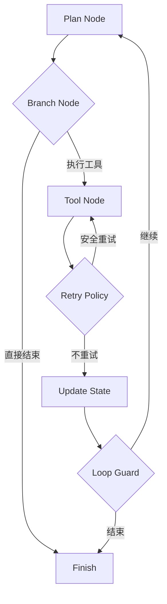

---
kb_id: ai-agent/frameworks/pocketflow-state-branching-retry-and-agent-loop
title: PocketFlow 进阶：Shared State、Branch、Retry 与 Agent Loop 该如何拆开理解
domain: ai-agent
component: pocketflow
topic: state-branching-retry-agent-loop
difficulty: advanced
status: reviewed
sidebar_position: 20
version_scope: PocketFlow docs, PocketFlow GitHub repository, LangGraph overview docs, and 实践资料 easy-pocket repository as verified on 2026-05-12
last_verified_at: '2026-05-12'
source_ids:
  - pocketflow-docs
  - pocketflow-github
  - practice-easy-pocket
  - langgraph-overview-docs
claim_ids:
  - practice-p1-claim-0006
  - agent-runtime-claim-0002
  - agent-runtime-claim-0004
  - agent-runtime-claim-0005
tags:
  - ai-agent
  - pocketflow
  - shared-state
  - retry
  - loop
---
## 用 PocketFlow 表达 Agent Loop 时，真正难的不是“会不会连节点”，而是状态和重试边界怎么画
很多人第一次上手 PocketFlow，会把 Agent loop 理解成几个节点连起来不停循环。这只能描述形状，不能描述运行语义。真正的深水区在于：状态怎么最小化、分支怎么表达、重试何时安全、循环何时该结束。

### 解决什么问题
如果 Shared State、Branch 和 Retry 没有拆开设计，极简图编排会很快遇到下面的问题：

1. 一个字段同时承担控制状态、业务结果和错误缓存，导致节点之间互相污染。
2. 分支条件不明确，流程会在“继续尝试”和“应该失败退出”之间来回摆动。
3. Retry 被默认成通用机制，结果对有副作用的节点造成重复写入。
4. Agent loop 缺少退出条件，只是机械重复 plan 和 tool call。

### 核心对象
| 对象 | 作用 | 关键边界 |
| --- | --- | --- |
| Shared State | 保存跨节点共享的最小必要信息 | 字段最小化、版本清晰 |
| Branch Node | 读取状态并决定后续路径 | 条件是否显式 |
| Retry Policy | 定义失败后能否重试以及如何重试 | 幂等、安全、次数 |
| Loop Guard | 防止无限循环 | 最大轮次、重复错误检测 |
| Terminal Node | 明确流程何时正式结束 | 成功、失败、人工接管 |

### 执行链路
PocketFlow 中更稳妥的 Agent loop，通常会把“思考”和“控制”分开：

1. Plan Node 只生成下一步动作建议。
2. Branch Node 决定是否允许进入工具节点。
3. Tool Node 执行动作，并把结果标准化写入 state。
4. Retry Policy 只对明确安全的错误类型生效。
5. Loop Guard 负责判断是否继续下一轮。



### 一致性与容错
PocketFlow 本身不强制状态 schema，所以容错要靠设计约束：

1. Shared State 中至少要区分业务结果、控制状态和错误信息三类字段。
2. Retry Policy 必须按节点类型区分，读操作和写操作不能共用策略。
3. Branch Node 不应该直接依赖原始工具返回值，而应该依赖标准化后的 observation。
4. Loop Guard 应能识别“连续相同错误”“重复相同动作”“预算耗尽”等退出信号。

### 性能模型
状态与重试设计也会直接影响延迟和吞吐：

1. Shared State 太大，会增加节点序列化与反序列化成本。
2. Branch 过多依赖模型判断，会增加额外 LLM 调用延迟。
3. Retry 设计不当，会放大失败成本，而不是提升成功率。
4. Loop 轮数过多，会让本来简单的工作流退化成高成本 Agent。

```yaml
retry_policy:
  search_docs:
    retry_safe: true
    max_retries: 1
  send_notification:
    retry_safe: false
    max_retries: 0
loop_guard:
  max_rounds: 4
  stop_on_repeated_same_error: true
```

### 生产排障
PocketFlow 的 loop 类问题，排查建议是：

1. 先看 state 字段是谁写的、在哪一轮开始异常。
2. 再看 branch 条件是不是依赖了不稳定值。
3. 再看 retry 是否误作用到了副作用节点。
4. 最后看 loop guard 是否缺失，导致流程在没有新信息的情况下继续迭代。

### 最小样例
```python
def branch_node(state):
    if state.get("task_done"):
        return "finish"
    if state.get("last_error") == "permission_denied":
        return "stop"
    return "tool"
```

### 和相邻技术的边界
这一页讨论的是 PocketFlow 如何表达运行控制，不是讨论某个具体工具库。LangGraph 等框架会把更多恢复语义内建进去，而 PocketFlow 更适合让我们先把 state、branch、retry 和 loop 这些基础边界想清楚。

## 本页结论
PocketFlow 之所以适合进阶学习，是因为它迫使我们正面面对 Shared State、Branch、Retry 和 Loop Guard 的边界。只有这些对象分工清楚，极简编排才能真正支撑 Agent loop，而不是变成无限循环和状态污染的温床。
