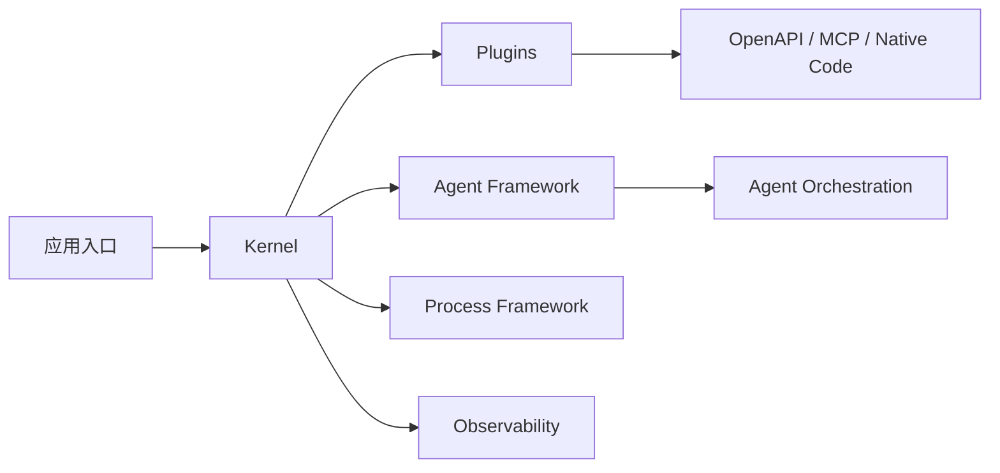

---
kb_id: ai-agent/frameworks/semantic-kernel
title: Semantic Kernel：它为什么更像 AI 中间件与 Agent 底座，而不是单一 Agent 框架
domain: ai-agent
component: semantic-kernel
topic: overview
difficulty: advanced
status: reviewed
sidebar_position: 12
version_scope: Semantic Kernel docs as verified on 2026-05-12
last_verified_at: '2026-05-12'
source_ids:
  - semantic-kernel-introduction
  - semantic-kernel-kernel-docs
  - semantic-kernel-plugins-docs
  - semantic-kernel-agent-framework-docs
  - semantic-kernel-agent-orchestration-docs
  - semantic-kernel-process-framework-docs
  - semantic-kernel-observability-docs
claim_ids:
  - semantic-kernel-claim-0001
  - semantic-kernel-claim-0002
  - semantic-kernel-claim-0003
  - semantic-kernel-claim-0004
  - semantic-kernel-claim-0005
  - semantic-kernel-claim-0006
  - semantic-kernel-claim-0007
  - semantic-kernel-claim-0008
  - semantic-kernel-claim-0009
tags:
  - ai-agent
  - semantic-kernel
  - plugins
  - middleware
  - orchestration
---
## Semantic Kernel 最容易被讲散，因为它覆盖的不是一个点，而是一整层 AI 中间件能力
很多人第一次接触 Semantic Kernel，会分别记住几个零散点：有 plugin、能做 function calling、能做 agent、还能跑 process。这样记忆没错，但一到面试或系统设计复盘，就很容易答散，因为这些点没有被放回统一架构里。

更稳的讲法是：Semantic Kernel 更像 AI 中间件与 Agent 底座。它先解决运行时和能力接入问题，再在这个底座上扩出 Agent Framework、Agent Orchestration、Process Framework 和 Observability 这些更高层能力。

## 为什么说它更像中间件而不是单一 Agent SDK
单一 Agent SDK 更强调“一个 agent 怎么跑”。Semantic Kernel 则明显多做了几层：

- `Kernel` 作为中央运行时和依赖注入中心。
- `Plugins` 作为统一能力接入层。
- `Agent Framework` 作为协作主体层。
- `Agent Orchestration` 作为多 Agent 协调层。
- `Process Framework` 作为确定性、状态化流程层。
- `Observability` 作为企业运行支撑层。

这说明它不是从“先有 agent”往外长，而是从“先有运行时底座和能力边界”往上长。所以它更像 AI 中间件与 Agent 平台底座，而不是一个只负责对话智能体的轻量库。

## 核心对象怎么讲
### Kernel
`Kernel` 是 Semantic Kernel 的第一关键词。它不是一个普通类名，而是运行时中心：

- 服务注册中心
- plugin 汇聚点
- 执行配置中枢
- 能力调用协调点

所以只讲 plugin 不讲 kernel，等于把系统中心漏掉了。回答这类题时，如果你能先说“Kernel 是运行时中枢，Plugin 是能力封装层”，整个逻辑会立刻清楚很多。

### Plugins
`Plugin` 是第二关键词。它的价值不只是“给 AI 提供可调用函数”，而是统一能力暴露接口。官方文档强调的重点包括：

- 可以把 native code 包成 plugin
- 可以从 OpenAPI 导入 plugin
- 可以接 MCP server
- 插件能力可以参与 function calling

这意味着 Semantic Kernel 的 plugin 不是单纯函数表，而是能力接入层。它天然适合作为“外部系统如何被 AI 安全、结构化接进运行时”的讨论入口。

### Agent Framework
`Agent Framework` 是更高一层的协作对象层。它回答的问题不再是“一个函数怎么被调用”，而是“一个 agent 作为行为主体如何存在、如何和别的 agent 协作”。

### Agent Orchestration
`Agent Orchestration` 更偏多 Agent 协调模式。官方文档提到的重点是统一接口下支持多种 coordination pattern，例如并发、顺序、handoff、group chat、magentic orchestration。它的价值在于把不同协作模式放进统一协调层，而不是让业务方每次自己拼装。

### Process Framework
`Process Framework` 更像确定性、状态化、事件驱动流程层。它强调的是 process、step、state、pause/resume 和长期运行流程。这一点非常关键，因为它说明 Semantic Kernel 并不是把所有复杂逻辑都扔给 agent 决策，而是提供了更稳定的业务流程容器。

## 一条典型架构主线
如果把 Semantic Kernel 放回系统架构里，一条更稳的主线是：

1. 应用初始化 kernel。
2. kernel 注册模型服务、memory、observability 和其他运行时依赖。
3. 外部能力通过 plugins 进入统一调用面。
4. 简单任务可直接由 kernel + plugins 完成。
5. 复杂任务可进入 agent framework 或 orchestration 层。
6. 需要强流程控制时，进入 process framework。
7. 全程通过 observability 把 logs、metrics、traces 接出来。



这条链里最重要的不是组件数量，而是层级关系：先有 kernel 和 plugins，再有 agent / orchestration / process 等更高层行为组织。

## 为什么 Plugin、Orchestration、Process 不能混着讲
这是 Semantic Kernel 最容易被讲乱的地方。

- `Plugin` 解决的是能力怎么接入。
- `Orchestration` 解决的是多个 agent 怎么协调。
- `Process Framework` 解决的是确定性、状态化业务流程怎么跑。

三者责任完全不同。如果混在一起，就会出现两类典型误答：

- 把 process 说成“另一种多 agent 对话”。
- 把 orchestration 说成“插件调多几次”。

真正成熟的回答，应该能主动把这三层切开，再补一句：`Agent Orchestration` 还带有 experimental 边界，而 `Process Framework` 更适合流程稳定性要求更高的场景。

## 运行时边界和版本边界
Semantic Kernel 里有一个很重要的生产边界：不是所有高层能力都等成熟度。尤其是 agent orchestration，官方就明确标过 experimental。这意味着高质量回答里要主动带上版本边界，而不是只讲能力列表。

一个靠谱的说法通常是：

- `Kernel` 和 `Plugins` 是相对稳定的中间件基础层。
- `Agent Orchestration` 值得关注，但生产选型要结合实验性边界。
- `Process Framework` 更适合那些不希望把所有执行路径都交给模型自由决策的系统。

## Observability 为什么在 Semantic Kernel 里特别重要
很多框架也会说自己支持日志和 trace，但 Semantic Kernel 把 observability 明确放进框架体系，而且兼容 OpenTelemetry。这个点很有企业味道，因为它说明观测不是你上线以后再补的旁路设施，而是中间件层要正式对接的运行时能力。

这直接决定它更适合企业场景，因为企业系统通常不仅关心“能跑”，还关心：

- 每步调用是谁触发的
- 哪个 plugin 失败了
- 哪个 process step 卡住了
- 多 agent 协调时哪一层造成延迟

## 最小样例
下面这个例子只演示“kernel + plugin”的最小骨架：

```python
from semantic_kernel import Kernel
from semantic_kernel.functions import kernel_function

class WeatherPlugin:
    @kernel_function(name="get_weather", description="查询天气")
    def get_weather(self, city: str) -> str:
        return f"{city} 晴，25 摄氏度"

kernel = Kernel()
kernel.add_plugin(WeatherPlugin(), plugin_name="weather")

# 实际系统里，这里通常还会注册模型服务，再让模型决定是否调用插件。
plugins = kernel.plugins
print(list(plugins.keys()))
```

这个例子虽然小，但能说明两个关键点：`Kernel` 是中枢，`Plugin` 是能力接入层。后续无论是 agent 还是 process，通常都建立在这层基础之上。

## 它适合什么，不适合什么
更适合 Semantic Kernel 的场景：

- 希望统一组织模型服务和外部能力。
- 需要把 OpenAPI、MCP、native code 等多种能力接进来。
- 既要 agent，又要更稳定的流程层。
- 企业内需要 observability、依赖注入和能力治理。

不一定优先用它的场景：

- 只是做一个非常轻量的单 Agent demo。
- 不需要明显的中间件层，也不需要复杂能力治理。
- 团队只想快速验证交互，不想先建立分层运行时。

## 相邻框架边界
和轻量 Agent SDK 相比，Semantic Kernel 更重视中间件结构。

和纯 workflow 系统相比，它又不是只做确定性流程，而是允许 agent、plugins 和 process 并存。

和单纯工具调用框架相比，它更强调企业可接入性、插件分层和观测能力。

## 本页结论
Semantic Kernel 最值得讲的，不是“它也能做 agent”，而是它用 `Kernel + Plugins` 先建立中间件底座，再把 `Agent Framework / Orchestration / Process / Observability` 叠上去。只要把这条分层主线说清，它就不会再被误答成普通 Agent 库。
