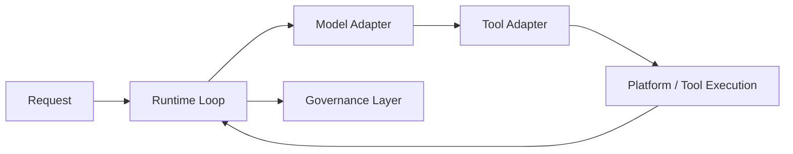

---
kb_id: ai-agent/frameworks/wow-agent-cross-platform-agent-framework
title: wow-agent：跨平台 Agent 框架应该从模型适配、工具适配、运行循环和治理边界一起评估
domain: ai-agent
component: wow-agent
topic: cross-platform-agent-framework
difficulty: intermediate
status: reviewed
sidebar_position: 25
version_scope: 实践资料 wow-agent repository, OpenAI Agents SDK docs, and MCP docs as verified on 2026-05-12
last_verified_at: '2026-05-12'
source_ids:
  - practice-wow-agent
  - openai-agents-sdk-docs
  - openai-agents-sdk-tools
  - mcp-introduction
claim_ids:
  - practice-p0-claim-0007
  - practice-p0-claim-0008
  - agent-runtime-claim-0002
  - agent-runtime-claim-0010
tags:
  - ai-agent
  - wow-agent
  - cross-platform
  - framework-selection
  - adapter
---
## 评估 wow-agent 这类跨平台框架时，真正要看的不是“接了多少模型”，而是它把哪些差异消化在了运行时里
跨平台 Agent 框架很容易被介绍成“支持 OpenAI、支持本地模型、支持工具调用、支持多个终端”。这些都只是表面兼容性。更关键的问题是：不同模型、不同工具协议、不同运行环境之间的差异，到底有没有被吸收成一套清晰的运行语义。如果没有，这种跨平台很可能只是薄薄一层 API 包装。

### 解决什么问题
跨平台框架试图解决四类差异：

1. 模型接口差异，例如消息格式、tool calling、streaming 和错误码。
2. 工具接口差异，例如 schema、审批、副作用与权限模型。
3. 运行环境差异，例如桌面、本地 CLI、聊天入口和远程服务。
4. 观测与治理差异，例如 trace、预算、恢复和权限审计。

wow-agent 作为学习案例，最适合用来训练这种“适配层 + 运行时 + 治理边界”的评估视角。

### 核心对象
| 对象 | 作用 | 观察重点 |
| --- | --- | --- |
| Model Adapter | 统一不同模型 API 差异 | tool calling、streaming、错误语义 |
| Tool Adapter | 统一内部工具抽象与外部能力 | schema、审批、副作用 |
| Runtime Loop | 负责 step、预算、终止和错误处理 | 最大轮次、失败恢复 |
| State Layer | 保存 transcript、run state、memory 等状态 | 边界是否清楚 |
| Governance Layer | 承接 trace、日志、成本、权限和审计 | 是否生产可用 |

### 执行链路
跨平台框架一条更成熟的链路应该是：

1. 请求进入后，先由 runtime 判断当前运行环境和目标模型。
2. Model Adapter 把请求转成目标模型能理解的消息与工具协议。
3. Tool Adapter 把内部动作映射到具体平台能力或外部协议。
4. Runtime Loop 根据结果决定继续、重试、结束或升级。
5. Governance Layer 记录每轮决策、工具调用和成本。



### 一致性与容错边界
跨平台并不自动带来一致性。真正要看的是：

1. 不同模型的错误和工具调用差异是否会污染统一状态层。
2. 不同平台能力是否被标明副作用和权限边界。
3. runtime loop 是否知道什么时候该停、什么时候该审批、什么时候该转人工。
4. State Layer 是否区分 transcript、run state、memory 和 checkpoint。

### 性能模型
跨平台框架的性能成本，常来自适配层和治理层叠加：

1. Model Adapter 过厚会增加序列化和转换成本。
2. Tool Adapter 过多包装会放大调用延迟。
3. 多平台能力暴露过宽，会让模型更难选对工具。
4. trace 和审计过重，会给本地运行环境带来额外开销。

```yaml
cross_platform_runtime:
  max_steps: 6
  adapters:
    model: required
    tool: required
  governance:
    trace: enabled
    cost_budget: medium
    approval_for_side_effects: true
```

### 生产排障
排 wow-agent 这类框架时，优先看：

1. 错误发生在 Model Adapter、Tool Adapter 还是底层平台。
2. runtime loop 有没有错误地继续执行。
3. 统一状态层是否混入了平台特有的脏字段。
4. trace 是否能还原出是哪一层的适配失败。

### 最小样例
```python
runtime = {
    "platform": "desktop",
    "model_provider": "openai-compatible",
    "max_steps": 6,
    "approved_tools": ["file_search", "read_file"],
}
```

### 和相邻技术的边界
wow-agent 更像跨平台学习案例，不应被夸大成已经自动解决所有生产问题。它适合拿来训练如何评估模型适配、工具适配、运行循环和治理边界；真正生产落地，还要继续看恢复、权限和幂等设计。

## 本页结论
评估 wow-agent 这类跨平台 Agent 框架时，不能只看支持哪些模型和终端。真正决定质量的是：模型适配、工具适配、运行循环、状态分层和治理边界是否一起被清晰定义。
