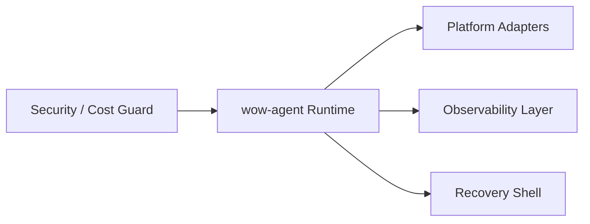

---
kb_id: ai-agent/frameworks/wow-agent-production-governance-observability-and-framework-selection
title: wow-agent 工程评估：跨平台框架什么时候适合教学原型，什么时候必须引入更重的治理壳
domain: ai-agent
component: wow-agent
topic: production-governance-observability-framework-selection
difficulty: advanced
status: reviewed
sidebar_position: 27
version_scope: 实践资料 wow-agent repository, OpenAI Agents SDK docs, and MCP docs as verified on 2026-05-12
last_verified_at: '2026-05-12'
source_ids:
  - practice-wow-agent
  - openai-agents-sdk-docs
  - openai-agents-sdk-tools
  - mcp-introduction
claim_ids:
  - practice-p0-claim-0007
  - practice-p0-claim-0008
  - agent-runtime-claim-0006
  - agent-runtime-claim-0010
tags:
  - ai-agent
  - wow-agent
  - observability
  - governance
  - framework-selection
---
## 跨平台框架的真正分水岭，不是能否接更多模型，而是何时需要更重的治理壳
wow-agent 这类项目很适合作为学习和快速原型框架，但当系统开始承担更长的任务、更高的权限和更复杂的审计责任时，仅靠“跨平台”本身已经不够。工程上更关键的是识别分水岭：什么时候它仍是高效选择，什么时候应该补更重的治理与观测层，甚至切换到更完整的运行时。

### 解决什么问题
这页主要解决三类判断：

1. 什么任务适合轻量跨平台框架。
2. 什么信号说明它已经接近工程边界。
3. 真正进入生产时，还需要补哪些治理能力。

### 核心对象
| 对象 | 作用 | 关键判断 |
| --- | --- | --- |
| Observability Layer | 提供 trace、日志、指标 | 是否能快速定位平台差异问题 |
| Cost Guard | 控制多平台调用成本 | 是否有预算与降级 |
| Security Guard | 控制权限和敏感动作 | 是否有审批与审计 |
| Recovery Shell | 支持中断、恢复和续跑 | 是否有 checkpoint 或 resume |
| Selection Criteria | 判断框架是否还适合当前阶段 | 任务长度、风险、租户复杂度 |

### 执行链路
进入较严肃场景后，轻量跨平台框架通常需要外加治理壳：

1. 请求先通过 cost / security / tenancy guard。
2. wow-agent 负责模型和工具适配、基础 loop 与平台调用。
3. Observability Layer 持续记录 trace 和平台级错误。
4. Recovery Shell 负责中断恢复或转人工。



### 一致性与容错
跨平台场景的容错重点有：

1. 平台能力差异不能污染统一业务状态。
2. 出错时要能区分框架 bug、平台 bug 和配置 bug。
3. 如果某平台能力不可用，系统要能降级或切换，而不是直接死循环。
4. 高风险动作要能中断和人工接管。

### 性能模型
跨平台框架的性能开销通常会在真实业务里才显现：

1. 多层适配叠加延迟。
2. 多平台 trace 采集增加 I/O。
3. 权限和审批壳引入等待时间。
4. 平台能力差异导致 fallback 链变长。

```yaml
selection_guard:
  suitable_for:
    - prototype
    - internal_tool
    - single_tenant_assistant
  upgrade_runtime_when:
    - long_running_jobs
    - strict_audit_required
    - multi_tenant_isolation
    - frequent_high_risk_tool_calls
```

### 生产排障
如果 wow-agent 在生产中表现不稳定，可以优先问：

1. 问题来自框架本身，还是来自某个平台的特殊行为。
2. 是否已经出现需要 checkpoint、审批和强审计的场景。
3. 是否已经进入多租户、高权限或长运行任务，这些需求可能超过当前轻量框架边界。

### 最小样例
```python
if requires_strict_audit(task) or is_long_running(task):
    route_to_heavier_runtime(task)
else:
    run_with_wow_agent(task)
```

### 和相邻技术的边界
这一页讨论的是选型和治理壳，不是说 wow-agent 本身不好。一个框架适合教学原型，不等于它永远适合作为生产主运行时。真正专业的判断，是知道何时继续用、何时补壳、何时换层。

## 本页结论
wow-agent 最适合拿来训练跨平台框架的评估思路：模型适配、工具适配、运行循环之外，还要看观测、恢复、权限和选型边界。只有把这些边界讲清，跨平台框架的价值和局限才算真正说透。
