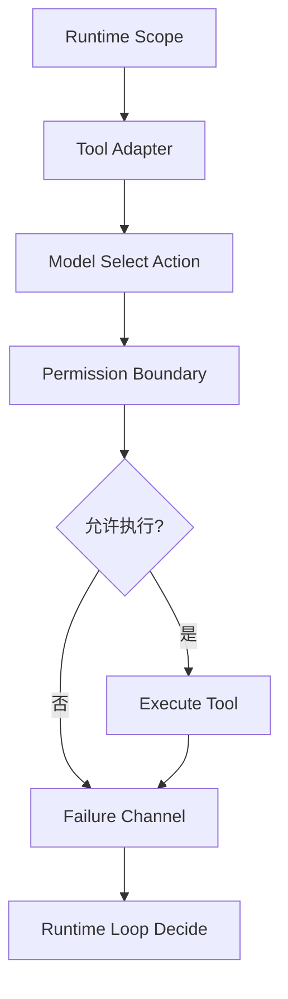

---
kb_id: ai-agent/frameworks/wow-agent-tool-adapter-runtime-loop-and-permission-boundaries
title: wow-agent 深水区：Tool Adapter、Runtime Loop 和 Permission Boundary 为什么要分层设计
domain: ai-agent
component: wow-agent
topic: tool-adapter-runtime-loop-permission-boundaries
difficulty: advanced
status: reviewed
sidebar_position: 26
version_scope: 实践资料 wow-agent repository, OpenAI Agents SDK docs, and MCP docs as verified on 2026-05-12
last_verified_at: '2026-05-12'
source_ids:
  - practice-wow-agent
  - openai-agents-sdk-docs
  - openai-agents-sdk-tools
  - mcp-introduction
claim_ids:
  - practice-p0-claim-0007
  - practice-p0-claim-0008
  - agent-runtime-claim-0002
  - agent-runtime-claim-0005
tags:
  - ai-agent
  - wow-agent
  - permission
  - tool-adapter
  - runtime-loop
---
## 跨平台 Agent 最容易失控的地方，不是模型回答错，而是工具适配和权限边界没有正式建模
很多跨平台框架 demo 能跑通，是因为场景简单、工具范围很小。但一旦进入真实任务，问题会迅速变成：不同平台上的工具能力到底怎样暴露给模型，副作用怎样标注，失败怎样回传，权限在哪里判断。这些问题如果不通过 Tool Adapter 和 Runtime Loop 分层处理，跨平台只会放大风险。

### 解决什么问题
这一层设计主要解决：

1. 模型能不能稳定理解工具输入输出。
2. 同一个工具在不同平台上的权限是否一致。
3. 失败是工具错误、参数错误还是权限错误。
4. 高风险动作是否有审批和停止条件。

### 核心对象
| 对象 | 作用 | 关键边界 |
| --- | --- | --- |
| Tool Adapter | 对外暴露结构化工具能力 | schema、副作用、审批要求 |
| Permission Boundary | 限制不同环境下能做的动作 | 文件、网络、外部系统 |
| Runtime Loop | 控制是否继续调用工具 | 预算、终止、升级 |
| Failure Channel | 统一错误返回语义 | retryable、terminal、approval |
| Approval Gate | 高风险动作的人机分界点 | 谁批准、批准后状态 |

### 执行链路
1. Runtime Loop 先根据任务 scope 决定允许哪些工具暴露给模型。
2. Tool Adapter 把工具包装成统一 schema，并声明副作用和风险级别。
3. 模型选择动作后，Permission Boundary 在执行前再次检查环境权限。
4. 执行结果通过 Failure Channel 回写，告知 loop 是继续、重试、等待审批还是终止。



### 一致性与容错
这层最关键的容错边界包括：

1. 权限拒绝不应该被当成普通临时错误自动重试。
2. 有副作用的工具必须在 Tool Adapter 层声明风险，而不是让调用方自己猜。
3. Approval Gate 通过后要留下明确状态，避免重复审批或重复执行。
4. Failure Channel 不能只返回一段字符串，而要返回可被 loop 理解的结构化语义。

### 性能模型
权限与适配层也会带来开销：

1. 工具 schema 过大，会增加模型理解成本。
2. 适配器层过多转换，会拉长调用链。
3. 审批点过多，会降低自动化收益。
4. 权限判定如果分散在多个层次，排障成本会急剧上升。

```json
{
  "tool": "write_file",
  "side_effect": "filesystem_write",
  "requires_approval": true,
  "allowed_platforms": ["desktop"],
  "failure_types": ["approval_required", "permission_denied", "io_error"]
}
```

### 生产排障
如果跨平台 Agent 频繁误操作工具，建议先看：

1. Tool Adapter 的 schema 是否过大或不明确。
2. Permission Boundary 是否在执行前真正校验。
3. Failure Channel 是否把不同错误都糊成一个文本。
4. Runtime Loop 是否对拒绝和审批错误做了错误重试。

### 和相邻技术的边界
这一页强调的是跨平台工具运行时，不是模型选型本身。模型强不强不决定权限边界是否存在；跨平台框架必须自己把这层责任担起来。

## 本页结论
wow-agent 这类框架一旦连接真实平台，真正的难点会落在 Tool Adapter、Permission Boundary、Approval Gate 和 Runtime Loop 的分层设计上。只有这些边界正式化，跨平台能力才不会演变成高风险能力泄露。
