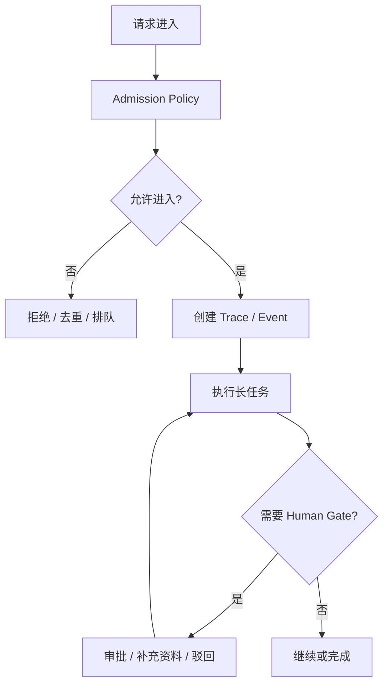

---
kb_id: ai-agent/patterns/agent-harness-admission-control-observability-and-human-gates
title: Harness 入口治理：Admission Control、Observability 与 Human Gate 为什么决定长任务是否可运营
domain: ai-agent
component: harness-engineering
topic: harness-admission-observability-human-gates
difficulty: advanced
status: reviewed
sidebar_position: 56
version_scope: Official long-running agent docs and 实践资料 self-harness repository as verified on 2026-04-26
last_verified_at: '2026-04-26'
source_ids:
  - openai-background-mode-guide
  - microsoft-agent-framework-workflows
  - openai-agents-sdk-human-in-the-loop
  - practice-self-harness
claim_ids:
  - practice-p0-claim-0003
  - agent-runtime-claim-0006
  - agent-runtime-claim-0007
tags:
  - ai-agent
  - harness-engineering
  - observability
  - hitl
  - admission-control
---
## 很多长任务不是死在模型能力上，而是死在入口失控、观测缺失和人工接管设计太晚
Agent 能否长期运行，并不只取决于恢复语义。另一个同样关键的问题是：任务在进入系统之前有没有被去重、限流和分级；运行过程中有没有留下足够证据；需要人工介入时能不能顺滑切换责任，而不是临时弹一个确认框。

## 解决什么问题
这一页主要解决：

1. 同一个用户或同一 thread 重复提交任务时，系统如何避免并发互踩。
2. 长任务运行中如何留下足够 trace、event 和 metrics 以支持排障和审计。
3. 需要人工审批、补充资料或风险确认时，如何把 HITL 设计成正式运行状态。

## 核心对象
| 对象 | 作用 | 观察重点 |
| --- | --- | --- |
| Admission Policy | 控制去重、并发、优先级、预算 | 重复提交率、拒绝原因 |
| Trace Span | 记录每个阶段的输入、输出和耗时 | 卡点、慢点、异常点 |
| Event Stream | 记录状态变化和关键动作 | 顺序性、可回放 |
| Human Gate Record | 记录审批原因、审批人和恢复入口 | 审批耗时、驳回率 |
| SLA Monitor | 监控等待、执行、恢复的时延边界 | 超时、排队、积压 |

## 执行链路
1. Admission Control 在任务进入前做身份校验、去重、预算和并发限制。
2. 任务一旦被接受，系统立刻生成 trace 和 event 链路，不等问题发生才补日志。
3. 如果命中高风险动作或缺少关键上下文，任务转入 Human Gate，并记录原因与恢复入口。
4. 恢复后继续沿原 run_id 和 trace 追加，而不是新建一条匿名任务链路。



## 一致性与容错
Admission 和 Human Gate 的一致性问题，通常表现为“谁拥有当前任务控制权”不清楚：

1. 如果没有并发策略，同一 thread 上的多个 run 可能同时修改共享状态。
2. 如果审批记录和 run state 分离，恢复后系统可能不知道用户已经批准还是仍在等待。
3. 如果 trace 不是从入口就建立，后续很难还原任务从哪里开始偏离。

## 性能模型
入口治理和观测也会影响系统效率：

1. 去重窗口过短会放进大量重复任务，过长则可能误伤合法重试。
2. trace 粒度过细会带来观测成本，过粗又无法定位瓶颈。
3. human gate 设计不合理时，任务会在等待审批阶段大量堆积。

```yaml
admission_policy:
  deduplicate_window_seconds: 120
  max_parallel_runs_per_thread: 1
  default_priority: normal
human_gate:
  required_for:
    - payment
    - external_delete
    - privilege_change
```

## 生产排障
如果长任务出现“入口就卡死”“审批后没有恢复”“线上问题无法复现”，通常按这个顺序查：

1. 查 admission 日志，看是否被错误去重、错误限流或错误排队。
2. 查 trace span，看卡在排队、工具执行还是等待审批。
3. 查 human gate record，看审批状态和恢复入口是否一致。
4. 查 event stream，看状态转移顺序是否断裂。

## 样例
```json
{
  "run_id": "run_001",
  "admission": {
    "deduplicated": false,
    "parallel_runs_on_thread": 0,
    "budget_class": "standard"
  },
  "human_gate": {
    "required": true,
    "reason": "delete action",
    "status": "pending"
  }
}
```

```python
def allow_new_run(thread_runs):
    active = [r for r in thread_runs if r["status"] in {"queued", "running", "waiting_for_approval"}]
    return len(active) == 0
```

## 相邻技术边界
Admission Control 不是单纯 API 网关限流，Human Gate 也不是产品确认弹窗，Observability 更不是“上线后再补日志”。在长任务 Harness 中，它们共同决定了系统能不能被运营、被审计、被恢复。

## 本页结论
长任务 Harness 的入口治理决定了任务能否被稳定接纳、被持续观测、被安全转人工。Admission Policy、Trace、Event Stream、Human Gate Record 和 SLA Monitor 一起构成可运营性基础，没有这层，恢复语义再漂亮也很难真正落地。
