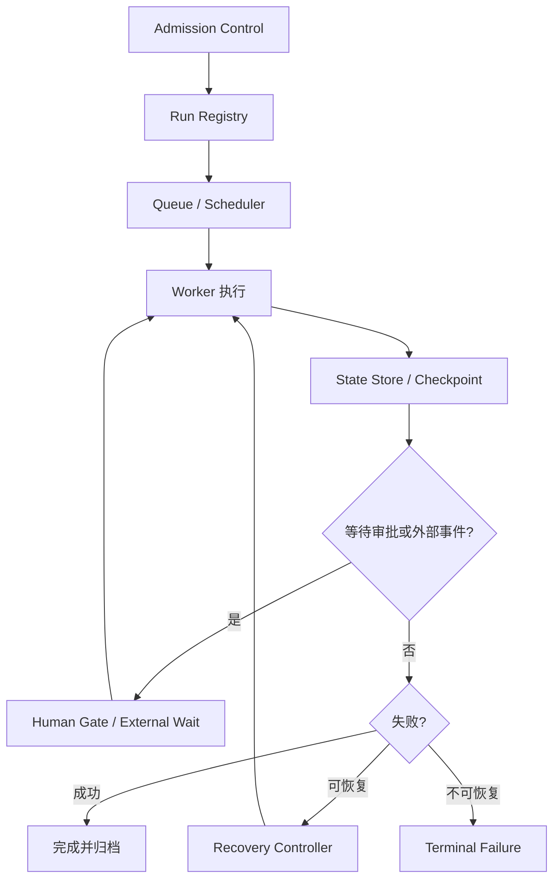

---
kb_id: ai-agent/patterns/agent-harness-runtime-recovery-and-production-governance
title: Harness Engineering：长时间运行 Agent 的执行责任层，为什么绝不能退化成一段循环代码
domain: ai-agent
component: harness-engineering
topic: agent-harness-runtime-recovery
difficulty: advanced
status: reviewed
sidebar_position: 50
version_scope: Official long-running agent docs and 实践资料 self-harness repository as verified on 2026-04-26
last_verified_at: '2026-04-26'
source_ids:
  - openai-background-mode-guide
  - langgraph-persistence-docs
  - microsoft-agent-framework-workflows
  - microsoft-agent-framework-checkpoints
  - openai-agents-sdk-human-in-the-loop
  - openai-agents-sdk-run-state
  - practice-self-harness
claim_ids:
  - practice-p0-claim-0003
  - practice-p0-claim-0004
  - agent-runtime-claim-0006
  - agent-runtime-claim-0007
tags:
  - ai-agent
  - harness-engineering
  - long-running-agent
  - checkpoint
  - recovery
  - production-governance
---
## 长任务 Agent 真正难的部分，不是模型能不能继续思考，而是系统能不能持续负责
很多 Demo 会把 Agent 写成一个 while loop，加上几把工具就开始跑。只要任务超过几分钟、涉及副作用、需要人工审批或可能跨进程恢复，这种写法就会立刻失去控制。Harness Engineering 的价值，在于把“模型参与决策”和“系统承担执行责任”明确拆开，让长任务 Agent 可以被暂停、恢复、审计、回放和降级。

## 解决什么问题
Harness 主要解决四类生产问题：

1. 任务运行很久时，前端断开、worker 重启或外部系统超时后如何续跑。
2. 工具产生副作用时，如何避免重复执行、重复扣款、重复发消息或重复改状态。
3. 遇到人工审批、外部回调或跨系统等待时，系统如何暂停而不是盲目继续推理。
4. 出现问题后，如何用 run state、checkpoint、trace 和 operation log 还原责任链。

## 核心对象
| 对象 | 主要职责 | 观察重点 |
| --- | --- | --- |
| Admission Control | 处理鉴权、并发限制、去重、预算和优先级 | 是否重复提交、是否超预算 |
| Run Registry | 保存 run_id、thread_id、owner、status、版本 | 生命周期、状态跳转 |
| State Store | 保存 run state、transcript、checkpoint、外部引用 | 恢复边界、状态兼容性 |
| Tool Executor | 执行真实动作并记录副作用结果 | 幂等、超时、错误分类 |
| Human Gate | 管理人工审批、补充信息、驳回和恢复 | 审批延迟、恢复点 |
| Recovery Controller | 从可信 checkpoint 恢复运行 | 是否重放、是否重复执行 |
| Observability Stack | 记录 trace、event、metrics、日志和告警 | 失败位置、成本、耗时 |

## 执行链路
一个成熟 harness 的长任务链路通常是：

1. Admission Control 接收请求，生成 run_id 并做去重、预算和并发判断。
2. Run Registry 记录任务状态，Queue 或 Scheduler 负责把任务送到执行 worker。
3. Worker 每完成一个语义边界动作，就把状态与 checkpoint 写入 State Store。
4. 如果工具需要审批或等待外部事件，状态转入 waiting，而不是继续往下执行。
5. 出现错误时先按错误类型决定 retry、fallback、handoff 或 terminal failure。
6. 恢复时由 Recovery Controller 从可信 checkpoint 继续，而不是整条链路重新跑一遍。



## 一致性与容错
Harness 最关键的一条边界是：模型输出不是执行事实，checkpoint 也不是随便保存一下内存变量。真正需要保证的是运行状态与副作用状态之间的关系可解释：

1. 工具如果已经对外提交动作，就必须在本地留下 operation log 或等价证据，恢复时才能判断是否允许重试。
2. checkpoint 必须对应明确语义边界，例如“审批前”“支付已提交但未确认”“文档已生成待上传”，而不是随机时间点快照。
3. waiting_for_approval 和 waiting_for_external_event 必须是正式状态，不然恢复后很容易越过本应暂停的安全边界。
4. 恢复策略要区分 recoverable failure 和 terminal failure，不能把所有失败都交给统一 retry 处理。

## 性能模型
Harness 的成本不只来自模型调用，还来自运行责任本身：

1. 状态写入过于频繁会提高持久化成本和恢复复杂度。
2. checkpoint 粒度过粗，失败后重放成本高；粒度过细，写放大严重。
3. admission、审批和外部等待链路设计不合理时，长任务平均延迟会被系统性拉长。
4. trace 过少会让排障困难，trace 过多则会增加存储和查询压力。

```yaml
harness_policy:
  deduplicate_window_seconds: 60
  max_concurrent_runs_per_thread: 1
  checkpoint_on:
    - before_side_effect_tool
    - after_side_effect_tool_ack
    - before_human_approval
  retryable_errors:
    - transient_network
    - rate_limited
```

## 生产排障
长任务 Harness 出问题时，先不要看 prompt，先看执行责任链：

1. 查 run registry，确认任务现在是什么状态，是否存在非法状态跳转。
2. 查 checkpoint 与 operation log，确认外部副作用执行到哪一步。
3. 查 human gate 和 external wait，确认是否卡在审批或回调而不是模型推理。
4. 查 trace 和 metrics，确认是 admission、tool executor、state store 还是 recovery controller 成为了瓶颈。

## 样例
下面的 run record 示例突出的是状态、预算和待恢复边界：

```json
{
  "run_id": "run_20260426_001",
  "thread_id": "customer_42_ticket_17",
  "status": "waiting_for_approval",
  "step": 5,
  "checkpoint_ref": "checkpoint/run_20260426_001/step_5",
  "pending_action": {
    "tool_call_id": "tool_005",
    "tool": "refund_order",
    "idempotency_key": "refund_order_8831_run_20260426_001"
  }
}
```

```python
def recover_run(run, state_store):
    checkpoint = state_store.load_checkpoint(run["checkpoint_ref"])
    if checkpoint["pending_action"]["already_committed"]:
        return resume_after_side_effect(checkpoint)
    return replay_from_safe_boundary(checkpoint)
```

## 相邻技术边界
Harness 不等于异步队列，不等于普通工作流引擎，也不等于 tracing SDK。队列只解决调度，工作流引擎偏重预定义流程，tracing 负责观测；Harness 则把调度、状态、审批、恢复、幂等和观测组织成统一执行责任层。没有它，长任务 Agent 很难真正进入生产环境。

## 本页结论
Harness Engineering 的核心不是“把 Agent 放后台跑”，而是建立一套真正负责执行的系统外壳。Admission、Run Registry、State Store、Tool Executor、Human Gate、Recovery Controller 和 Observability Stack 一起工作，Agent 才能在长任务和高风险任务里被安全地暂停、恢复、审计和回放。
