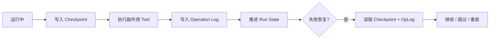

---
kb_id: ai-agent/patterns/agent-harness-state-machine-checkpoints-and-idempotency
title: Harness 恢复语义：状态机、Checkpoint 与幂等副作用为什么要一起设计
domain: ai-agent
component: harness-engineering
topic: harness-state-machine-checkpoints-idempotency
difficulty: advanced
status: reviewed
sidebar_position: 55
version_scope: Official long-running agent docs and 实践资料 self-harness repository as verified on 2026-04-26
last_verified_at: '2026-04-26'
source_ids:
  - langgraph-persistence-docs
  - microsoft-agent-framework-checkpoints
  - openai-agents-sdk-run-state
  - practice-self-harness
claim_ids:
  - practice-p0-claim-0003
  - practice-p0-claim-0004
  - agent-runtime-claim-0008
tags:
  - ai-agent
  - harness-engineering
  - checkpoint
  - idempotency
  - state-machine
---
## 长任务恢复能不能成立，关键看你保存的是“变量快照”，还是“语义恢复点”
很多系统把 checkpoint 理解成“定时把内存 dump 一下”。这在长任务 Agent 里通常不够，因为真正难的是副作用与状态的对齐。只要外部动作已经提交，但本地状态没有同步更新，恢复时就会面临“到底该不该再执行一次”的经典难题。

## 解决什么问题
这一页主要解决三个问题：

1. 状态机怎样定义，才能区分 running、waiting、retrying 和 terminal 状态。
2. checkpoint 该保存什么，才能从语义边界恢复而不是从随机时间点重放。
3. 外部副作用如何靠幂等键和 operation log 控制重复执行风险。

## 核心对象
| 对象 | 作用 | 关键边界 |
| --- | --- | --- |
| Run State Machine | 描述长任务的合法状态与转移 | 非法跳转、等待状态 |
| Checkpoint Record | 记录某个语义边界的可信快照 | step、版本、待执行动作 |
| Operation Log | 记录已提交外部副作用 | 已提交、已确认、可重放 |
| Idempotency Key | 让重复请求可被识别和去重 | 生成规则、作用范围 |
| Replay Policy | 决定恢复时从哪一步继续 | 安全边界、重放成本 |

## 执行链路
恢复语义正确的链路通常应这样组织：

1. 任务进入 `running` 前先生成稳定 run_id 和 tool_call_id 规则。
2. 在高风险工具执行前写 checkpoint，标记即将提交的动作。
3. 工具调用成功后，把 idempotency key、外部返回值和提交状态写入 operation log。
4. 只有当本地状态与外部提交状态都可解释时，才把状态推进到下一步。
5. 恢复时先读 checkpoint 和 operation log，再决定继续、跳过还是重放。



## 一致性与容错
这个层面的关键不是追求空洞的 exactly-once，而是把 at-least-once 执行下的重复风险降到可控：

1. tool_call_id 和 idempotency key 必须稳定，否则重试时系统无法判断是否为同一动作。
2. checkpoint 不能写在副作用之后但状态之前的危险区间，否则恢复时会既没有证据也没有状态。
3. operation log 要能区分“已发起”“已确认”“未知结果”，不能只用一个 success 字段糊过去。
4. 如果外部系统本身不支持幂等，harness 至少要保存本地去重和人工复核入口。

## 性能模型
恢复语义会直接影响吞吐和时延：

1. checkpoint 太频繁，状态存储成本高；太稀疏，失败重放代价大。
2. operation log 太粗，恢复时判断困难；太细，写入放大严重。
3. 幂等检查如果每次都依赖高延迟外部系统，会让正常执行路径也变慢。

```json
{
  "tool_call_id": "refund_20260426_005",
  "idempotency_key": "refund_order_8831_run_001",
  "status": "submitted",
  "external_receipt": null,
  "retry_safe": false
}
```

## 生产排障
如果线上出现重复发消息、重复退款、重复建单，优先按下面顺序查：

1. 查 tool_call_id 和 idempotency key 是否稳定生成。
2. 查 checkpoint 写入位置，确认是不是保存到了危险区间。
3. 查 operation log 是否记录了外部提交状态。
4. 查 replay policy，确认恢复时是不是错误地重放了已提交动作。

## 样例
```yaml
checkpoint_record:
  run_id: run_001
  step: 7
  status: before_side_effect
  pending_tool:
    name: refund_order
    tool_call_id: refund_20260426_005
    idempotency_key: refund_order_8831_run_001
```

```python
def should_replay(operation):
    if operation["status"] == "confirmed":
        return False
    if operation["status"] == "submitted" and not operation["retry_safe"]:
        return False
    return True
```

## 相邻技术边界
这一页讨论的是长任务恢复语义，不是普通缓存策略，也不是简单数据库事务。缓存关心的是性能，事务关心的是局部数据一致性；Harness 这里关心的是跨模型、跨工具、跨外部系统的恢复解释力。

## 本页结论
长任务恢复能否成立，取决于状态机、checkpoint 和幂等副作用是否被放在同一条责任链上设计。只有保存的是语义恢复点，而不是随手快照，系统才可能在失败后既不丢状态，也不重复执行高风险动作。
