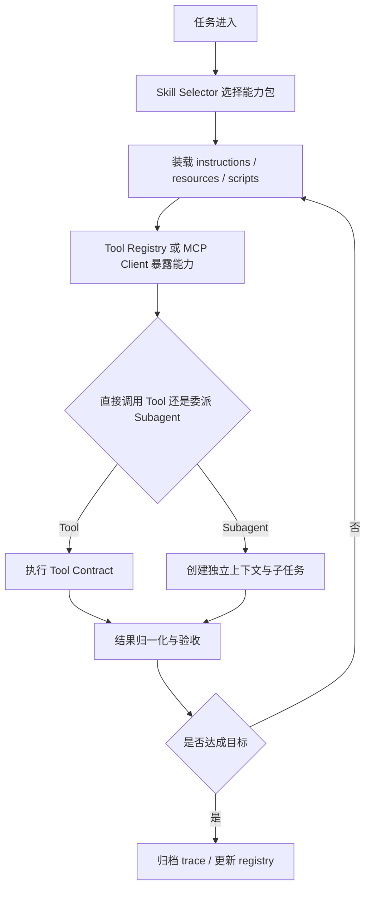

---
kb_id: ai-agent/patterns/agent-skills-tools-mcp-and-subagents
title: Agent Skills / Tools / MCP / Subagents：从能力封装到执行委派，为什么必须拆成四层
domain: ai-agent
component: agent-skills
topic: agent-skills-tools-mcp-subagents
difficulty: advanced
status: reviewed
sidebar_position: 52
version_scope: Anthropic docs, Claude blog, DeepLearning.AI course page, and 实践资料 agent-skills repository as verified on 2026-04-26
last_verified_at: '2026-04-26'
source_ids:
  - anthropic-agent-skills-docs
  - anthropic-skills-explained-blog
  - deeplearning-ai-agent-skills-course
  - practice-agent-skills-with-anthropic
  - mcp-server-concepts
claim_ids:
  - practice-p2-claim-0002
  - practice-p2-claim-0003
  - agent-runtime-claim-0005
  - agent-runtime-claim-0006
tags:
  - ai-agent
  - agent-skills
  - tools
  - mcp
  - subagents
---
## 把四者都叫“插件”，会让 Agent 系统最关键的责任边界瞬间消失
在早期 Demo 里，Skill、Tool、MCP、Subagent 经常一起出现，所以很多人会直接把它们都叫插件。但工程上这四者解决的不是同一类问题：Skill 管能力封装与装载，Tool 管动作合同与副作用，MCP 管外部能力暴露协议，Subagent 管任务委派与隔离执行。只有把它们分层，系统才可能在复杂任务里既灵活又可控。

## 解决什么问题
如果这四层不拆开，系统很快会出现四类典型故障：

1. 把长说明直接塞进主 prompt，导致每次都重复装载无关上下文。
2. 把高风险外部动作包装成模糊工具，模型不知道什么动作可重试、什么动作必须审批。
3. 把 MCP 当成“一个工具集合”，忽略 host、client、server 之间的信任和发现边界。
4. 把 Subagent 当成普通 tool call，结果既没有独立验收，也没有独立上下文，委派成本上升但质量没有提高。

所以这页真正要回答的问题不是“它们分别是什么”，而是“为什么必须把能力装载、动作执行、协议接入和任务委派分成不同层”。

## 核心对象
| 对象 | 主要职责 | 观察重点 |
| --- | --- | --- |
| Skill Package | 封装 instructions、resources、scripts、示例和适用范围 | 触发条件、资源大小、版本、命中率 |
| Tool Contract | 定义可执行动作的输入输出、权限和副作用 | schema、超时、幂等、失败语义 |
| MCP Client | 代表 Agent 侧去发现和调用外部能力 | 连接状态、可见 server、鉴权 |
| MCP Server | 以标准协议暴露 tools、resources、prompts | 信任边界、资源范围、延迟 |
| Subagent | 负责独立完成某个子目标的执行主体 | 独立上下文、验收合同、回收结果 |
| Skill Registry | 管理 skill 的版本、owner、灰度和禁用状态 | 发布策略、召回质量、回滚 |
| Approval Policy | 控制高风险工具或高风险委派何时需要人工介入 | 风险等级、审批耗时、拒绝率 |

## 执行链路
一个成熟 Agent 系统里，这四层通常按下面的顺序协作：

1. 主 Agent 先根据任务目标判断是否需要某个 Skill，而不是直接把所有领域说明都塞给模型。
2. Skill Selector 只装载当前任务需要的 instructions、resource 摘要和必要脚本。
3. 如果任务需要调用外部能力，运行时再通过本地 Tool Registry 或 MCP Client 获取可用工具清单。
4. 对于需要独立思考、独立上下文或并行探索的子任务，主 Agent 才会创建 Subagent，而不是把所有动作都塞进主循环。
5. Tool 或 Subagent 返回结果后，主 Agent 先做结果归一化和验收，再决定是否继续、回退或升级人工。



## 一致性与容错
Skill、Tool、MCP、Subagent 最大的区别之一，是它们的失败语义完全不同：

1. Skill 装载失败通常意味着上下文准备不完整，并不代表外部副作用已经发生。
2. Tool 失败可能发生在参数校验、权限校验、执行超时、远程系统报错多个阶段，不能统一用“再试一次”处理。
3. MCP 失败既可能是 server 不可达，也可能是鉴权失效、资源暴露范围变化或 host/client 版本不兼容。
4. Subagent 失败时要判断是子任务没完成、输出不满足合同，还是子任务已经触发了外部动作但主 Agent 尚未收到确认。

因此容错设计必须分层：

- Skill 需要版本和回退策略，避免错误能力包持续污染主上下文。
- Tool 需要幂等键、错误分类和审批边界，避免副作用被重复执行。
- MCP 需要 server 级信任配置和降级策略，避免外部能力不可用时整个系统失控。
- Subagent 需要独立输出合同和结果验收，避免“看起来完成了”但实际上没有满足主任务要求。

## 性能模型
这四层拆开之后，性能瓶颈也会更容易定位：

1. Skill 太多但没有索引，会把选择成本转移给模型，导致首轮决策延迟上升。
2. Skill 资源包太大，会让上下文装载膨胀，降低真正有用信息的密度。
3. MCP Server 数量增加后，连接建立、鉴权和远程调用会带来额外网络开销。
4. Subagent 开得太多，会放大上下文复制、任务切换和结果汇总成本。
5. Tool surface 过大，会让模型在动作选择阶段浪费更多 token 去比较本不该暴露的能力。

```yaml
skill_runtime_policy:
  max_loaded_skills: 2
  max_skill_resource_chars: 6000
  allowed_remote_mcp_servers:
    - docs-server
    - code-search-server
  subagent_budget:
    max_parallel_subagents: 2
    max_subagent_steps: 5
  high_risk_tools_require_approval: true
```

## 生产排障
线上排这类问题时，建议按责任层逐层收窄：

1. 先看当前 run 到底装载了哪个 Skill，确认是不是能力包选错了，而不是模型“突然变笨”。
2. 再看模型拿到的工具清单，确认是否暴露了过多工具，或者漏暴露了必要工具。
3. 如果问题出现在远程能力，继续看 MCP Client 到 MCP Server 的连接、鉴权和返回结构。
4. 如果是复杂任务失败，再看是否错误地用了 Tool 代替 Subagent，或者错误地用了 Subagent 代替普通 Tool。
5. 最后再看审批、幂等和 trace，确认是否发生过重复动作或未验收输出直接进入主链路。

典型现象和根因的对应关系通常很稳定：

- 一直重复同一类操作，常见是 Skill 指南过宽或 Tool 暴露过多。
- 远程工具偶发失灵，常见是 MCP 连接、权限或 server 侧暴露范围变化。
- 委派后结果质量下降，常见是 Subagent 没有独立目标和验收合同。

## 样例
下面的 skill manifest 示例强调的是能力包边界，而不是某个框架私有格式：

```yaml
skill:
  name: release-diagnosis
  description: 用于排查发布失败并生成根因摘要
  trigger_when:
    - task_contains: "发布失败"
    - task_contains: "回滚"
  resources:
    - runbook/release-checklist.md
    - templates/incident-summary.md
  scripts:
    - scripts/extract_release_events.py
  allowed_tools:
    - search_logs
    - read_change_ticket
    - draft_summary
  disallowed_tools:
    - refund_order
    - delete_resource
```

下面的伪代码展示主 Agent 如何在 Skill、Tool、Subagent 之间做分层决策：

```python
def handle_task(task, registry, tool_registry, mcp_client):
    skill = registry.select_skill(task)
    context = load_skill_bundle(skill, max_chars=6000)
    tools = tool_registry.local_tools(skill.allowed_tools)
    tools += mcp_client.discover(skill.allowed_tools)

    if should_delegate(task, context):
        result = run_subagent(goal=task, context=context, tools=tools)
    else:
        action = choose_tool(task, context, tools)
        result = execute_tool(action)

    return validate_result_against_contract(result)
```

## 相邻技术边界
Skill 不是 Prompt 模板仓库，Tool 不是所有外部能力的统称，MCP 不是某个框架的业务工作流，Subagent 也不是“会调用工具的模型分身”。

更准确的边界是：

- Skill 管理的是可装载的任务能力包。
- Tool 管理的是可执行动作接口。
- MCP 管理的是外部能力如何被标准化暴露和发现。
- Subagent 管理的是子任务如何独立完成并回到主链路。

如果系统里这四层职责分不清，后续很难再把权限、审计、成本、可恢复性和评估做好。

## 本页结论
Skill、Tool、MCP、Subagent 不是四个近义词，而是 Agent 工程里四个不同责任层。Skill 解决能力装载，Tool 解决动作执行，MCP 解决外部能力接入，Subagent 解决任务委派。把这四层拆清楚，才有可能在复杂任务里同时获得灵活性、可观测性和安全边界。
