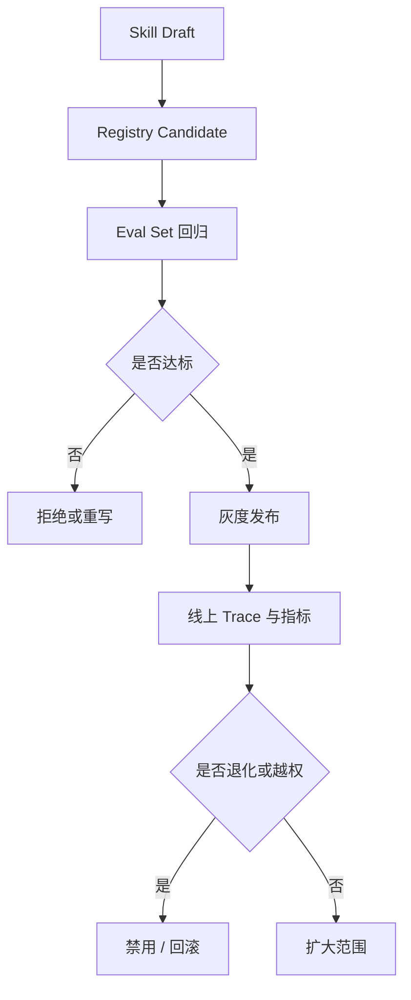

---
kb_id: ai-agent/patterns/agent-skills-versioning-evals-and-permission-governance
title: Agent Skills 工程治理：版本、评估、权限边界与回滚为什么必须先于大规模复用
domain: ai-agent
component: agent-skills
topic: agent-skills-versioning-evals-permission-governance
difficulty: advanced
status: reviewed
sidebar_position: 54
version_scope: Anthropic docs, Claude blog, DeepLearning.AI course page, and 实践资料 agent-skills repository as verified on 2026-04-26
last_verified_at: '2026-04-26'
source_ids:
  - anthropic-agent-skills-docs
  - anthropic-skills-explained-blog
  - practice-agent-skills-with-anthropic
  - mcp-server-concepts
claim_ids:
  - practice-p2-claim-0003
  - agent-runtime-claim-0006
  - agent-runtime-claim-0007
tags:
  - ai-agent
  - agent-skills
  - governance
  - evals
  - permissions
---
## Skill 一旦开始被复用，它就不再只是提示词资产，而是生产系统的一部分
很多团队在 Skill 刚验证可用时，会马上把它推广到更多任务上。真正的风险恰恰从这里开始：一个能在单次 Demo 里成功的 skill，未必适合大规模复用。因为复用之后就会碰到版本、权限、评估、灰度、回滚和责任归属问题。

## 解决什么问题
Skill 治理页要解决的核心问题有三类：

1. 一个 skill 改版后，如何避免线上任务突然命中错误版本。
2. 一个 skill 要调用更多工具或远程 MCP 能力时，如何保证权限边界不会无声扩大。
3. 一个 skill 上线后表现退化时，如何快速发现、禁用、回滚，并追溯受影响任务。

## 核心对象
| 对象 | 作用 | 治理焦点 |
| --- | --- | --- |
| Skill Registry | 保存 skill 元数据、版本、owner、状态和适用范围 | 发布、灰度、禁用、回滚 |
| Eval Set | 用固定任务集验证 skill 是否真的提升成功率 | 正确率、步骤数、成本、人工介入率 |
| Permission Profile | 限定 skill 允许使用的本地工具和远程能力 | 最小权限、审批规则、越权检测 |
| Rollout Policy | 控制 skill 的灰度范围和切换策略 | 租户、环境、风险级别 |
| Incident Trace | 在退化或越权时追踪 skill 实际命中与执行结果 | 命中任务、失败模式、回滚影响 |

## 执行链路
治理闭环应该发生在 skill 被广泛复用之前，而不是事故之后才补：

1. 新 skill 或新版本先进入 registry 的 candidate 状态。
2. 用固定 eval set 比较新旧版本在成功率、平均步骤、成本和高风险动作上的差异。
3. 通过后只在灰度范围内启用，例如某个环境、某类租户或某组低风险任务。
4. 线上 trace 和指标持续观察，如果发现误召回、越权调用或成功率下降，立即降级或回滚。



## 一致性与容错
Skill 治理层的容错重点不是事务一致性，而是发布一致性和权限一致性：

1. 同一个任务在同一个评估周期内，不应因为 registry 缓存抖动随机命中不同 skill 版本。
2. Skill 允许使用的工具列表必须显式声明，不能因为全局工具注册扩容而隐式获得新权限。
3. 一旦远程 MCP Server 暴露内容变化，依赖它的 skill 应触发重新评估，而不是继续默认可信。
4. 回滚不只是把版本号改回去，还要确认是否有错误产物、错误知识或错误操作已经进入后续链路。

## 性能模型
Skill 治理也有自己的系统成本：

1. Eval 集过小，无法发现真实退化；Eval 集过大，发布速度会被拖慢。
2. 权限检查太粗，会让高风险动作漏审；太细则可能让低风险任务也被过度阻塞。
3. 灰度范围设计不合理，会让回滚影响扩大，或者让问题长期隐藏在低流量区域。
4. Registry 缺少索引和状态字段时，召回延迟和运维定位成本都会上升。

```yaml
skill_registry_entry:
  skill_id: release-diagnosis-v3
  owner: sre-platform
  status: canary
  allowed_tools:
    - search_logs
    - read_change_ticket
    - draft_summary
  blocked_tools:
    - delete_resource
    - trigger_payment
  eval_gate:
    min_success_rate: 0.85
    max_avg_steps: 6
    max_cost_increase_pct: 15
  rollback_on:
    - repeated_wrong_skill_selection
    - unexpected_high_risk_tool_request
```

## 生产排障
当某个 skill 上线后系统突然变差，排障顺序通常应该是：

1. 先定位失败任务命中了哪个 skill、哪个版本、哪个 rollout 范围。
2. 再比对新旧版本的 eval 结果，确认是评估集没覆盖到真实场景，还是线上环境与测试环境差异过大。
3. 然后检查 permission profile，确认是不是新版本扩大了工具或 MCP 能力范围。
4. 最后才回头看模型输出本身，因为很多“模型问题”其实是 skill 选择、权限边界或版本切换问题。

## 样例
下面的评估配置示例强调的是治理门槛，而不是某个特定框架：

```json
{
  "skill_id": "db-migration-review-v2",
  "eval_set": "migration-risk-suite",
  "checks": {
    "task_success_rate": ">=0.8",
    "wrong_tool_request_rate": "<=0.02",
    "human_escalation_rate": "<=0.15"
  },
  "release_stage": "candidate"
}
```

```python
def should_enable_skill(candidate_metrics, baseline_metrics):
    return (
        candidate_metrics["task_success_rate"] >= baseline_metrics["task_success_rate"]
        and candidate_metrics["wrong_tool_request_rate"] <= 0.02
        and candidate_metrics["avg_steps"] <= baseline_metrics["avg_steps"] + 1
    )
```

## 相邻技术边界
Skill Registry 不等于向量索引，不等于普通 Prompt 仓库，也不等于工具白名单配置中心。它是连接“能力包发布”“运行时装载”“权限控制”“质量评估”的治理层。没有这层，skill 只能算一次性技巧；有了这层，skill 才可能成为可运营的长期资产。

## 本页结论
Skill 一旦承担真实任务，就必须进入版本、评估、权限和回滚闭环。没有 registry、eval、permission profile 和 rollout policy，所谓 skill 复用只是在放大偶然成功，也在放大偶然错误。治理做在前面，Skill 才能安全地从 Demo 资产变成生产能力。
